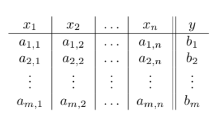

```yaml
Campus: Ciudad Universitaria
Facultad: Ingeniería
Materia : Inteligencia Artificial
Semestre: 2022-2
Equipo: 1
Clave: 0406
Participantes: 
	- Barrera Peña Víctor Miguel
	- Espino De Horta Joaquín Gustavo
	
Profesor: Dr. Ismael Everardo Barcenas Patiño
Título : Proyecto 
Subtítulo : Inferencia bayesiana
Fecha entrega: 03/05/2022

```

# Capítulo 0 Estructura del  repositorio

```yaml
.
├── Codigo
├── Diapositivas
├── Documentacion
├── Material_ayuda
├── LICENSE (Archivo)
└── README.md (Archivo)
```

Aquí mostramos la estructura de  los archivos contenidos en el repositorio para que puedas navegar dentro.

## Código

Aquí se encuentra el código  en `C++`  y el `.exe` para poder ejecutarlo, esta compilado para maquina de `64 bits` en sistema Windows pero esta el código disponible para su compilación.

## Diapositivas

Sólo se encuentra el PDF de las diapositivas y el código `.tex`.

## Documentación

Se encuentra una documentación del programa escrito en C++ y por tanto es posible exportar un `.html` que explica todas las funcioens

## Material de ayuda

Aquí se recopila, pdf´s dados por el profesor y externos con los cuales se basó para crear el proyecto, se acumulan aquí, ya que la duración de un archivo en la red tiene un tiempo limitado de vida y es posible que si se desea mejorar este proyecto a futuro o hacerle un fork, sería buena idea contar con el.

## Archivos 

- License (Licencia) la linecia es GNU.
- README.md Es el mismo archivo que esta leyendo, solo que en formato `.md` para poder leerlo desde Github.

# Capítulo 1 Introducción

La probabilidad es una rama de las matemáticas  surgido en 1553 de la mano de Gerolamo Cardano (1501-1576). Por otra parte << Pierre Fermat (1601-1665) y Blaise Pascal (1623-1662) son conocidos como los padres de la teoría de la probabilidad debido las grandes aportaciones que realizaron sobre este campo>>

<<Andréi Kolmogorov. Fue el creador de la obra «Los fundamentos de la Teoría de la Probabilidad» en la que expuso la axiomática de Kolmogorov y le hizo ser reconocido como una eminencia de la probabilidad>>.

La probabilidad busca encontrar el nivel de certeza de que ocurra un evento dado, por lo cual existe un porcentaje asociado a ello, lo cual puede ir desde un  0% hasta un 100%. Cuando el evento se aproxima a la cantidad más alt, significa que es muy posible que suceda el evento, por  otro lado, cuando es cercano a 0 significa que es probable que el evento no suceda.

Ahora un concepto más avanzado es el calculo de probabilidades dado por un suceso anterior, es decir que tan probable es que suceda un evento dado por que ocurra haya ocurrido otro evento. Para calcular dicha probabilidad utilizamos el **teorema de Bayes** el cual nos proporciona una forma fácil de calcular dicha probabilidad.

## Conceptos

**Definición** (Regla de la adición).

​	
$$
P(A \cup B) = P(A) + P(B) - P(A \cap B)
$$


**Definición 9 **(Probabilidad condicional) . La probabilidad condicional de un evento $B$ dado otro evento $A$, escrita $P(B|A)$, se define 
$$
P(B|A)=\frac{P (A\cap B)}{P(A)}
$$


**Definición 13** (Clasificación Bayesiana). Considere el espacio muestra compuesto por los siguientes vectores:



El modelo de clasificación Bayesiana se define como sigue: 
$$
\hat{y}=\max \left\{P\left(y_{i}\right) P\left(x_{1} \mid y_{i}\right) P\left(x_{2} \mid y_{i}\right) \ldots P\left(x_{n} \mid y_{i}\right) \mid i=1, \ldots, m\right\}
$$

## 

## Problema

Entrada: un espacio muestra, nuevos datos para clasificar.

Salida: la clasificación de los datos.

Dado un vector de condiciones $\vec{Q}$ que contiene los valores $[q_1,q_2,...,q_j]$ para $j$ condiciones, a los cuales debe igualarse $Am_i$, obtener $Y_{max}(\vec{Q})$ que es la probabilidad más grande para dicho vector.

**Ejemplo.** Considere la siguiente base de datos.

| #    | Usuario | Género | Calificación |
| ---- | ------- | ------ | ------------ |
| 1    | F       | Terror | 1            |
| 2    | M       | Acción | 3            |
| 3    | F       | Drama  | 2            |
| 4    | M       | Drama  | 2            |
| 5    | F       | Acción | 2            |
| 6    | M       | Terror | 3            |
| 7    | F       | Terror | 3            |
| 8    | M       | Drama  | 1            |
| 9    | F       | Acción | 2            |

Calcule la calificación que le pondría un usuario $M$ a una película de Drama.
$$
\begin{aligned}
&P(1) P(\mathrm{M} \mid 1) P(\text { Drama } \mid 1)=2 / 9 * 1 / 2 * 1 / 2=1 / 18 \\
&P(2) P(\mathrm{M} \mid 2) P(\text { Drama } \mid 2)=4 / 9 * 1 / 4 * 1 / 2=1 / 18 \\
&P(3) P(\mathrm{M} \mid 3) P(\text { Drama } \mid 3)=1 / 3 * 2 / 3 * 0=0
\end{aligned}
$$
En este caso $Y_{max}(\vec{Q})=1/18$, ya que es la mayor probabilidad, con las condiciones que se le dierron 

# Capítulo 2 Desarrollo

##  Solución

### Pseudocódigo

```python
inicio main():
    Datos= cargarDatos(nombre)

	Condiciones <= input()
	Cuestion	<= input()

	real 	probabilidad = 1.0, masProbable = 0.0
	cadena  Argumento = "No hay coincidencias", Objetivo, Regla 

	por_cada Objetivo en obten_coleccion(Cuestion) realiza:

		probabilidad = obten_Probabilidad(Datos,Objetivo)

		por_cada Regla en obten_coleccion(Condiciones) realiza:

			probabilidad = probabilidad * obten_Probabilidad(Datos,Objetivo,Regla)

		fin_bucle

		si (probabilidad > masProbable) entonces:

			mas probable <= probabilidad
			Argumento	 <= Objetivo

		fin_condicion

	fin_bucle

	imprimir(Argumento)

fin_main

inicio obten_Probabilidad(Datos,Objetivo):
	retorna	veces_En_Categoria(Datos,Objetivo) / (Datos.Altura - 1)
fin_obten_Probabilidad

inicio obten_Probabilidad(Datos,Objetivo,Regla):
	retorna	coincidencia(Datos,Objetivo,Regla) / veces_En_Categoria(Datos,Objetivo)
fin_obten_Probabilidad
```

## Experimentos

Por cada nivel de dificultad usaremos un conjunto de datos (data-set) y el problema cambiará de lo que se esta preguntado, en este caso serán 3 preguntas diferentes acerca de la probabilidad.

### Baja dificultad

Considere la siguiente base de datos (tomada de la pág. 8 del texto proporcionado por el profesor).

> Puedes encontrar el archivo como data-set1.csv en la carpeta de codigo

| Género | Calificación |
| ------ | ------------ |
| Terror | 1            |
| Acción | 3            |
| Drama  | 2            |
| Drama  | 2            |
| Acción | 2            |
| Terror | 3            |
| Teror  | 3            |
| Drama  | 1            |
| Acción | 2            |

#### Problema 1

Que usuario le pondría 1 a una categoría de terror

```
Inserte condiciones con el formato [Clasificacion]:[Objetivo],*
|       Categoria       |       Calificacion    |       Usuario |
Categoria:terror,Calificacion:1
Inserte la cuestion Usuario
|       Categoria       |       Calificacion    |       Usuario |
|       terror  |       3       |       F       |
|       terror  |       1       |       M       |
|       terror  |       2       |       F       |
|       terror  |       3       |       F       |
|       terror  |       3       |       M       |
|       comedia |       5       |       M       |
|       comedia |       1       |       M       |
|       comedia |       1       |       F       |
|       comedia |       2       |       F       |
|       comedia |       2       |       F       |
|       comedia |       2       |       M       |
|       comedia |       2       |       M       |
|       romance |       2       |       M       |
|       romance |       2       |       M       |
|       romance |       3       |       M       |
|       romance |       3       |       F       |
|       romance |       4       |       M       |
|       terror  |       3       |       F       |
|       comedia |       2       |       M       |
|       romance |       3       |       M       |
Para F: (8/20)*(4/6)*(1/3) = 0.0888889
Para M: (12/20)*(2/6)*(2/3) = 0.133333
Resultado posible: M    Probabilidad: 0.133333
Realizado en: 19.6674 milisegundosd
```


#### Problema 2

Siendo usuario masculino, de calificación 3  ¿Qué categoría seria?

```
Cargar Hoja de Datos...
Inserte el nombre del archivo: prueba1_facil.csv
Se han leido los datos correctamente...

Seleccione una opcion:
1.- Cargar Hoja de Datos
2.- Preguntar
3.- Test de presicion
4.- Salir
2
Preguntar...
Inserte condiciones con el formato [Clasificacion]:[Objetivo],*
|       Categoria       |       Calificacion    |       Usuario |
Usuario:M,Calificacion:3
Inserte la cuestion Categoria
|       Categoria       |       Calificacion    |       Usuario |
|       terror  |       3       |       F       |
|       terror  |       1       |       M       |
|       terror  |       2       |       F       |
|       terror  |       3       |       F       |
|       terror  |       3       |       M       |
|       comedia |       5       |       M       |
|       comedia |       1       |       M       |
|       comedia |       1       |       F       |
|       comedia |       2       |       F       |
|       comedia |       2       |       F       |
|       comedia |       2       |       M       |
|       comedia |       2       |       M       |
|       romance |       2       |       M       |
|       romance |       2       |       M       |
|       romance |       3       |       M       |
|       romance |       3       |       F       |
|       romance |       4       |       M       |
|       terror  |       3       |       F       |
|       comedia |       2       |       M       |
|       romance |       3       |       M       |
Para terror: (6/20)*(2/12)*(4/7) = 0.0285714
Para comedia: (8/20)*(5/12)*(0/7) = 0
Para romance: (6/20)*(5/12)*(3/7) = 0.0535714
Resultado posible: romance      Probabilidad: 0.053571
Realizado en: 24.0973 milisegundos
```

Test de precisión

```
Especulacion: No hay coincidencia       | Realidad: romance
Especulacion: 2 | Realidad: 4
Especulacion: No hay coincidencia       | Realidad: M
Especulacion: terror    | Realidad: terror
Especulacion: 3 | Realidad: 3
Especulacion: F | Realidad: F
Especulacion: comedia   | Realidad: comedia
Especulacion: 2 | Realidad: 2
Especulacion: M | Realidad: M
Especulacion: terror    | Realidad: romance
Especulacion: 2 | Realidad: 3
Especulacion: M | Realidad: M
La presicion es del...  58.3333%
Realizado en: 33.1889 milisegundos
```


#### Problema 3

### Media dificultad

| order_no            | order_date                      | buyer      | ship_city    | ship_state        | sku               | description                                                  | quantity | item_total | shipping_fee | cod              | order_status       |
| ------------------- | ------------------------------- | ---------- | ------------ | ----------------- | ----------------- | ------------------------------------------------------------ | -------- | ---------- | ------------ | ---------------- | ------------------ |
| 405-9763961-5211537 | Sun, 18 Jul, 2021, 10:38 pm IST | Mr.        | CHANDIGARH,  | CHANDIGARH        | SKU: 2X-3C0F-KNJE | 100% Leather Elephant Shaped Piggy Coin Bank \| Block Printed  West Bengal Handicrafts (Shantiniketan Art) \| Money Bank for Kids \|  Children's Gift Ideas | 1        | ₹449.00    |              |                  | Delivered to buyer |
| 404-3964908-7850720 | Tue, 19 Oct, 2021, 6:05 pm IST  | Minam      | PASIGHAT,    | ARUNACHAL PRADESH | SKU: DN-0WDX-VYOT | Women's Set of 5 Multicolor Pure Leather Single Lipstick Cases  with Mirror, Handy and Compact Handcrafted Shantiniketan Block Printed  Jewelry Boxes | 1        | ₹449.00    | ₹60.18       |                  | Delivered to buyer |
| 171-8103182-4289117 | Sun, 28 Nov, 2021, 10:20 pm IST | yatipertin | PASIGHAT,    | ARUNACHAL PRADESH | SKU: DN-0WDX-VYOT | Women's Set of 5 Multicolor Pure Leather Single Lipstick Cases  with Mirror, Handy and Compact Handcrafted Shantiniketan Block Printed  Jewelry Boxes | 1        | ₹449.00    | ₹60.18       |                  | Delivered to buyer |
| 405-3171677-9557154 | Wed, 28 Jul, 2021, 4:06 am IST  | aciya      | DEVARAKONDA, | TELANGANA         | SKU: AH-J3AO-R7DN | Pure 100% Leather Block Print Rectangular Jewelry Box with  Mirror \| Button Closure Multiple Utility Case (Shantiniketan Handicrafts)  (Yellow) | 1        |            |              | Cash On Delivery | Delivered to buyer |
| 402-8910771-1215552 | Tue, 28 Sept, 2021, 2:50 pm IST | Susmita    | MUMBAI,      | MAHARASHTRA       | SKU: KL-7WAA-Z82I | Pure Leather Sling Bag with Multiple Pockets and Adjustable  Strap \| Shantiniketan Block Print Cross-Body Bags for Women (1 pc) (Brown) | 1        | ₹1,099.00  | ₹84.96       |                  | Delivered to buyer |
| 406-9292208-6725123 | Thu, 17 Jun, 2021, 9:12 pm IST  | Subinita   | HOWRAH,      | WEST BENGAL       | SKU: HH-FOWV-5YWO | Women's Trendy Pure Leather Clutch Purse \| Leather Zipper  Wallet | 1        | ₹200.00    |              |                  | Delivered to buyer |

**Context**

- Title:  Amazon Seller - Order Status Prediction
- About this file: BL is a small leather products business which has recently started selling its products on Amazon. Currently, it has around 40 SKUs registered in the Indian Marketplace. Over the past few months, it has incurred some loss due to return orders. Now, BL seeks help to predict the likelihood of a new order being rejected. This would help them to take necessary actions and subsequently reduce the loss.

**Contexto**

- Título: Vendedor de Amazon - Predicción del estado del pedido
- Acerca de este archivo:  BL es un pequeño negocio de productos de cuero que recientemente ha comenzado a vender sus productos en Amazon. Actualmente, tiene alrededor de 40 SKU registrados en el mercado indio. En los últimos meses, ha incurrido en algunas pérdidas debido a los pedidos de devolución. Ahora, BL busca ayuda para predecir la probabilidad de que una nueva orden sea rechazada. Esto les ayudaría a tomar las medidas necesarias y, posteriormente, a reducir la pérdida

- Son   172 registros por  12 columnas

[Link Kaggle]([Vendedor de Amazon - | de predicción del estado del pedido Kaggle](https://www.kaggle.com/datasets/pranalibose/amazon-seller-order-status-prediction))

#### Problema 1

#### Problema 2

#### Problema 3

### Alta dificultad

| title                                          | artist     | top genre   | year released | added      | bpm  | nrgy | dnce | dB   | live | val  | dur  | acous | spch | pop  | top year | artist type |
| ---------------------------------------------- | ---------- | ----------- | ------------- | ---------- | ---- | ---- | ---- | ---- | ---- | ---- | ---- | ----- | ---- | ---- | -------- | ----------- |
| STARSTRUKK (feat. Katy Perry)                  | 3OH!3      | dance pop   | 2009          | 2022‑02‑17 | 140  | 81   | 61   | -6   | 23   | 23   | 203  | 0     | 6    | 70   | 2010     | Duo         |
| My First Kiss (feat. Ke$ha)                    | 3OH!3      | dance pop   | 2010          | 2022‑02‑17 | 138  | 89   | 68   | -4   | 36   | 83   | 192  | 1     | 8    | 68   | 2010     | Duo         |
| I Need A Dollar                                | Aloe Blacc | pop soul    | 2010          | 2022‑02‑17 | 95   | 48   | 84   | -7   | 9    | 96   | 243  | 20    | 3    | 72   | 2010     | Solo        |
| Airplanes (feat. Hayley Williams of  Paramore) | B.o.B      | atl hip hop | 2010          | 2022‑02‑17 | 93   | 87   | 66   | -4   | 4    | 38   | 180  | 11    | 12   | 80   | 2010     | Solo        |
| Nothin' on You (feat. Bruno Mars)              | B.o.B      | atl hip hop | 2010          | 2022‑02‑17 | 104  | 85   | 69   | -6   | 9    | 74   | 268  | 39    | 5    | 79   | 2010     | Solo        |

**Context**

- Title:  Date Fruit Datasets
- About this file:

A great number of fruits are grown around the world, each of which has various types. The factors that determine the type of fruit are the external appearance features such as color, length, diameter, and shape. The external appearance of the fruits is a major determinant of the fruit type. Determining the variety of fruits by looking at their external appearance may necessitate expertise, which is time-consuming and requires great effort. The aim of this study is to classify the types of date fruit, that are, Barhee, Deglet Nour, Sukkary, Rotab Mozafati, Ruthana, Safawi, and Sagai by using three different machine learning methods. In accordance with this purpose, 898 images of seven different date fruit types were obtained via the computer vision system (CVS). Through image processing techniques, a total of 34 features, including morphological features, shape, and color, were extracted from these images. First, models were developed by using the logistic regression (LR) and artificial neural network (ANN) methods, which are among the machine learning methods. Performance results achieved with these methods are 91.0% and 92.2%, respectively. Then, with the stacking model created by combining these models, the performance result was increased to 92.8%. It has been concluded that machine learning methods can be applied successfully for the classification of date fruit types.

**Contexto**

- Título: Conjuntos de datos de frutas de dátiles
- Acerca de este archivo:  

En todo el mundo se cultiva una gran cantidad de frutas, cada una de las cuales tiene varios tipos. Los factores que determinan el tipo de fruto son las características de la apariencia externa como el color, la longitud, el diámetro y la forma. La apariencia externa de los frutos es un determinante importante del tipo de fruto. Determinar la variedad de frutas observando su apariencia externa puede requerir experiencia, lo que lleva mucho tiempo y requiere un gran esfuerzo. El objetivo de este estudio es clasificar los tipos de dátiles, es decir, Barhee, Deglet Nour, Sukkary, Rotab Mozafati, Ruthana, Safawi y Sagai, utilizando tres métodos diferentes de aprendizaje automático. De acuerdo con este propósito, se obtuvieron 898 imágenes de siete tipos diferentes de frutos de dátiles a través del sistema de visión por computadora (CVS). A través de técnicas de procesamiento de imágenes, un total de 34 características, incluidas las características morfológicas, la forma y el color, se extrajeron de estas imágenes. Primero, se desarrollaron modelos utilizando los métodos de regresión logística (LR) y red neuronal artificial (ANN), que se encuentran entre los métodos de aprendizaje automático. Los resultados de rendimiento logrados con estos métodos son 91,0% y 92,2%, respectivamente. Luego, con el modelo de apilamiento creado mediante la combinación de estos modelos, el resultado de rendimiento se incrementó al 92,8 %. Se ha concluido que los métodos de aprendizaje automático se pueden aplicar con éxito para la clasificación de tipos de frutos de dátil. respectivamente. Luego, con el modelo de apilamiento creado mediante la combinación de estos modelos, el resultado de rendimiento se incrementó al 92,8 %. Se ha concluido que los métodos de aprendizaje automático se pueden aplicar con éxito para la clasificación de tipos de frutos de dátil. respectivamente. Luego, con el modelo de apilamiento creado mediante la combinación de estos modelos, el resultado de rendimiento se incrementó al 92,8 %. Se ha concluido que los métodos de aprendizaje automático se pueden aplicar con éxito para la clasificación de tipos de frutos de dátil.

[Link Kaggle]([Las 100 mejores canciones de Spotify de 2010-2019 | Kaggle](https://www.kaggle.com/datasets/muhmores/spotify-top-100-songs-of-20152019))

### Problema 1

### Problema 2

### Problema 3

## Sin solución

**Context**

- Title: Walmart Sales Forecast
- About this file:This file contains additional data related to the store, department, and regional activity for the given dates. It contains the following fields:

**Contexto**

- Título: Pronóstico de ventas de Walmart
- Acerca de este archivo: este archivo contiene datos adicionales relacionados con la actividad de la tienda, el departamento y la región para las fechas indicadas. Contiene los siguientes campos:

| Store | Dept | Date       | Weekly_Sales | IsHoliday |
| ----- | ---- | ---------- | ------------ | --------- |
| 1     | 1    | 05/02/2010 | 24924.5      | FALSE     |
| 1     | 1    | 12/02/2010 | 46039.49     | TRUE      |
| 1     | 1    | 19/02/2010 | 41595.55     | FALSE     |
| 1     | 1    | 26/02/2010 | 19403.54     | FALSE     |
| 1     | 1    | 05/03/2010 | 21827.9      | FALSE     |
| 1     | 1    | 12/03/2010 | 21043.39     | FALSE     |
| 1     | 1    | 19/03/2010 | 22136.64     | FALSE     |
| 1     | 1    | 26/03/2010 | 26229.21     | FALSE     |
| 1     | 1    | 02/04/2010 | 57258.43     | FALSE     |
| 1     | 1    | 09/04/2010 | 42960.91     | FALSE     |
| 1     | 1    | 16/04/2010 | 17596.96     | FALSE     |
| 1     | 1    | 23/04/2010 | 16145.35     | FALSE     |
| 1     | 1    | 30/04/2010 | 16555.11     | FALSE     |
| 1     | 1    | 07/05/2010 | 17413.94     | FALSE     |
| 1     | 1    | 14/05/2010 | 18926.74     | FALSE     |
| ...   | ...  | ...        | ...          | ...       |

- Son 421,571 registros por 5 columnas

[Link Kaggle](https://www.kaggle.com/datasets/aslanahmedov/walmart-sales-forecast?titleType=dataset-downloads&showDatasetDownloadSkip=False&messageId=datasetsWelcome&returnUrl=%2Fdatasets%2Faslanahmedov%2Fwalmart-sales-forecast%3Fresource%3Ddownload)

# Capítulo 3 Conclusión

## Barrera Peña Víctor Miguel

- Se cumplió de acuerdo a lo esperado el proyecto, presento una dificultad considerable, sobre todo la teoría matemática, sin embargo fue posible la creación del programa utilizando la probabilidad condicional usando conjuntos de datos reales, con lo cual apenas se puede vislumbrar la verdadera introducción a la inteligencia artificial, mediante la selección de "comportamiento inteligentes", como podría ser, que acción realizar de acuerdo a eventos pasados sucedidos, constituye un avance que se verá incrementado con el siguiente proyecto.

## Espino de Horta Joaquín Gustavo

- 

# Anexo (teoría)

**Definición 1** (Experimentos aleatorios). Un experimento con diferentes resultados, incluso si es repetido en la misma manera, se llama un experimento aleatorio.

**Definición 2** (Espacio muestra). El conjunto de todos los posibles resultados de un experimento aleatorio, se llama el espacio muestra del experimento.
Ejemplo:
$$
\begin{align}
& S= \mathbb{R} + = \{x \in \mathbb{R}|x >0\} \\
& S= \{x \in N | 10 < x <20\} \\
& S=\{low,medium,light\} \\
& S= \{yes.not\}
\end{align}
$$

**Definición 3** (Espacio muestra discreto). Un espacio muestra es discreto si y sólo si, es contable.

Ejemplo:
$$
\begin{aligned}
&S=\{x \in \mathbb{N} \mid 10<x<20\} \\
&S=\{\text { low, medium,light }\} \\
&S=\{y e s, \text { not }\} \\
&S=\{x \in \mathbb{N} \mid \exists y \in \mathbb{N}: 2 y+1=x\} \\
&S=\{0,1\}^{\star}
\end{aligned}
$$
**Definición 4** (Espacio muestra continuo). Un espacio muestra S es continuo si y sólo si, existe una biyección $f: S \mapsto \mathbb{R}$ .

Ejemplos:
$$
\begin{aligned}
&S=\{x \in \mathbb{R} \mid 0<x<2\} \\
&S=\mathbb{R}^{+} \times \mathbb{R}^{+} \\
&S=\left\{x|x=| S^{\prime} \mid, S^{\prime} \subseteq \mathbb{N}\right\}
\end{aligned}
$$
**Definición 5** (Evento). Un evento $S$, es decir, $E \subseteq S$.

- La unión de dos eventos $E_1,E_2$ se define $E_1 \cup E_2=\{x|x \in E_1 or x \in E_2\}$.
- La intersección de dos eventos $E_1,E_2,$ se define $E_1 \cap E_2=\{x|x \in E_1 \text{and } x \in\}$.
- El complemento de un evento $E$ en el espacio muestral $S$ se define $E=\{x \in S | x \in E\}$.

**Ejemplos:** Considere el espacio muestra  $S={yy,yn,ny,nn}$. Los siguientes son eventos $S$.
$$
\begin{aligned}
&E_1=\{yy,yn,ny\}\\
& E_2=\{nn\}\\
& E_3=\empty 
\\
& E_4= S \\
& E_5 = \{yn,ny,nn\}
\end{aligned}
$$

$$
\begin{align}
 & E_1 \cup E_2 = S & E_1 \cap E_5=\{yn,ny\}  &  E^c 
\end{align}E_{1} \cup E_{2}=S, \quad E_{1} \cap E_{5}=\{y n, n y\}, \quad E_{1}^{c}=\{n n\}
$$
Mas ejemplos. Considere $ S =\mathbb{R}^+, E_{1}=\{x \mid 1 \leq x<10\} \text { y } E_{2}=\{x \mid 3<x<118\},$ entonces
$$
\begin{aligned}
E_{1} \cup E_{2} &=\{x \mid 1 \leq x<118\} \\
E_{1} \cap E_{2} &=\{x \mid 3<x<10\} \\
E_{1}^{c} &=\{x \mid x \geq 10\} \\
E_{1}^{c} \cap E_{2} &=\{x \mid 10 \leq x<118\}
\end{aligned}
$$
Algunas propiedades de los eventos.

Dos eventos $A$ y $B$ se dicen mutuamente exclusivos si y sólo si, su intersección de vacía, es decir, $A \cap B= \empty$
$$
\begin{aligned}
\left(E^{c}\right)^{c} &=E \\
(A \cup B) \cap C &=(A \cap C) \cup(B \cap C) \\
(A \cap B) \cup C &=(A \cup C) \cap(B \cup C) \\
(A \cup B)^{c} &=A^{c} \cap B^{c} \\
(A \cap B)^{c} &=A^{c} \cup B^{c} \\
A \cup B &=B \cup A \\
A \cap B &=B \cap A
\end{aligned}
$$

$$
\begin{aligned}
\left(E^{c}\right)^{c} &=E \\
(A \cup B) \cap C &=(A \cap C) \cup(B \cap C) \\
(A \cap B) \cup C &=(A \cup C) \cap(B \cup C) \\
(A \cup B)^{c} &=A^{c} \cap B^{c} \\
(A \cap B)^{c} &=A^{c} \cup B^{c} \\
A \cup B &=B \cup A \\
A \cap B &=B \cap A
\end{aligned}
$$

**Definición 6** (Probabilidad). En un espacio muestra discreto, la probabilidad
de un evento E, escrito P(E), es igual a la suma de las probabilidades de sus
resultados en E.

**Ejemplo.**

Un experimento aleatorio puede resultar en ${a,b,c,d}$ con probabilidades $0.1,0.3,0.5$ y $0.1$, respectivamente. Considere el evento A como $\{a,b\},B=\{b,c,d\}$ y $C={d}$. Entonces,
$$
\begin{aligned}
&P(A)=0.1+0.3=0.4 \\
&P(B)=0.3+0.5+0.1=0.9 \\
&P(C)=0.1
\end{aligned}
$$
También, $P\left(A^{c}\right)=0.6, P\left(B^{c}\right)=0.1, P\left(C^{c}\right)=0.9$. Más aún, debido a $A \cap B=$ $\{b\}$, entonces $P(A \cap B)=0.3$. Debido a $A \cup B=\{a, b, c, d\}, P(A \cup B)=$ $0.1+0.3+0.5+0.1=1$. Y debido a $A \cap C=\emptyset$, entonces $P(A \cap C)=0$.

**Definición 7** (Axiomas de la probabilidad). Considere los eventos $E,E_1$ y $E$ del espacio muestra $S$ de un experimento aleatorio.

- $P(S)=1$
- $0 \leq P(E) \leq 1$
- Si $E_{1} \cap E_{2}=\emptyset$, entonces $P\left(E_{1} \cup E_{2}\right)=P\left(E_{1}\right)+P\left(E_{2}\right)$

Algunas propiedades.
$$
P(\emptyset)=0 \quad P\left(E^{c}\right)=1-P(E) \quad \text { Si } E_{1} \subseteq E_{2}, \text { entonces } P\left(E_{1}\right) \leq P\left(E_{2}\right)
$$

# Ejercicios

## Problema 1

Suponga que las placas de los vehículos están compuestas inicialmente por tres dígitos (0−9), seguidas de tres letras (A−Z). Calcule la probabilidad de una determinada placa.

## Problema 2

Un mensaje puede seguir diferentes rutas a través de una red de servidores. En el primer paso, el mensaje puede llegar a cinco servidores, a partir de cada uno de estos servidores, el mensaje puede llegar a cinco servidores m´as, desde los cuales puede acceder a otros cuatro servidores.

- Calcule la cantidad de rutas.
- Si todas las rutas son igualmente probables, calcule la probabilidad de que el mensaje llegue a alguno de los cuatro servidores del tercer bloque.

## Demuestre lo siguiente

$$
P(\empty)= 0
$$

$$
\begin{align}
	S^c&=\empty  &\text{ Definimos el conjunto}\\
	P(S \cup S^c)&=P(S)+P(S^c)-P(S \cap S^c) & \text{ Usamos la prpiedad} \\
	P(S \cup S^c)&= 1 + P(S^c) -  0  & \text{ Sustituimos}\\
	P(S \cup S^c)&= 1 &\text{ Decladamos una propieda} \\
	1-1 &=P(S^c)  & \text{ Sustituimos lo anterios} \\
	0 &=P(S^c) \\
	P(S^c) &= 0 \\
	\therefore P(\empty) &= 0
\end{align}
$$


$$
P(E^c)=1-P(E)
$$

$$
\text { Para cualquier evento } A, P(A)+P\left(A^{\prime}\right)=1 \text {, a partir de la cual } P(A)=1-P\left(A^{\prime}\right) \text {. }
$$

Comprobación En el axioma 3 , sea  $k=2, A_{1}=A$ y $A_{2}=A^{\prime}$  . Como por definición de $A^{\prime}, A \cup A^{\prime}=\mathcal{S}$ en tanto $A$ y $A^{\prime}$ sean eventos disjuntos, $1=P(\mathcal{S})=P\left(A \cup A^{\prime}\right)=$  $P(A)+P\left(A^{\prime}\right)$


$$
\text{Si } E_1 \subseteq E_2 \text{ entonces } P(E_1) \leq P(E_2)
$$

- Si tienen los mismos elementos, entonces la probabilidad de obtener un evento $E_1,E_2$, es la misma, pero y si $E_2$ Tiene un elemento más que $E_2$ su  probabilidad aumenta, esto se puede demostrar por ordinales de conjuntos.

$$
\frac{\#E_1}{Total} \leq \frac{\#E_2}{Total}
$$

$E_1,E_2$ es el número de elementos a favor.

# Mas ejemplos

## Problema 1

Una mezcla química es preparada correctamente por el 25% de los técnicos de un laboratorio, 70% de los técnicos la preparan con un error mínimo, y 5% con un error mayor. 

- Si un técnico es elegido aleatoriamente, ¿Cuál es la probabilidad de que prepare la mezcla sin error alguno?

$$
P(E)=25\%
$$


- Calcule la probabilidad de que el técnico la prepare con cualquier tipo de error.

$$
P(E)=70\% + 5\%=75\%
$$


## Problema 2

Considere las emisiones de tres fabricas clasificadas por su calidad. De la primera fábrica 22 muestras de emisiones cumplen con el mínimo, y 8 no lo hacen; 25 cumplen con el mínimo y 5 no, en el caso de la segunda fábrica; en cuanto a la tercera, 30 cumplen y 10 no. Considere A denota el evento de las muestras de emisiones de la primera fábrica, y B como el evento de una muestra cumple con el mínimo. Calcule las siguientes probabilidades.
$$
P(A) \quad P(B) \quad P\left(A^{c}\right) \quad P(A \cap B) \quad P(A \cup B) \quad P\left(A^{c} \cup B\right)
$$
**Solución:**
$$
\begin{align}
P(A) &= \frac{22+8}{100} = 0.3\\
P(B) &= \frac{22+25+30}{100}\\
P\left(A^{c}\right)&= \frac{70}{100} \\
P(A \cap B)&= \frac{22}{100}\\
P(A \cup B) &= \frac{22+25+30}{100} \\
P\left(A^{c} \cup B\right)& = \frac{70+8}{100}
\end{align}
$$
**Definición 8** (regla de la adición).
$$
P(A \cup B)= P(A) +(B) - P(A )ls
$$

**Definición** (Regla de la adición).

​	
$$
P(A \cup B) = P(A) + P(B) - P(A \cap B)
$$
**Ejemplo** 

Considere la tabla abajo con el historial de producción de 949 semiconductores. Suponga que un semiconductor es elegido aleatoriamente. Considere $M$ denota el evento de que el semiconductor contiene niveles altos de contaminación. C es el evento cuando el semiconductor se encuentra en el centro de una herramienta de pulverización.
$$
P(H \cup C)= P(H) + P(C) - P(H \cap C)=\frac{1}{940} (358+626 -112)= \frac{872}{940}
$$


**Ejemplo:** En el mismo contexto del ejemplo anterior, considere $E_1$ el evento de que un semiconductor contiene 4 o más partículas contaminantes, $E2$ es el evento de que un semiconductor se encuentra en la orilla de la herramienta.
$$
P(E_1 \cap E_2) = P(E_1) + P(E_2) - P(E_1 \cap E_2) =
$$


**Ejercicios**

Si P(A) = 0.3, P(B) = 0.2, y P(A ∩ B) = 0.1, determine las siguientes probabilidades:
$$
\begin{array}{lll}
P\left(A^{c}\right) & P(A \cup B) & P\left(A^{c} \cap B\right) \\
P\left(A \cap B^{c}\right) & P\left((A \cup B)^{c}\right) & P\left(A^{c} \cup B\right)
\end{array}
$$

**Definición 9 **(Probabilidad condicional) . La probabilidad condicional de un evento $B$ dado otro evento $A$, escrita $P(B|A)$, se define 
$$
P(B|A)=\frac{P (A\cap B)}{P(A)}
$$


# 8

- Calcule la probabilidad de que el inspector detecte un objeto defectuso.
- Si un objeto es clasificado libre de defectos, determine la probabilidad de que efectivamente lo esté.

**Definición 13** (Clasificación Bayesiana). Considere el espacio muestra compuesto por los siguientes vectores:


El modelo de clasificación Bayesiana se define como sigue: 
$$
\hat{y}=\max \left\{P\left(y_{i}\right) P\left(x_{1} \mid y_{i}\right) P\left(x_{2} \mid y_{i}\right) \ldots P\left(x_{n} \mid y_{i}\right) \mid i=1, \ldots, m\right\}
$$

## Ejemplo

Considere la siguiente base de datos

| Género | Calificación |
| ------ | ------------ |
| Terror | 1            |
| Acción | 3            |
| Drama  | 2            |
| Drama  | 2            |
| Acción | 2            |
| Terror | 3            |
| Teror  | 3            |
| Drama  | 1            |
| Acción | 2            |


- Calcule la probabilidad de que el inspector detecte un objeto defecuso

La calificación de una película de acción se puede predecir de la siguiente forma:
$$
\begin{aligned}
&P(1) P(\text { Acción } \mid 1)=2 / 9 * 0=0 \\
&P(2) P(\text { Acción } \mid 2)=4 / 9 * 1 / 2=2 / 9 \\
&P(3) P(\text { Acción } \mid 3)=1 / 3 * 1 / 3=1 / 9
\end{aligned}
$$
por lo tanto, la calificación de una película de acción será 2.

# 9

**Ejemplo.** Considere la siguiente base de datos.

| #    | Usuario | Género | Calificación |
| ---- | ------- | ------ | ------------ |
| 1    | F       | Terror | 1            |
| 2    | M       | Acción | 3            |
| 3    | F       | Drama  | 2            |
| 4    | M       | Drama  | 2            |
| 5    | F       | Acción | 2            |
| 6    | M       | Terror | 3            |
| 7    | F       | Terror | 3            |
| 8    | M       | Drama  | 1            |
| 9    | F       | Acción | 2            |

Calcule la calificación que le pondría un usuario $M$ a una película de Drama.
$$
\begin{aligned}
&P(1) P(\mathrm{M} \mid 1) P(\text { Drama } \mid 1)=2 / 9 * 1 / 2 * 1 / 2=1 / 18 \\
&P(2) P(\mathrm{M} \mid 2) P(\text { Drama } \mid 2)=4 / 9 * 1 / 4 * 1 / 2=1 / 18 \\
&P(3) P(\mathrm{M} \mid 3) P(\text { Drama } \mid 3)=1 / 3 * 2 / 3 * 0=0
\end{aligned}
$$
## Ejercicios

Considere la siguiente base de datos.

| #    | Productora | Usuario | Género | Calificación |
| ---- | ---------- | ------- | ------ | ------------ |
| 1    | Universal  | F       | Terror | 1            |
| 2    | Universal  | M       | Acción | 3            |
| 3    | Warner     | F       | Drama  | 2            |
| 4    | Disney     | M       | Drama  | 2            |
| 5    | Warner     | F       | Acción | 2            |
| 6    | Disney     | M       | Terror | 3            |
| 7    | Universal  | F       | Terror | 3            |
| 8    | Disney     | M       | Drama  | 1            |
| 9    | Warney     | F       | Acción | 2            |
| 10   | Warner     | M       | Acción | 1            |
| 11   | Disney     | F       | Drama  | 2            |
| 12   | Universal  | F       | Terror | 3            |
| 13   | Warner     | F       | Terror | 3            |
| 14   | Disney     | M       | Acción | 2            |
| 15   | Universal  | M       | Drama  | 1            |

Calcule la calificación que otorgará un usuario $F$ a una película de Acción producida Warner.
$$
P(1) \cdot P(F|1) \cdot P(A|1) \cdot P(W | 1) \\
=\frac{4}{15} \cdot \frac{1}{4} \cdot \frac{1}{4} \cdot \frac{1}{4} = \frac{4}{960}=0.0041\overline{6}
$$

$$
P(2) \cdot P(F|2) \cdot P(A|2) \cdot P(W | 2) \\
=\frac{6}{15} \cdot \frac{4}{6} \cdot \frac{3}{6} \cdot \frac{3}{6} = \frac{216}{3240}=0.0666\overline{6}
$$

$$
P(3) \cdot P(F|3) \cdot P(A|3) \cdot P(W | 3) \\
=\frac{5}{15} \cdot \frac{3}{5} \cdot \frac{1}{5} \cdot \frac{1}{5} = \frac{15}{1,875}=0.0026\overline{6}
$$

# 10

## Ejercicio

- Considere la siguiente base de datos.

| #    | Director   | Productora | Usuario | Género | Calificación |
| ---- | ---------- | ---------- | ------- | ------ | ------------ |
| 1    | Hnos. Coen | Universal  | F       | Terror | 1            |
| 2    | Del tor    | Universal  | M       | Acción | 3            |
| 3    | Bañuel     | Warner     | F       | Drama  | 2            |
| 4    | Bañuel     | Disney     | M       | Drama  | 2            |
| 5    | Hnos. Coen | Warner     | F       | Acción | 2            |
| 6    | Del toro   | Disney     | M       | Terror | 3            |
| 7    | Del toro   | Universal  | F       | Terror | 3            |
| 8    | Hnos. Coen | Disney     | M       | Drama  | 1            |
| 9    | Bañuel     | Warner     | F       | Acción | 2            |
| 10   | Del toro   | Warner     | M       | Acción | 1            |
| 11   | Bañuel     | Disney     | F       | Drama  | 2            |
| 12   | Hnos. Coen | Universal  | F       | Terror | 3            |
| 13   | Hnos. Coen | Warner     | F       | Terror | 3            |
| 14   | Del Toro   | Disney     | M       | Acción | 2            |
| 15   | Bañuel     | Universal  | M       | Drama  | 1            |
| 16   | Bañuel     | Warner     | M       | Acción | 1            |
| 17   | Del Toro   | Warner     | F       | Acción | 2            |
| 18   | Bañuel     | Disney     | M       | Drama  | 3            |
| 19   | Hnos. Coen | Universal  | M       | Terror | 1            |
| 20   | Hnos. Coen | Warner     | F       | Terror | 1            |
| 21   | Del Toro   | Disney     | F       | Acción | 2            |
| 22   | Bañuel     | Uiversal   | M       | Drama  | 3            |

Calcule la calificación que otorgará un usuario $M$ a una película de Terror, producida y dirigida por Bañuel.

- Implemente un algoritmo para el modelo de clasificación Bayesiana.

$$
P(1) \cdot P(M|1) \cdot P(Terror|1) \cdot P(Universal | 1) \cdot P(Bañuel | 1) \\
=\frac{7}{22} \cdot \frac{5}{7} \cdot \frac{3}{7} \cdot \frac{3}{7} \cdot \frac{2}{7} = \frac{45}{3773}=0.0119268
$$

$$
P(2) \cdot P(M|2) \cdot P(Terror|2) \cdot P(Universal | 2) \cdot P(Bañuel | 2) \\
=\frac{8}{22} \cdot \frac{2}{7} \cdot 0 \cdots =0
$$

$$
P(3) \cdot P(M|3) \cdot P(Terror|3) \cdot P(Universal | 3) \cdot P(Bañuel | 3) \\
=\frac{7}{22} \cdot \frac{4}{7} \cdot \frac{4}{7} \cdot \frac{4}{7} \cdot \frac{2}{7} = \frac{896}{52,822}=0.0169626
$$

# Referencias

- Barcenas, E. (s. f.). *Introducción a la probabilidad*. classrom. Recuperado 3 de mayo de 2022, de https://classroom.google.com/c/NDYyNTA3MDkxNDA2
- Devore, J. L. *Probabilidad y estadística para ingeniería y ciencias/por Jay L. Devore* (No. 519 D4.).
- Westreicher, G. (2021, 14 julio). *Probabilidad*. Economipedia. https://economipedia.com/definiciones/probabilidad.html
