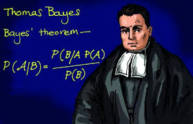
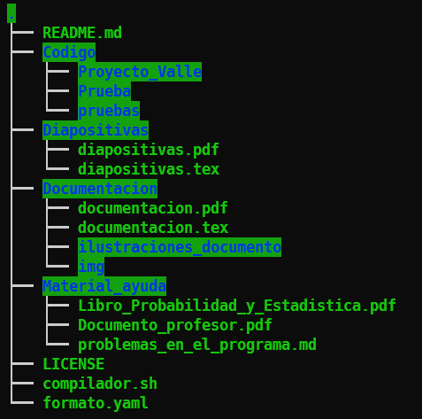
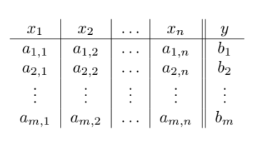
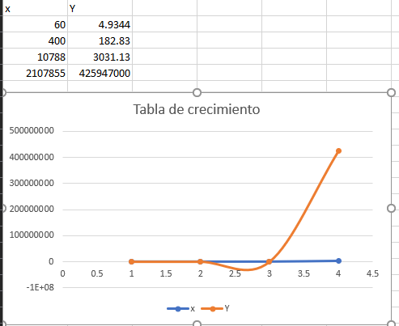

```yaml
Campus: Ciudad Universitaria
Facultad: Ingeniería
Materia : Inteligencia Artificial
Semestre: 2022-2
Equipo: 1
Clave: 0406
Participantes: 
- Barrera Peña Víctor Miguel
- Espino De Horta Joaquín Gustavo
	
Profesor: Dr. Ismael Everardo Barcenas Patiño
Título : Proyecto 
Subtítulo : Inferencia bayesiana
Fecha entrega: 03/05/2022

```


# 

\pagebreak

# Capítulo 0 Estructura del  repositorio {.allowframebreaks}




Aquí mostramos la estructura de  los archivos contenidos en el repositorio para que puedas navegar dentro.

## Código

Aquí se encuentra el código  en `C++`  y el `.exe` para poder ejecutarlo, esta compilado para maquina de `64 bits` en sistema Windows pero esta el código disponible para su compilación.

## Diapositivas

Sólo se encuentra el PDF de las diapositivas y el código `.tex`.

## Documentación

Se encuentra una documentación del programa escrito en C++ y por tanto es posible exportar un `.html` que explica todas las funcioens

## Material de ayuda

Aquí se recopila, pdf´s dados por el profesor y externos con los cuales se basó para crear el proyecto, se acumulan aquí, ya que la duración de un archivo en la red tiene un tiempo limitado de vida y es posible que si se desea mejorar este proyecto a futuro o hacerle un fork, sería buena idea contar con el.

## Archivos 

- License (Licencia) la linecia es GNU.
- README.md Es el mismo archivo que esta leyendo, solo que en formato `.md` para poder leerlo desde Github.

# Capítulo 1 Introducción {.allowframebreaks}

La probabilidad es una rama de las matemáticas  surgido en 1553 de la mano de Gerolamo Cardano (1501-1576). Por otra parte << Pierre Fermat (1601-1665) y Blaise Pascal (1623-1662) son conocidos como los padres de la teoría de la probabilidad debido las grandes aportaciones que realizaron sobre este campo>>

<<Andréi Kolmogorov. Fue el creador de la obra «Los fundamentos de la Teoría de la Probabilidad» en la que expuso la axiomática de Kolmogorov y le hizo ser reconocido como una eminencia de la probabilidad>>.

La probabilidad busca encontrar el nivel de certeza de que ocurra un evento dado, por lo cual existe un porcentaje asociado a ello, lo cual puede ir desde un  0% hasta un 100%. Cuando el evento se aproxima a la cantidad más alt, significa que es muy posible que suceda el evento, por  otro lado, cuando es cercano a 0 significa que es probable que el evento no suceda.

Ahora un concepto más avanzado es el calculo de probabilidades dado por un suceso anterior, es decir que tan probable es que suceda un evento dado por que ocurra haya ocurrido otro evento. Para calcular dicha probabilidad utilizamos el **teorema de Bayes** el cual nos proporciona una forma fácil de calcular dicha probabilidad.

## Conceptos

**Definición** (Regla de la adición).

​	
$$
P(A \cup B) = P(A) + P(B) - P(A \cap B)
$$


**Definición 9 **(Probabilidad condicional) . La probabilidad condicional de un evento $B$ dado otro evento $A$, escrita $P(B|A)$, se define 
$$
P(B|A)=\frac{P (A\cap B)}{P(A)}
$$

**Definición 13** (Clasificación Bayesiana). Considere el espacio muestra compuesto por los siguientes vectores:

{ width=300}

El modelo de clasificación Bayesiana se define como sigue: 
$$
\hat{y}=\max \left\{P\left(y_{i}\right) P\left(x_{1} \mid y_{i}\right) P\left(x_{2} \mid y_{i}\right) \ldots P\left(x_{n} \mid y_{i}\right) \mid i=1, \ldots, m\right\}
$$

## Problema

Entrada: un espacio muestra, nuevos datos para clasificar.

Salida: la clasificación de los datos.

Dado un vector de condiciones $\vec{Q}$ que contiene los valores $[q_1,q_2,...,q_j]$ para $j$ condiciones, a los cuales debe igualarse $Am_i$, obtener $Y_{max}(\vec{Q})$ que es la probabilidad más grande para dicho vector.

**Ejemplo.** Considere la siguiente base de datos.

| #    | Usuario | Género | Calificación |
| ---- | ------- | ------ | ------------ |
| 1    | F       | Terror | 1            |
| 2    | M       | Acción | 3            |
| 3    | F       | Drama  | 2            |
| 4    | M       | Drama  | 2            |
| 5    | F       | Acción | 2            |
| 6    | M       | Terror | 3            |
| 7    | F       | Terror | 3            |
| 8    | M       | Drama  | 1            |
| 9    | F       | Acción | 2            |

Calcule la calificación que le pondría un usuario $M$ a una película de Drama.
$$
\begin{aligned}
&P(1) P(\mathrm{M} \mid 1) P(\text { Drama } \mid 1)=2 / 9 * 1 / 2 * 1 / 2=1 / 18 \\
&P(2) P(\mathrm{M} \mid 2) P(\text { Drama } \mid 2)=4 / 9 * 1 / 4 * 1 / 2=1 / 18 \\
&P(3) P(\mathrm{M} \mid 3) P(\text { Drama } \mid 3)=1 / 3 * 2 / 3 * 0=0
\end{aligned}
$$
En este caso $Y_{max}(\vec{Q})=1/18$, ya que es la mayor probabilidad, con las condiciones que se le dieron.

# Capítulo 2 Desarrollo {.allowframebreaks}

##  Solución

### Pseudocódigo

```python
inicio main():
    Datos= cargarDatos(nombre)

	Condiciones <= input()
	Cuestion	<= input()

	real 	probabilidad = 1.0, masProbable = 0.0
	cadena  Argumento = "No hay coincidencias", Objetivo, Regla 

	por_cada Objetivo en obten_coleccion(Cuestion) realiza:

		probabilidad = obten_Probabilidad(Datos,Objetivo)

		por_cada Regla en obten_coleccion(Condiciones) realiza:

			probabilidad = probabilidad * obten_Probabilidad(Datos,Objetivo,Regla)

		fin_bucle

		si (probabilidad > masProbable) entonces:

			mas probable <= probabilidad
			Argumento	 <= Objetivo

		fin_condicion

	fin_bucle

	imprimir(Argumento)

fin_main

inicio obten_Probabilidad(Datos,Objetivo):
	retorna	veces_En_Categoria(Datos,Objetivo) / (Datos.Altura - 1)
fin_obten_Probabilidad

inicio obten_Probabilidad(Datos,Objetivo,Regla):
	retorna	coincidencia(Datos,Objetivo,Regla) / veces_En_Categoria(Datos,Objetivo)
fin_obten_Probabilidad
```

## Experimentos

Por cada nivel de dificultad usaremos un conjunto de datos (data-set) y el problema cambiará de lo que se esta preguntado, en este caso serán 3 preguntas diferentes acerca de la probabilidad. 

### Baja dificultad

Considere la siguiente base de datos (tomada de la pág. 8 del texto proporcionado por el profesor).

> Puedes encontrar el archivo como data-set1.csv en la carpeta de codigo

| Género | Calificación |
| ------ | ------------ |
| Terror | 1            |
| Acción | 3            |
| Drama  | 2            |
| Drama  | 2            |
| Acción | 2            |
| Terror | 3            |
| Teror  | 3            |
| Drama  | 1            |
| Acción | 2            |

#### Problema 1

Que usuario le pondría 1 a una categoría de terror

```
Seleccione una opcion:
1.- Cargar Hoja de Datos
2.- Preguntar
3.- Test de presicion
4.- Salir
1
Cargar Hoja de Datos...
Inserte el nombre del archivo: prueba1_facil_precision.csv
Se han leido los datos correctamente...

Seleccione una opcion:
1.- Cargar Hoja de Datos
2.- Preguntar
3.- Test de presicion
4.- Salir
2
Preguntar...
Inserte condiciones con el formato [Clasificacion]:[Objetivo],*
|       Categoria       |       Calificacion    |       Usuario |
Categoria:terror,Calificacion:1
Inserte la cuestion Usuario
|       Categoria       |       Calificacion    |       Usuario |
|       terror  |       3       |       F       |
|       comedia |       2       |       M       |
|       comedia |       1       |       F       |
|       romance |       3       |       M       |
|       terror  |       3       |       M       |
|       romance |       2       |       M       |
|       terror  |       3       |       F       |
|       romance |       2       |       M       |
|       romance |       4       |       M       |
|       comedia |       2       |       F       |
|       comedia |       5       |       M       |
|       comedia |       2       |       M       |
|       terror  |       3       |       F       |
|       romance |       3       |       M       |
|       comedia |       2       |       F       |
|       comedia |       2       |       M       |
|       terror  |       2       |       F       |
|       romance |       3       |       F       |
|       terror  |       1       |       M       |
|       comedia |       1       |       M       |
Para F: (8/20)*(4/6)*(1/3) = 0.0888889
Para M: (12/20)*(2/6)*(2/3) = 0.133333
Resultado posible: M    Probabilidad: 0.133333
Realizado en: 2.5849 milisegundos
```

#### Problema 2

Siendo usuario masculino, de calificación 3  ¿Qué categoría seria sería la más probable?

```
Preguntar...
Inserte condiciones con el formato [Clasificacion]:[Objetivo],*
|       Categoria       |       Calificacion    |       Usuario |
Usuario:M,Calificacion:3
Inserte la cuestion Categoria
|       Categoria       |       Calificacion    |       Usuario |
|       terror  |       3       |       F       |
|       comedia |       2       |       M       |
|       comedia |       1       |       F       |
|       romance |       3       |       M       |
|       terror  |       3       |       M       |
|       romance |       2       |       M       |
|       terror  |       3       |       F       |
|       romance |       2       |       M       |
|       romance |       4       |       M       |
|       comedia |       2       |       F       |
|       comedia |       5       |       M       |
|       comedia |       2       |       M       |
|       terror  |       3       |       F       |
|       romance |       3       |       M       |
|       comedia |       2       |       F       |
|       comedia |       2       |       M       |
|       terror  |       2       |       F       |
|       romance |       3       |       F       |
|       terror  |       1       |       M       |
|       comedia |       1       |       M       |
Para terror: (6/20)*(2/12)*(4/7) = 0.0285714
Para comedia: (8/20)*(5/12)*(0/7) = 0
Para romance: (6/20)*(5/12)*(3/7) = 0.0535714
Resultado posible: romance      Probabilidad: 0.053571
Realizado en: 3.4736 milisegundos
```

#### Problema 3

Siendo usuario femenino, pelicula de romance,  ¿Qué calificación es la más probable?

```
Preguntar...
Inserte condiciones con el formato [Clasificacion]:[Objetivo],*
|       Categoria       |       Calificacion    |       Usuario |
Categoria:romance,Usuario:F
Inserte la cuestion Calificacion
|       Categoria       |       Calificacion    |       Usuario |
|       terror  |       3       |       F       |
|       comedia |       2       |       M       |
|       comedia |       1       |       F       |
|       romance |       3       |       M       |
|       terror  |       3       |       M       |
|       romance |       2       |       M       |
|       terror  |       3       |       F       |
|       romance |       2       |       M       |
|       romance |       4       |       M       |
|       comedia |       2       |       F       |
|       comedia |       5       |       M       |
|       comedia |       2       |       M       |
|       terror  |       3       |       F       |
|       romance |       3       |       M       |
|       comedia |       2       |       F       |
|       comedia |       2       |       M       |
|       terror  |       2       |       F       |
|       romance |       3       |       F       |
|       terror  |       1       |       M       |
|       comedia |       1       |       M       |
Para 3: (7/20)*(3/6)*(4/8) = 0.0875
Para 2: (8/20)*(2/6)*(3/8) = 0.05
Para 1: (3/20)*(0/6)*(1/8) = 0
Para 4: (1/20)*(1/6)*(0/8) = 0
Para 5: (1/20)*(0/6)*(0/8) = 0
Resultado posible: 3    Probabilidad: 0.087500
Realizado en: 5.0094 milisegundos
```

#### Test de precisión

Para poder obtener la precisión es necesario hacer 2 pasos más, ya que como el programa  toma los primeros 80% de datos para entrenamiento, y los toma de arriba para abajo, tenemos que revolverlos aleatoriamente para que dichos datos sean lo más aletorio que se pueda y para realizar ello ejecutamos otro ejecutable que también ahí se incluye.

Paso 1 Ejecutar programa aleatorio.exe de la siguiente manera usando `cmd`

```lua
aleatorio.exe <nombre_del_archivo.csv>
```

Paso 2  El programa `aleatorio.exe` genera un nuevo archivo `<nombre_del_archivo_precision.csv>` el cual deberá ser cargar el nuevo archivo y ejecutar el test de preicisión como se observa a continuación.

```
Especulacion: comedia   | Realidad: terror
Especulacion: 3 | Realidad: 2
Especulacion: M | Realidad: F
Especulacion: terror    | Realidad: romance
Especulacion: 3 | Realidad: 3
Especulacion: M | Realidad: F
Especulacion: comedia   | Realidad: terror
Especulacion: 3 | Realidad: 1
Especulacion: F | Realidad: M
Especulacion: comedia   | Realidad: comedia
Especulacion: 2 | Realidad: 1
Especulacion: F | Realidad: M
La presicion es del...  16.6667%
Realizado en: 4.9344 milisegundos
```

### Media dificultad

Considere el siguiente contexto, hay dos parametros, **cgpa** es el coeficiente de estrés dependiendo de el **Iq** , un mayor número de **cgpa** implica un mayor nivel de estrés en la universidad. Como el programa lo maneja mediante cadena podemos decir que `5.13==513` es decir que es un dado discreto.

| cgpa | iq   |
| ---- | ---- |
| 5.13 | 88   |
| 5.9  | 113  |
| 8.36 | 93   |
| 8.27 | 97   |
| 5.45 | 110  |
| 5.88 | 109  |
| 8.41 | 98   |
| 8.8  | 115  |
| 5.79 | 110  |
| 8.09 | 94   |
| 4.6  | 86   |
| 6.1  | 110  |
| ...  | ...  |

#### Problema 1

¿Qué IQ es más probable que tenga alguien con `cgpa:8.36`?

```
cgpa:8.36
iq
```

Ejecución

```
Para 88: (12/200)*(0/1) = 0
Para 118: (13/200)*(0/1) = 0
Para 87: (9/200)*(0/1) = 0
Para 98: (5/200)*(0/1) = 0
Para 93: (8/200)*(1/1) = 0.04
Para 111: (10/200)*(0/1) = 0
Para 116: (7/200)*(0/1) = 0
Para 89: (4/200)*(0/1) = 0
Para 110: (7/200)*(0/1) = 0
Para 117: (15/200)*(0/1) = 0
Para 92: (5/200)*(0/1) = 0
Para 83: (3/200)*(0/1) = 0
Para 96: (9/200)*(0/1) = 0
Para 94: (8/200)*(0/1) = 0
Para 95: (7/200)*(0/1) = 0
Para 86: (11/200)*(0/1) = 0
Para 119: (6/200)*(0/1) = 0
Para 109: (11/200)*(0/1) = 0
Para 113: (4/200)*(0/1) = 0
Para 108: (10/200)*(0/1) = 0
Para 112: (4/200)*(0/1) = 0
Para 97: (3/200)*(0/1) = 0
Para 91: (5/200)*(0/1) = 0
Para 115: (5/200)*(0/1) = 0
Para 85: (8/200)*(0/1) = 0
Para 114: (1/200)*(0/1) = 0
Para 84: (1/200)*(0/1) = 0
Para 104: (1/200)*(0/1) = 0
Para 107: (2/200)*(0/1) = 0
Para 100: (1/200)*(0/1) = 0
Para 120: (1/200)*(0/1) = 0
Para 106: (2/200)*(0/1) = 0
Para 121: (1/200)*(0/1) = 0
Para 90: (1/200)*(0/1) = 0
Resultado posible: 93   Probabilidad: 0.040000
Realizado en: 32.4148 milisegundos
```


#### Problema 2

¿Qué `cgpa` es más probable que tenga un alumno con $IQ=110$ ?

```
iq:110
cgpa
```

Ejecución

```
Para 5.32: (2/200)*(0/7) = 0
Para 8.98: (1/200)*(0/7) = 0
Para 5.03: (1/200)*(0/7) = 0
Para 8.92: (1/200)*(0/7) = 0
Para 8.41: (1/200)*(0/7) = 0
Para 7.91: (1/200)*(0/7) = 0
Para 8.46: (1/200)*(0/7) = 0
Para 6.14: (1/200)*(0/7) = 0
Para 8.96: (1/200)*(0/7) = 0
Para 5.2: (2/200)*(0/7) = 0
Para 5.45: (1/200)*(1/7) = 0.000714286
Para 8.6: (1/200)*(0/7) = 0
Para 4.87: (1/200)*(0/7) = 0
Para 8.33: (1/200)*(0/7) = 0
Para 5.14: (1/200)*(0/7) = 0
Para 8.43: (1/200)*(0/7) = 0
Para 8.14: (2/200)*(0/7) = 0
Para 8.31: (1/200)*(0/7) = 0
Para 8.29: (1/200)*(0/7) = 0
Para 8: (1/200)*(0/7) = 0
Para 7.89: (1/200)*(0/7) = 0
Para 4.86: (3/200)*(0/7) = 0
Para 8.45: (1/200)*(0/7) = 0
Para 6.05: (3/200)*(0/7) = 0
Para 8.75: (1/200)*(0/7) = 0
Para 5.71: (1/200)*(0/7) = 0
Para 5.91: (2/200)*(0/7) = 0
Para 6.01: (2/200)*(0/7) = 0
Para 7.84: (1/200)*(0/7) = 0
Para 8.23: (2/200)*(0/7) = 0
Para 8.36: (1/200)*(0/7) = 0
Para 8.27: (1/200)*(0/7) = 0
Para 8.12: (1/200)*(0/7) = 0
Para 8.94: (2/200)*(0/7) = 0
Para 5.85: (2/200)*(0/7) = 0
Para 8.4: (2/200)*(0/7) = 0
Para 4.95: (2/200)*(0/7) = 0
Para 8.82: (1/200)*(0/7) = 0
Para 5.67: (2/200)*(0/7) = 0
Para 5.74: (3/200)*(0/7) = 0
Para 5.01: (3/200)*(0/7) = 0
Para 5.13: (1/200)*(0/7) = 0
Para 8.78: (2/200)*(0/7) = 0
Para 8.86: (3/200)*(0/7) = 0
Para 9.3: (1/200)*(0/7) = 0
Para 8.21: (1/200)*(0/7) = 0
Para 8.56: (1/200)*(0/7) = 0
Para 4.89: (2/200)*(0/7) = 0
Para 9.23: (1/200)*(0/7) = 0
Para 8.25: (2/200)*(0/7) = 0
Para 5.88: (2/200)*(1/7) = 0.00142857
Para 4.85: (1/200)*(0/7) = 0
Para 5.31: (1/200)*(0/7) = 0
Para 8.57: (1/200)*(0/7) = 0
Para 8.76: (1/200)*(0/7) = 0
Para 8.58: (1/200)*(0/7) = 0
Para 5.77: (1/200)*(0/7) = 0
Para 8.9: (1/200)*(0/7) = 0
Para 8.95: (1/200)*(0/7) = 0
Para 5.44: (1/200)*(0/7) = 0
Para 6.33: (1/200)*(0/7) = 0
Para 5.86: (1/200)*(0/7) = 0
Para 8.18: (1/200)*(0/7) = 0
Para 6.02: (1/200)*(0/7) = 0
Para 6.24: (1/200)*(0/7) = 0
Para 8.67: (1/200)*(0/7) = 0
Para 5.05: (2/200)*(0/7) = 0
Para 5.81: (1/200)*(0/7) = 0
Para 8.34: (1/200)*(0/7) = 0
Para 9: (1/200)*(0/7) = 0
Para 8.97: (3/200)*(0/7) = 0
Para 8.71: (1/200)*(0/7) = 0
Para 8.53: (1/200)*(0/7) = 0
Para 8.44: (1/200)*(0/7) = 0
Para 8.91: (4/200)*(0/7) = 0
Para 8.81: (2/200)*(0/7) = 0
Para 5.21: (1/200)*(0/7) = 0
Para 8.08: (2/200)*(0/7) = 0
Para 4.98: (3/200)*(0/7) = 0
Para 4.79: (1/200)*(0/7) = 0
Para 8.72: (2/200)*(0/7) = 0
Para 9.18: (1/200)*(0/7) = 0
Para 8.65: (1/200)*(0/7) = 0
Para 5.57: (1/200)*(0/7) = 0
Para 6.17: (1/200)*(1/7) = 0.000714286
Para 5.87: (2/200)*(0/7) = 0
Para 4.9: (1/200)*(0/7) = 0
Para 6.23: (1/200)*(0/7) = 0
Para 8.26: (1/200)*(0/7) = 0
Para 4.78: (3/200)*(0/7) = 0
Para 4.67: (1/200)*(0/7) = 0
Para 8.79: (2/200)*(0/7) = 0
Para 7.47: (1/200)*(0/7) = 0
Para 4.68: (2/200)*(0/7) = 0
Para 6.4: (1/200)*(0/7) = 0
Para 9.03: (2/200)*(0/7) = 0
Para 8.88: (1/200)*(0/7) = 0
Para 7.97: (1/200)*(0/7) = 0
Para 9.07: (1/200)*(0/7) = 0
Para 5.94: (1/200)*(0/7) = 0
Para 9.13: (1/200)*(0/7) = 0
Para 6.38: (1/200)*(0/7) = 0
Para 6.1: (2/200)*(1/7) = 0.00142857
Para 5.15: (2/200)*(0/7) = 0
Para 7.9: (1/200)*(0/7) = 0
Para 4.99: (1/200)*(0/7) = 0
Para 5: (1/200)*(0/7) = 0
Para 5.84: (1/200)*(0/7) = 0
Para 8.35: (1/200)*(0/7) = 0
Para 5.28: (1/200)*(0/7) = 0
Para 8.8: (1/200)*(0/7) = 0
Para 9.06: (1/200)*(0/7) = 0
Para 8.68: (1/200)*(0/7) = 0
Para 7.93: (2/200)*(0/7) = 0
Para 5.43: (1/200)*(0/7) = 0
Para 4.77: (1/200)*(0/7) = 0
Para 7.87: (1/200)*(0/7) = 0
Para 4.76: (2/200)*(0/7) = 0
Para 5.97: (1/200)*(0/7) = 0
Para 5.47: (1/200)*(0/7) = 0
Para 7.78: (1/200)*(0/7) = 0
Para 5.8: (2/200)*(1/7) = 0.00142857
Para 4.81: (1/200)*(0/7) = 0
Para 5.9: (1/200)*(0/7) = 0
Para 6.06: (1/200)*(0/7) = 0
Para 4.91: (1/200)*(0/7) = 0
Para 5.34: (1/200)*(0/7) = 0
Para 8.04: (1/200)*(0/7) = 0
Para 7.99: (1/200)*(0/7) = 0
Para 8.83: (1/200)*(0/7) = 0
Para 5.69: (1/200)*(0/7) = 0
Para 8.09: (1/200)*(0/7) = 0
Para 4.97: (1/200)*(0/7) = 0
Para 4.96: (2/200)*(0/7) = 0
Para 8.02: (1/200)*(0/7) = 0
Para 8.2: (1/200)*(0/7) = 0
Para 6.04: (1/200)*(1/7) = 0.000714286
Para 7.77: (1/200)*(0/7) = 0
Para 8.16: (1/200)*(0/7) = 0
Para 8.61: (1/200)*(0/7) = 0
Para 8.3: (1/200)*(0/7) = 0
Para 8.54: (1/200)*(0/7) = 0
Para 8.77: (1/200)*(0/7) = 0
Para 8.93: (1/200)*(0/7) = 0
Para 5.5: (1/200)*(0/7) = 0
Para 5.79: (1/200)*(1/7) = 0.000714286
Para 9.01: (1/200)*(0/7) = 0
Para 4.88: (1/200)*(0/7) = 0
Para 5.55: (1/200)*(0/7) = 0
Para 8.89: (1/200)*(0/7) = 0
Para 6.61: (1/200)*(0/7) = 0
Para 4.6: (1/200)*(0/7) = 0
Resultado posible: 5.88 Probabilidad: 0.001429
Realizado en: 135.316 milisegundos
```


#### Problema 3

¿Cuanto cgpa tienen aquellos alumnos con `IQ=86` ?

```
iq:86
cgpa
```

Ejecución

```
Para 5.32: (2/200)*(0/11) = 0
Para 8.98: (1/200)*(0/11) = 0
Para 5.03: (1/200)*(0/11) = 0
Para 8.92: (1/200)*(0/11) = 0
Para 8.41: (1/200)*(0/11) = 0
Para 7.91: (1/200)*(0/11) = 0
Para 8.46: (1/200)*(0/11) = 0
Para 6.14: (1/200)*(0/11) = 0
Para 8.96: (1/200)*(0/11) = 0
Para 5.2: (2/200)*(0/11) = 0
Para 5.45: (1/200)*(0/11) = 0
Para 8.6: (1/200)*(0/11) = 0
Para 4.87: (1/200)*(0/11) = 0
Para 8.33: (1/200)*(0/11) = 0
Para 5.14: (1/200)*(0/11) = 0
Para 8.43: (1/200)*(0/11) = 0
Para 8.14: (2/200)*(0/11) = 0
Para 8.31: (1/200)*(0/11) = 0
Para 8.29: (1/200)*(0/11) = 0
Para 8: (1/200)*(0/11) = 0
Para 7.89: (1/200)*(0/11) = 0
Para 4.86: (3/200)*(1/11) = 0.00136364
Para 8.45: (1/200)*(0/11) = 0
Para 6.05: (3/200)*(0/11) = 0
Para 8.75: (1/200)*(0/11) = 0
Para 5.71: (1/200)*(0/11) = 0
Para 5.91: (2/200)*(0/11) = 0
Para 6.01: (2/200)*(0/11) = 0
Para 7.84: (1/200)*(0/11) = 0
Para 8.23: (2/200)*(0/11) = 0
Para 8.36: (1/200)*(0/11) = 0
Para 8.27: (1/200)*(0/11) = 0
Para 8.12: (1/200)*(0/11) = 0
Para 8.94: (2/200)*(0/11) = 0
Para 5.85: (2/200)*(0/11) = 0
Para 8.4: (2/200)*(0/11) = 0
Para 4.95: (2/200)*(1/11) = 0.000909091
Para 8.82: (1/200)*(0/11) = 0
Para 5.67: (2/200)*(0/11) = 0
Para 5.74: (3/200)*(0/11) = 0
Para 5.01: (3/200)*(2/11) = 0.00272727
Para 5.13: (1/200)*(0/11) = 0
Para 8.78: (2/200)*(0/11) = 0
Para 8.86: (3/200)*(0/11) = 0
Para 9.3: (1/200)*(0/11) = 0
Para 8.21: (1/200)*(0/11) = 0
Para 8.56: (1/200)*(0/11) = 0
Para 4.89: (2/200)*(0/11) = 0
Para 9.23: (1/200)*(0/11) = 0
Para 8.25: (2/200)*(0/11) = 0
Para 5.88: (2/200)*(0/11) = 0
Para 4.85: (1/200)*(1/11) = 0.000454545
Para 5.31: (1/200)*(1/11) = 0.000454545
Para 8.57: (1/200)*(0/11) = 0
Para 8.76: (1/200)*(0/11) = 0
Para 8.58: (1/200)*(0/11) = 0
Para 5.77: (1/200)*(0/11) = 0
Para 8.9: (1/200)*(0/11) = 0
Para 8.95: (1/200)*(0/11) = 0
Para 5.44: (1/200)*(0/11) = 0
Para 6.33: (1/200)*(0/11) = 0
Para 5.86: (1/200)*(0/11) = 0
Para 8.18: (1/200)*(0/11) = 0
Para 6.02: (1/200)*(0/11) = 0
Para 6.24: (1/200)*(0/11) = 0
Para 8.67: (1/200)*(0/11) = 0
Para 5.05: (2/200)*(1/11) = 0.000909091
Para 5.81: (1/200)*(0/11) = 0
Para 8.34: (1/200)*(0/11) = 0
Para 9: (1/200)*(0/11) = 0
Para 8.97: (3/200)*(0/11) = 0
Para 8.71: (1/200)*(0/11) = 0
Para 8.53: (1/200)*(0/11) = 0
Para 8.44: (1/200)*(0/11) = 0
Para 8.91: (4/200)*(0/11) = 0
Para 8.81: (2/200)*(0/11) = 0
Para 5.21: (1/200)*(0/11) = 0
Para 8.08: (2/200)*(0/11) = 0
Para 4.98: (3/200)*(0/11) = 0
Para 4.79: (1/200)*(0/11) = 0
Para 8.72: (2/200)*(0/11) = 0
Para 9.18: (1/200)*(0/11) = 0
Para 8.65: (1/200)*(0/11) = 0
Para 5.57: (1/200)*(0/11) = 0
Para 6.17: (1/200)*(0/11) = 0
Para 5.87: (2/200)*(0/11) = 0
Para 4.9: (1/200)*(0/11) = 0
Para 6.23: (1/200)*(0/11) = 0
Para 8.26: (1/200)*(0/11) = 0
Para 4.78: (3/200)*(0/11) = 0
Para 4.67: (1/200)*(1/11) = 0.000454545
Para 8.79: (2/200)*(0/11) = 0
Para 7.47: (1/200)*(0/11) = 0
Para 4.68: (2/200)*(0/11) = 0
Para 6.4: (1/200)*(0/11) = 0
Para 9.03: (2/200)*(0/11) = 0
Para 8.88: (1/200)*(0/11) = 0
Para 7.97: (1/200)*(0/11) = 0
Para 9.07: (1/200)*(0/11) = 0
Para 5.94: (1/200)*(0/11) = 0
Para 9.13: (1/200)*(0/11) = 0
Para 6.38: (1/200)*(0/11) = 0
Para 6.1: (2/200)*(0/11) = 0
Para 5.15: (2/200)*(0/11) = 0
Para 7.9: (1/200)*(0/11) = 0
Para 4.99: (1/200)*(0/11) = 0
Para 5: (1/200)*(0/11) = 0
Para 5.84: (1/200)*(0/11) = 0
Para 8.35: (1/200)*(0/11) = 0
Para 5.28: (1/200)*(0/11) = 0
Para 8.8: (1/200)*(0/11) = 0
Para 9.06: (1/200)*(0/11) = 0
Para 8.68: (1/200)*(0/11) = 0
Para 7.93: (2/200)*(0/11) = 0
Para 5.43: (1/200)*(0/11) = 0
Para 4.77: (1/200)*(1/11) = 0.000454545
Para 7.87: (1/200)*(0/11) = 0
Para 4.76: (2/200)*(0/11) = 0
Para 5.97: (1/200)*(0/11) = 0
Para 5.47: (1/200)*(0/11) = 0
Para 7.78: (1/200)*(0/11) = 0
Para 5.8: (2/200)*(0/11) = 0
Para 4.81: (1/200)*(0/11) = 0
Para 5.9: (1/200)*(0/11) = 0
Para 6.06: (1/200)*(0/11) = 0
Para 4.91: (1/200)*(0/11) = 0
Para 5.34: (1/200)*(0/11) = 0
Para 8.04: (1/200)*(0/11) = 0
Para 7.99: (1/200)*(0/11) = 0
Para 8.83: (1/200)*(0/11) = 0
Para 5.69: (1/200)*(0/11) = 0
Para 8.09: (1/200)*(0/11) = 0
Para 4.97: (1/200)*(0/11) = 0
Para 4.96: (2/200)*(0/11) = 0
Para 8.02: (1/200)*(0/11) = 0
Para 8.2: (1/200)*(0/11) = 0
Para 6.04: (1/200)*(0/11) = 0
Para 7.77: (1/200)*(0/11) = 0
Para 8.16: (1/200)*(0/11) = 0
Para 8.61: (1/200)*(0/11) = 0
Para 8.3: (1/200)*(0/11) = 0
Para 8.54: (1/200)*(0/11) = 0
Para 8.77: (1/200)*(0/11) = 0
Para 8.93: (1/200)*(0/11) = 0
Para 5.5: (1/200)*(0/11) = 0
Para 5.79: (1/200)*(0/11) = 0
Para 9.01: (1/200)*(0/11) = 0
Para 4.88: (1/200)*(1/11) = 0.000454545
Para 5.55: (1/200)*(0/11) = 0
Para 8.89: (1/200)*(0/11) = 0
Para 6.61: (1/200)*(0/11) = 0
Para 4.6: (1/200)*(1/11) = 0.000454545
Resultado posible: 5.01 Probabilidad: 0.002727
Realizado en: 134.471 milisegundos
```

#### Test de precisión

```
Especulacion: 4.86      | Realidad: 4.78
Especulacion: 85        | Realidad: 87
Especulacion: 8.14      | Realidad: 8.04
Especulacion: No hay coincidencia       | Realidad: 94
Especulacion: 8.33      | Realidad: 7.99
Especulacion: No hay coincidencia       | Realidad: 92
Especulacion: 9.03      | Realidad: 8.83
Especulacion: No hay coincidencia       | Realidad: 118
Especulacion: 9.03      | Realidad: 8.86
Especulacion: 117       | Realidad: 118
Especulacion: 6.05      | Realidad: 5.69
Especulacion: No hay coincidencia       | Realidad: 109
Especulacion: 4.86      | Realidad: 5.05
Especulacion: 87        | Realidad: 86
Especulacion: 8.14      | Realidad: 8.09
Especulacion: No hay coincidencia       | Realidad: 94
Especulacion: 4.86      | Realidad: 4.97
Especulacion: No hay coincidencia       | Realidad: 88
Especulacion: 5.2       | Realidad: 4.96
Especulacion: No hay coincidencia       | Realidad: 89
Especulacion: 7.91      | Realidad: 8.02
Especulacion: No hay coincidencia       | Realidad: 93
Especulacion: 7.91      | Realidad: 8.4
Especulacion: 93        | Realidad: 93
Especulacion: 8.33      | Realidad: 8.2
Especulacion: No hay coincidencia       | Realidad: 92
Especulacion: 6.05      | Realidad: 5.67
Especulacion: 109       | Realidad: 111
Especulacion: 5.88      | Realidad: 6.04
Especulacion: No hay coincidencia       | Realidad: 110
Especulacion: 8.25      | Realidad: 7.77
Especulacion: No hay coincidencia       | Realidad: 96
Especulacion: 6.05      | Realidad: 5.87
Especulacion: 109       | Realidad: 108
Especulacion: 4.86      | Realidad: 4.98
Especulacion: 87        | Realidad: 87
Especulacion: 5.88      | Realidad: 5.8
Especulacion: 108       | Realidad: 110
Especulacion: 4.86      | Realidad: 4.89
Especulacion: 85        | Realidad: 88
Especulacion: 7.84      | Realidad: 8.16
Especulacion: No hay coincidencia       | Realidad: 97
Especulacion: 4.86      | Realidad: 5.01
Especulacion: 86        | Realidad: 86
Especulacion: 8.23      | Realidad: 8.61
Especulacion: No hay coincidencia       | Realidad: 95
Especulacion: 8.08      | Realidad: 7.93
Especulacion: 94        | Realidad: 98
Especulacion: 4.86      | Realidad: 4.96
Especulacion: No hay coincidencia       | Realidad: 88
Especulacion: 7.91      | Realidad: 8.3
Especulacion: No hay coincidencia       | Realidad: 93
Especulacion: 9.03      | Realidad: 8.54
Especulacion: No hay coincidencia       | Realidad: 118
Especulacion: 8.91      | Realidad: 8.77
Especulacion: No hay coincidencia       | Realidad: 117
Especulacion: 9.03      | Realidad: 8.93
Especulacion: No hay coincidencia       | Realidad: 118
Especulacion: 8.33      | Realidad: 8.72
Especulacion: 119       | Realidad: 92
Especulacion: 6.05      | Realidad: 5.5
Especulacion: No hay coincidencia       | Realidad: 111
Especulacion: 5.88      | Realidad: 5.79
Especulacion: No hay coincidencia       | Realidad: 110
Especulacion: No hay coincidencia       | Realidad: 9.01
Especulacion: No hay coincidencia       | Realidad: 121
Especulacion: 4.86      | Realidad: 4.88
Especulacion: No hay coincidencia       | Realidad: 86
Especulacion: 8.97      | Realidad: 8.81
Especulacion: 115       | Realidad: 116
Especulacion: 6.05      | Realidad: 5.55
Especulacion: No hay coincidencia       | Realidad: 109
Especulacion: 9.03      | Realidad: 8.89
Especulacion: No hay coincidencia       | Realidad: 118
Especulacion: 6.05      | Realidad: 6.61
Especulacion: No hay coincidencia       | Realidad: 111
Especulacion: No hay coincidencia       | Realidad: 4.76
Especulacion: 89        | Realidad: 90
Especulacion: 4.86      | Realidad: 4.6
Especulacion: No hay coincidencia       | Realidad: 86
La presicion es del...  3.75%
Realizado en: 182.83 milisegundos
```


### Alta Dificultad

Resumen: Un gran número de frutas se cultivan en todo el mundo, cada una de las cuales tiene varios tipos. Los factores que determinan el tipo de fruta son las características de apariencia externa, como el color, la longitud, el diámetro y la forma. La apariencia externa de los frutos es un determinante importante del tipo de fruta. Determinar la variedad de frutas observando su apariencia externa puede requerir experiencia, lo que lleva mucho tiempo y requiere un gran esfuerzo. 

| AREA   | PERIMETER | MAJOR_AXIS | MINOR_AXIS | ECCENTRICITY | EQDIASQ  | SOLIDITY | CONVEX_AREA | EXTENT | ASPECT_RATIO | ROUNDNESS | COMPACTNESS |
| ------ | --------- | ---------- | ---------- | ------------ | -------- | -------- | ----------- | ------ | ------------ | --------- | ----------- |
| 422163 | 2378.908  | 837.8484   | 645.6693   | 0.6373       | 733.1539 | 0.9947   | 424428      | 0.7831 | 1.2976       | 0.9374    | 0.875       |
| 338136 | 2085.144  | 723.8198   | 595.2073   | 0.569        | 656.1464 | 0.9974   | 339014      | 0.7795 | 1.2161       | 0.9773    | 0.9065      |
| 526843 | 2647.394  | 940.7379   | 715.3638   | 0.6494       | 819.0222 | 0.9962   | 528876      | 0.7657 | 1.315        | 0.9446    | 0.8706      |
| 416063 | 2351.21   | 827.9804   | 645.2988   | 0.6266       | 727.8378 | 0.9948   | 418255      | 0.7759 | 1.2831       | 0.9458    | 0.8791      |
| 347562 | 2160.354  | 763.9877   | 582.8359   | 0.6465       | 665.2291 | 0.9908   | 350797      | 0.7569 | 1.3108       | 0.9358    | 0.8707      |
| 408953 | 2326.6931 | 840.1821   | 622.0076   | 0.6722       | 721.5921 | 0.9974   | 410036      | 0.7805 | 1.3508       | 0.9493    | 0.8589      |
| 451414 | 2457.208  | 889.3253   | 652.4316   | 0.6796       | 758.1281 | 0.997    | 452755      | 0.7877 | 1.3631       | 0.9395    | 0.8525      |
| ...    | ...       | ...        | ...        | ...          | ...      | ...      | ...         | ...    | ...          | ...       | ...         |

[Link kaggle](https://www.kaggle.com/datasets/muratkokludataset/date-fruit-datasets)

#### Problema 1

```
AREA:314398,PERIMETER:2301.7771
SOLIDITY
```

Ejecución

```
Para 0.9947: (6/898)*(0/1)*(0/1) = 0
Para 0.9974: (3/898)*(0/1)*(0/1) = 0
Para 0.9962: (3/898)*(0/1)*(0/1) = 0
Para 0.9948: (5/898)*(0/1)*(0/1) = 0
Para 0.9908: (5/898)*(0/1)*(0/1) = 0
Para 0.997: (2/898)*(0/1)*(0/1) = 0
Para 0.9931: (4/898)*(0/1)*(0/1) = 0
Para 0.9882: (4/898)*(0/1)*(0/1) = 0
Para 0.9918: (11/898)*(0/1)*(0/1) = 0
Para 0.9949: (2/898)*(0/1)*(0/1) = 0
Para 0.9921: (4/898)*(0/1)*(0/1) = 0
Para 0.9958: (1/898)*(0/1)*(0/1) = 0
Para 0.9971: (2/898)*(0/1)*(0/1) = 0
Para 0.9946: (6/898)*(0/1)*(0/1) = 0
Para 0.9968: (1/898)*(0/1)*(0/1) = 0
Para 0.9917: (7/898)*(0/1)*(0/1) = 0
Para 0.9967: (3/898)*(0/1)*(0/1) = 0
Para 0.9911: (3/898)*(0/1)*(0/1) = 0
Para 0.9965: (2/898)*(0/1)*(0/1) = 0
Para 0.9904: (7/898)*(0/1)*(0/1) = 0
Para 0.9927: (7/898)*(0/1)*(0/1) = 0
Para 0.9952: (3/898)*(0/1)*(0/1) = 0
Para 0.9954: (3/898)*(0/1)*(0/1) = 0
Para 0.9919: (8/898)*(0/1)*(0/1) = 0
Para 0.9942: (4/898)*(0/1)*(0/1) = 0
Para 0.9969: (2/898)*(0/1)*(0/1) = 0
Para 0.9912: (7/898)*(0/1)*(0/1) = 0
Para 0.9941: (4/898)*(0/1)*(0/1) = 0
Para 0.9943: (4/898)*(0/1)*(0/1) = 0
Para 0.9898: (7/898)*(0/1)*(0/1) = 0
Para 0.9964: (4/898)*(0/1)*(0/1) = 0
Para 0.996: (2/898)*(0/1)*(0/1) = 0
Para 0.9939: (3/898)*(0/1)*(0/1) = 0
Para 0.9973: (2/898)*(0/1)*(0/1) = 0
Para 0.9936: (8/898)*(0/1)*(0/1) = 0
Para 0.9891: (8/898)*(0/1)*(0/1) = 0
Para 0.9893: (10/898)*(0/1)*(0/1) = 0
Para 0.9924: (8/898)*(0/1)*(0/1) = 0
Para 0.9909: (6/898)*(0/1)*(0/1) = 0
Para 0.9925: (7/898)*(0/1)*(0/1) = 0
Para 0.9907: (3/898)*(0/1)*(0/1) = 0
Para 0.9957: (1/898)*(0/1)*(0/1) = 0
Para 0.9914: (3/898)*(0/1)*(0/1) = 0
Para 0.9922: (9/898)*(0/1)*(0/1) = 0
Para 0.994: (10/898)*(0/1)*(0/1) = 0
Para 0.9945: (2/898)*(0/1)*(0/1) = 0
Para 0.9926: (3/898)*(0/1)*(0/1) = 0
Para 0.9932: (6/898)*(0/1)*(0/1) = 0
Para 0.9883: (9/898)*(0/1)*(0/1) = 0
Para 0.993: (10/898)*(0/1)*(0/1) = 0
Para 0.9823: (3/898)*(0/1)*(0/1) = 0
Para 0.9807: (1/898)*(0/1)*(0/1) = 0
Para 0.992: (7/898)*(0/1)*(0/1) = 0
Para 0.9896: (9/898)*(0/1)*(0/1) = 0
Para 0.9915: (2/898)*(0/1)*(0/1) = 0
Para 0.9831: (1/898)*(0/1)*(0/1) = 0
Para 0.9751: (1/898)*(0/1)*(0/1) = 0
Para 0.9897: (7/898)*(0/1)*(0/1) = 0
Para 0.9792: (5/898)*(0/1)*(0/1) = 0
Para 0.9899: (6/898)*(0/1)*(0/1) = 0
Para 0.976: (3/898)*(0/1)*(0/1) = 0
Para 0.9838: (3/898)*(0/1)*(0/1) = 0
Para 0.9822: (3/898)*(0/1)*(0/1) = 0
Para 0.9825: (2/898)*(0/1)*(0/1) = 0
Para 0.909: (1/898)*(0/1)*(0/1) = 0
Para 0.9938: (5/898)*(0/1)*(0/1) = 0
Para 0.9871: (7/898)*(0/1)*(0/1) = 0
Para 0.9935: (5/898)*(0/1)*(0/1) = 0
Para 0.9857: (4/898)*(0/1)*(0/1) = 0
Para 0.919: (1/898)*(0/1)*(0/1) = 0
Para 0.9913: (6/898)*(0/1)*(0/1) = 0
Para 0.9813: (3/898)*(0/1)*(0/1) = 0
Para 0.9937: (5/898)*(0/1)*(0/1) = 0
Para 0.989: (7/898)*(0/1)*(0/1) = 0
Para 0.9923: (6/898)*(0/1)*(0/1) = 0
Para 0.9906: (6/898)*(0/1)*(0/1) = 0
Para 0.9865: (4/898)*(0/1)*(0/1) = 0
Para 0.9934: (4/898)*(0/1)*(0/1) = 0
Para 0.9832: (4/898)*(0/1)*(0/1) = 0
Para 0.9887: (6/898)*(0/1)*(0/1) = 0
Para 0.8928: (1/898)*(0/1)*(0/1) = 0
Para 0.9902: (4/898)*(0/1)*(0/1) = 0
Para 0.9843: (6/898)*(0/1)*(0/1) = 0
Para 0.9852: (3/898)*(0/1)*(0/1) = 0
Para 0.8987: (1/898)*(0/1)*(0/1) = 0
Para 0.9787: (1/898)*(0/1)*(0/1) = 0
Para 0.9875: (6/898)*(0/1)*(0/1) = 0
Para 0.9928: (4/898)*(0/1)*(0/1) = 0
Para 0.9851: (3/898)*(0/1)*(0/1) = 0
Para 0.9863: (5/898)*(0/1)*(0/1) = 0
Para 0.9929: (5/898)*(0/1)*(0/1) = 0
Para 0.988: (3/898)*(0/1)*(0/1) = 0
Para 0.9903: (4/898)*(0/1)*(0/1) = 0
Para 0.9916: (4/898)*(0/1)*(0/1) = 0
Para 0.8374: (1/898)*(0/1)*(0/1) = 0
Para 0.9885: (7/898)*(0/1)*(0/1) = 0
Para 0.9881: (3/898)*(0/1)*(0/1) = 0
Para 0.9836: (6/898)*(0/1)*(0/1) = 0
Para 0.9901: (3/898)*(0/1)*(0/1) = 0
Para 0.986: (4/898)*(0/1)*(0/1) = 0
Para 0.9814: (3/898)*(0/1)*(0/1) = 0
Para 0.9879: (2/898)*(0/1)*(0/1) = 0
Para 0.9888: (3/898)*(0/1)*(0/1) = 0
Para 0.9884: (3/898)*(0/1)*(0/1) = 0
Para 0.9905: (5/898)*(0/1)*(0/1) = 0
Para 0.9889: (5/898)*(0/1)*(0/1) = 0
Para 0.9868: (5/898)*(0/1)*(0/1) = 0
Para 0.9861: (9/898)*(0/1)*(0/1) = 0
Para 0.9839: (5/898)*(0/1)*(0/1) = 0
Para 0.8996: (1/898)*(0/1)*(0/1) = 0
Para 0.9631: (1/898)*(0/1)*(0/1) = 0
Para 0.984: (3/898)*(0/1)*(0/1) = 0
Para 0.9873: (7/898)*(0/1)*(0/1) = 0
Para 0.8366: (1/898)*(0/1)*(0/1) = 0
Para 0.9484: (1/898)*(0/1)*(0/1) = 0
Para 0.9895: (4/898)*(0/1)*(0/1) = 0
Para 0.987: (5/898)*(0/1)*(0/1) = 0
Para 0.9892: (3/898)*(0/1)*(0/1) = 0
Para 0.9886: (3/898)*(0/1)*(0/1) = 0
Para 0.9858: (1/898)*(0/1)*(0/1) = 0
Para 0.9859: (3/898)*(0/1)*(0/1) = 0
Para 0.991: (8/898)*(0/1)*(0/1) = 0
Para 0.9794: (3/898)*(0/1)*(0/1) = 0
Para 0.9845: (5/898)*(0/1)*(0/1) = 0
Para 0.9827: (3/898)*(0/1)*(0/1) = 0
Para 0.9223: (1/898)*(0/1)*(0/1) = 0
Para 0.9894: (1/898)*(0/1)*(0/1) = 0
Para 0.9877: (4/898)*(0/1)*(0/1) = 0
Para 0.9874: (4/898)*(0/1)*(0/1) = 0
Para 0.9847: (2/898)*(0/1)*(0/1) = 0
Para 0.9876: (3/898)*(0/1)*(0/1) = 0
Para 0.9841: (2/898)*(0/1)*(0/1) = 0
Para 0.9818: (3/898)*(0/1)*(0/1) = 0
Para 0.9842: (4/898)*(0/1)*(0/1) = 0
Para 0.983: (3/898)*(0/1)*(0/1) = 0
Para 0.9856: (1/898)*(0/1)*(0/1) = 0
Para 0.9878: (5/898)*(0/1)*(0/1) = 0
Para 0.9848: (2/898)*(0/1)*(0/1) = 0
Para 0.9835: (3/898)*(0/1)*(0/1) = 0
Para 0.9804: (3/898)*(0/1)*(0/1) = 0
Para 0.9933: (4/898)*(0/1)*(0/1) = 0
Para 0.9844: (4/898)*(0/1)*(0/1) = 0
Para 0.9118: (2/898)*(0/1)*(0/1) = 0
Para 0.9834: (4/898)*(0/1)*(0/1) = 0
Para 0.9853: (2/898)*(0/1)*(0/1) = 0
Para 0.9846: (3/898)*(0/1)*(0/1) = 0
Para 0.9944: (4/898)*(0/1)*(0/1) = 0
Para 0.9955: (4/898)*(0/1)*(0/1) = 0
Para 0.99: (4/898)*(0/1)*(0/1) = 0
Para 0.9801: (3/898)*(0/1)*(0/1) = 0
Para 0.995: (2/898)*(0/1)*(0/1) = 0
Para 0.9953: (1/898)*(0/1)*(0/1) = 0
Para 0.9951: (3/898)*(0/1)*(0/1) = 0
Para 0.9956: (2/898)*(0/1)*(0/1) = 0
Para 0.9961: (1/898)*(0/1)*(0/1) = 0
Para 0.9869: (2/898)*(0/1)*(0/1) = 0
Para 0.9963: (1/898)*(0/1)*(0/1) = 0
Para 0.9799: (2/898)*(0/1)*(0/1) = 0
Para 0.9959: (1/898)*(0/1)*(0/1) = 0
Para 0.9819: (5/898)*(0/1)*(0/1) = 0
Para 0.9538: (1/898)*(0/1)*(0/1) = 0
Para 0.981: (1/898)*(0/1)*(0/1) = 0
Para 0.9734: (3/898)*(0/1)*(0/1) = 0
Para 0.9791: (1/898)*(0/1)*(0/1) = 0
Para 0.9689: (1/898)*(0/1)*(0/1) = 0
Para 0.9745: (1/898)*(0/1)*(0/1) = 0
Para 0.975: (1/898)*(0/1)*(0/1) = 0
Para 0.9795: (2/898)*(0/1)*(0/1) = 0
Para 0.9402: (1/898)*(0/1)*(0/1) = 0
Para 0.961: (1/898)*(0/1)*(0/1) = 0
Para 0.9867: (4/898)*(0/1)*(0/1) = 0
Para 0.9705: (1/898)*(0/1)*(0/1) = 0
Para 0.9824: (2/898)*(0/1)*(0/1) = 0
Para 0.9547: (1/898)*(0/1)*(0/1) = 0
Para 0.9849: (2/898)*(0/1)*(0/1) = 0
Para 0.9514: (1/898)*(0/1)*(0/1) = 0
Para 0.9381: (1/898)*(0/1)*(0/1) = 0
Para 0.9759: (1/898)*(0/1)*(0/1) = 0
Para 0.9739: (1/898)*(0/1)*(0/1) = 0
Para 0.9686: (1/898)*(0/1)*(0/1) = 0
Para 0.9712: (1/898)*(0/1)*(0/1) = 0
Para 0.966: (3/898)*(0/1)*(0/1) = 0
Para 0.9729: (1/898)*(0/1)*(0/1) = 0
Para 0.9866: (4/898)*(0/1)*(0/1) = 0
Para 0.9681: (3/898)*(0/1)*(0/1) = 0
Para 0.9769: (1/898)*(0/1)*(0/1) = 0
Para 0.9677: (1/898)*(0/1)*(0/1) = 0
Para 0.9738: (1/898)*(0/1)*(0/1) = 0
Para 0.9609: (1/898)*(0/1)*(0/1) = 0
Para 0.985: (2/898)*(0/1)*(0/1) = 0
Para 0.9741: (3/898)*(0/1)*(0/1) = 0
Para 0.978: (2/898)*(0/1)*(0/1) = 0
Para 0.9805: (2/898)*(0/1)*(0/1) = 0
Para 0.9785: (2/898)*(0/1)*(0/1) = 0
Para 0.9816: (2/898)*(0/1)*(0/1) = 0
Para 0.9862: (2/898)*(0/1)*(0/1) = 0
Para 0.9815: (2/898)*(0/1)*(0/1) = 0
Para 0.9617: (1/898)*(0/1)*(0/1) = 0
Para 0.9837: (2/898)*(0/1)*(0/1) = 0
Para 0.9693: (1/898)*(0/1)*(0/1) = 0
Para 0.9661: (2/898)*(0/1)*(0/1) = 0
Para 0.9662: (3/898)*(0/1)*(0/1) = 0
Para 0.9766: (1/898)*(0/1)*(0/1) = 0
Para 0.9619: (1/898)*(0/1)*(0/1) = 0
Para 0.9719: (1/898)*(0/1)*(0/1) = 0
Para 0.9747: (5/898)*(0/1)*(0/1) = 0
Para 0.9783: (2/898)*(0/1)*(0/1) = 0
Para 0.9808: (1/898)*(0/1)*(0/1) = 0
Para 0.9744: (2/898)*(0/1)*(0/1) = 0
Para 0.9774: (4/898)*(0/1)*(0/1) = 0
Para 0.9723: (1/898)*(0/1)*(0/1) = 0
Para 0.9373: (1/898)*(0/1)*(0/1) = 0
Para 0.9767: (1/898)*(0/1)*(0/1) = 0
Para 0.9789: (2/898)*(0/1)*(0/1) = 0
Para 0.9604: (2/898)*(0/1)*(0/1) = 0
Para 0.9682: (1/898)*(0/1)*(0/1) = 0
Para 0.9788: (1/898)*(0/1)*(0/1) = 0
Para 0.9685: (2/898)*(0/1)*(0/1) = 0
Para 0.982: (1/898)*(0/1)*(0/1) = 0
Para 0.9872: (3/898)*(0/1)*(0/1) = 0
Para 0.9828: (2/898)*(0/1)*(0/1) = 0
Para 0.9809: (2/898)*(0/1)*(0/1) = 0
Para 0.9784: (3/898)*(0/1)*(0/1) = 0
Para 0.9764: (2/898)*(0/1)*(0/1) = 0
Para 0.9777: (5/898)*(0/1)*(0/1) = 0
Para 0.9752: (2/898)*(0/1)*(0/1) = 0
Para 0.9678: (2/898)*(0/1)*(0/1) = 0
Para 0.9701: (3/898)*(0/1)*(0/1) = 0
Para 0.9782: (1/898)*(0/1)*(0/1) = 0
Para 0.9651: (2/898)*(0/1)*(0/1) = 0
Para 0.9803: (1/898)*(0/1)*(0/1) = 0
Para 0.9694: (2/898)*(0/1)*(0/1) = 0
Para 0.9675: (1/898)*(0/1)*(0/1) = 0
Para 0.9724: (1/898)*(0/1)*(0/1) = 0
Para 0.9647: (1/898)*(0/1)*(0/1) = 0
Para 0.9778: (2/898)*(0/1)*(0/1) = 0
Para 0.8804: (1/898)*(0/1)*(0/1) = 0
Para 0.9608: (1/898)*(0/1)*(0/1) = 0
Para 0.9601: (1/898)*(0/1)*(0/1) = 0
Para 0.98: (1/898)*(0/1)*(0/1) = 0
Para 0.9855: (1/898)*(0/1)*(0/1) = 0
Para 0.979: (2/898)*(0/1)*(0/1) = 0
Para 0.9714: (1/898)*(0/1)*(0/1) = 0
Para 0.9659: (1/898)*(0/1)*(0/1) = 0
Para 0.9424: (1/898)*(0/1)*(0/1) = 0
Para 0.9781: (2/898)*(0/1)*(0/1) = 0
Para 0.9786: (1/898)*(0/1)*(0/1) = 0
Para 0.9622: (2/898)*(0/1)*(0/1) = 0
Para 0.9643: (1/898)*(0/1)*(0/1) = 0
Para 0.9674: (1/898)*(0/1)*(0/1) = 0
Para 0.9426: (1/898)*(0/1)*(0/1) = 0
Para 0.9431: (1/898)*(0/1)*(0/1) = 0
Para 0.9603: (2/898)*(1/1)*(1/1) = 0.00222717
Para 0.972: (2/898)*(0/1)*(0/1) = 0
Para 0.9389: (1/898)*(0/1)*(0/1) = 0
Para 0.9679: (1/898)*(0/1)*(0/1) = 0
Para 0.9692: (1/898)*(0/1)*(0/1) = 0
Para 0.9688: (1/898)*(0/1)*(0/1) = 0
Para 0.9357: (1/898)*(0/1)*(0/1) = 0
Para 0.9753: (1/898)*(0/1)*(0/1) = 0
Para 0.9761: (3/898)*(0/1)*(0/1) = 0
Para 0.9407: (1/898)*(0/1)*(0/1) = 0
Para 0.9612: (1/898)*(0/1)*(0/1) = 0
Para 0.9623: (1/898)*(0/1)*(0/1) = 0
Para 0.9648: (1/898)*(0/1)*(0/1) = 0
Para 0.9736: (2/898)*(0/1)*(0/1) = 0
Para 0.9586: (1/898)*(0/1)*(0/1) = 0
Para 0.9443: (1/898)*(0/1)*(0/1) = 0
Para 0.9585: (1/898)*(0/1)*(0/1) = 0
Para 0.9737: (5/898)*(0/1)*(0/1) = 0
Para 0.9704: (1/898)*(0/1)*(0/1) = 0
Para 0.9644: (1/898)*(0/1)*(0/1) = 0
Para 0.9557: (1/898)*(0/1)*(0/1) = 0
Para 0.9756: (2/898)*(0/1)*(0/1) = 0
Para 0.9639: (1/898)*(0/1)*(0/1) = 0
Para 0.9768: (2/898)*(0/1)*(0/1) = 0
Para 0.9495: (1/898)*(0/1)*(0/1) = 0
Para 0.9763: (2/898)*(0/1)*(0/1) = 0
Para 0.9722: (2/898)*(0/1)*(0/1) = 0
Para 0.9525: (1/898)*(0/1)*(0/1) = 0
Para 0.9775: (1/898)*(0/1)*(0/1) = 0
Para 0.9451: (1/898)*(0/1)*(0/1) = 0
Para 0.965: (1/898)*(0/1)*(0/1) = 0
Para 0.9806: (1/898)*(0/1)*(0/1) = 0
Para 0.9708: (1/898)*(0/1)*(0/1) = 0
Para 0.9657: (1/898)*(0/1)*(0/1) = 0
Para 0.9758: (2/898)*(0/1)*(0/1) = 0
Para 0.9535: (1/898)*(0/1)*(0/1) = 0
Para 0.9793: (1/898)*(0/1)*(0/1) = 0
Para 0.9509: (1/898)*(0/1)*(0/1) = 0
Para 0.962: (1/898)*(0/1)*(0/1) = 0
Para 0.9742: (1/898)*(0/1)*(0/1) = 0
Para 0.9562: (1/898)*(0/1)*(0/1) = 0
Para 0.9564: (1/898)*(0/1)*(0/1) = 0
Para 0.9596: (1/898)*(0/1)*(0/1) = 0
Para 0.9746: (1/898)*(0/1)*(0/1) = 0
Para 0.9802: (3/898)*(0/1)*(0/1) = 0
Para 0.956: (1/898)*(0/1)*(0/1) = 0
Para 0.9757: (1/898)*(0/1)*(0/1) = 0
Para 0.977: (1/898)*(0/1)*(0/1) = 0
Para 0.9798: (2/898)*(0/1)*(0/1) = 0
Para 0.9716: (1/898)*(0/1)*(0/1) = 0
Para 0.954: (1/898)*(0/1)*(0/1) = 0
Para 0.9812: (3/898)*(0/1)*(0/1) = 0
Para 0.9727: (1/898)*(0/1)*(0/1) = 0
Para 0.9776: (1/898)*(0/1)*(0/1) = 0
Para 0.9817: (1/898)*(0/1)*(0/1) = 0
Para 0.9748: (1/898)*(0/1)*(0/1) = 0
Para 0.9594: (2/898)*(0/1)*(0/1) = 0
Para 0.9425: (1/898)*(0/1)*(0/1) = 0
Para 0.9709: (1/898)*(0/1)*(0/1) = 0
Para 0.9711: (1/898)*(0/1)*(0/1) = 0
Para 0.9638: (1/898)*(0/1)*(0/1) = 0
Para 0.9255: (1/898)*(0/1)*(0/1) = 0
Para 0.9749: (1/898)*(0/1)*(0/1) = 0
Para 0.9432: (1/898)*(0/1)*(0/1) = 0
Para 0.9565: (1/898)*(0/1)*(0/1) = 0
Para 0.8834: (1/898)*(0/1)*(0/1) = 0
Para 0.9492: (1/898)*(0/1)*(0/1) = 0
Para 0.9833: (2/898)*(0/1)*(0/1) = 0
Para 0.8776: (1/898)*(0/1)*(0/1) = 0
Para 0.9779: (2/898)*(0/1)*(0/1) = 0
Para 0.9573: (1/898)*(0/1)*(0/1) = 0
Para 0.9409: (1/898)*(0/1)*(0/1) = 0
Para 0.9014: (1/898)*(0/1)*(0/1) = 0
Para 0.9205: (1/898)*(0/1)*(0/1) = 0
Para 0.9669: (1/898)*(0/1)*(0/1) = 0
Para 0.9146: (1/898)*(0/1)*(0/1) = 0
Para 0.9016: (1/898)*(0/1)*(0/1) = 0
Para 0.9122: (1/898)*(0/1)*(0/1) = 0
Para 0.9667: (1/898)*(0/1)*(0/1) = 0
Para 0.9773: (1/898)*(0/1)*(0/1) = 0
Para 0.899: (1/898)*(0/1)*(0/1) = 0
Para 0.8845: (1/898)*(0/1)*(0/1) = 0
Para 0.9376: (1/898)*(0/1)*(0/1) = 0
Para 0.8909: (1/898)*(0/1)*(0/1) = 0
Para 0.9687: (1/898)*(0/1)*(0/1) = 0
Para 0.8739: (1/898)*(0/1)*(0/1) = 0
Para 0.9826: (1/898)*(0/1)*(0/1) = 0
Para 0.9735: (1/898)*(0/1)*(0/1) = 0
Para 0.9715: (1/898)*(0/1)*(0/1) = 0
Para 0.9553: (1/898)*(0/1)*(0/1) = 0
Para 0.9466: (1/898)*(0/1)*(0/1) = 0
Resultado posible: 0.9603       Probabilidad: 0.002227
Realizado en: 358.46 milisegundos
```


#### Problema 2

```
EXTENT:0.7426,SOLIDITY:0.989
Inserte la cuestion AREA
```

Ejecución

```
Para 422163: (1/898)*(0/1)*(0/7) = 0
Para 338136: (1/898)*(0/1)*(0/7) = 0
Para 526843: (1/898)*(0/1)*(0/7) = 0
Para 416063: (1/898)*(0/1)*(0/7) = 0
Para 347562: (1/898)*(0/1)*(0/7) = 0
Para 408953: (1/898)*(0/1)*(0/7) = 0
Para 451414: (1/898)*(0/1)*(0/7) = 0
Para 382636: (1/898)*(0/1)*(0/7) = 0
Para 546063: (1/898)*(0/1)*(0/7) = 0
Para 420044: (1/898)*(0/1)*(0/7) = 0
Para 364495: (1/898)*(0/1)*(0/7) = 0
Para 404243: (1/898)*(0/1)*(0/7) = 0
Para 407789: (1/898)*(0/1)*(0/7) = 0
Para 340451: (1/898)*(0/1)*(0/7) = 0
Para 467092: (1/898)*(0/1)*(0/7) = 0
Para 386374: (1/898)*(0/1)*(0/7) = 0
Para 413069: (1/898)*(0/1)*(0/7) = 0
Para 396792: (1/898)*(0/1)*(0/7) = 0
Para 358545: (1/898)*(0/1)*(0/7) = 0
Para 397744: (1/898)*(0/1)*(0/7) = 0
Para 398901: (1/898)*(0/1)*(0/7) = 0
Para 342155: (1/898)*(0/1)*(0/7) = 0
Para 408220: (1/898)*(0/1)*(0/7) = 0
Para 306560: (1/898)*(0/1)*(0/7) = 0
Para 354590: (1/898)*(0/1)*(0/7) = 0
Para 381508: (1/898)*(0/1)*(0/7) = 0
Para 356022: (1/898)*(0/1)*(0/7) = 0
Para 394859: (1/898)*(0/1)*(0/7) = 0
Para 389859: (1/898)*(0/1)*(0/7) = 0
Para 342514: (1/898)*(0/1)*(0/7) = 0
Para 414954: (1/898)*(0/1)*(0/7) = 0
Para 314313: (1/898)*(0/1)*(0/7) = 0
Para 347694: (1/898)*(0/1)*(0/7) = 0
Para 423905: (1/898)*(0/1)*(0/7) = 0
Para 445381: (1/898)*(0/1)*(0/7) = 0
Para 409607: (1/898)*(0/1)*(0/7) = 0
Para 419554: (1/898)*(0/1)*(0/7) = 0
Para 426810: (1/898)*(0/1)*(0/7) = 0
Para 443805: (1/898)*(0/1)*(0/7) = 0
Para 402279: (1/898)*(0/1)*(0/7) = 0
Para 426661: (1/898)*(0/1)*(0/7) = 0
Para 439197: (1/898)*(0/1)*(0/7) = 0
Para 442845: (1/898)*(0/1)*(0/7) = 0
Para 424225: (1/898)*(0/1)*(0/7) = 0
Para 416064: (1/898)*(0/1)*(0/7) = 0
Para 453074: (1/898)*(0/1)*(0/7) = 0
Para 409032: (1/898)*(0/1)*(0/7) = 0
Para 429203: (1/898)*(0/1)*(0/7) = 0
Para 453763: (1/898)*(0/1)*(0/7) = 0
Para 353766: (1/898)*(0/1)*(0/7) = 0
Para 288730: (1/898)*(0/1)*(0/7) = 0
Para 411542: (1/898)*(0/1)*(0/7) = 0
Para 383504: (1/898)*(0/1)*(0/7) = 0
Para 430176: (1/898)*(0/1)*(0/7) = 0
Para 438436: (1/898)*(0/1)*(0/7) = 0
Para 497802: (1/898)*(0/1)*(0/7) = 0
Para 454917: (1/898)*(0/1)*(0/7) = 0
Para 392588: (1/898)*(0/1)*(0/7) = 0
Para 384232: (1/898)*(0/1)*(0/7) = 0
Para 294273: (1/898)*(0/1)*(0/7) = 0
Para 445290: (1/898)*(0/1)*(0/7) = 0
Para 375936: (1/898)*(0/1)*(0/7) = 0
Para 439650: (1/898)*(0/1)*(0/7) = 0
Para 433338: (1/898)*(0/1)*(0/7) = 0
Para 500669: (1/898)*(0/1)*(0/7) = 0
Para 230122: (1/898)*(0/1)*(0/7) = 0
Para 231946: (1/898)*(0/1)*(0/7) = 0
Para 218006: (1/898)*(0/1)*(0/7) = 0
Para 272074: (1/898)*(0/1)*(0/7) = 0
Para 222790: (1/898)*(0/1)*(0/7) = 0
Para 332286: (1/898)*(0/1)*(0/7) = 0
Para 265701: (1/898)*(0/1)*(0/7) = 0
Para 213610: (1/898)*(0/1)*(0/7) = 0
Para 267823: (1/898)*(0/1)*(0/7) = 0
Para 235942: (1/898)*(0/1)*(0/7) = 0
Para 261890: (1/898)*(0/1)*(0/7) = 0
Para 285100: (1/898)*(0/1)*(0/7) = 0
Para 326556: (1/898)*(0/1)*(0/7) = 0
Para 225074: (1/898)*(0/1)*(0/7) = 0
Para 217486: (1/898)*(0/1)*(0/7) = 0
Para 277321: (1/898)*(0/1)*(0/7) = 0
Para 270195: (1/898)*(0/1)*(0/7) = 0
Para 218442: (1/898)*(0/1)*(0/7) = 0
Para 271398: (1/898)*(0/1)*(0/7) = 0
Para 253276: (1/898)*(0/1)*(0/7) = 0
Para 215340: (1/898)*(0/1)*(0/7) = 0
Para 248661: (1/898)*(0/1)*(0/7) = 0
Para 161461: (1/898)*(0/1)*(0/7) = 0
Para 270495: (1/898)*(0/1)*(0/7) = 0
Para 192966: (1/898)*(0/1)*(0/7) = 0
Para 254070: (1/898)*(0/1)*(0/7) = 0
Para 206921: (1/898)*(0/1)*(0/7) = 0
Para 180508: (1/898)*(0/1)*(0/7) = 0
Para 296944: (1/898)*(0/1)*(0/7) = 0
Para 163130: (1/898)*(0/1)*(0/7) = 0
Para 232841: (1/898)*(0/1)*(0/7) = 0
Para 247112: (1/898)*(0/1)*(0/7) = 0
Para 246014: (1/898)*(0/1)*(0/7) = 0
Para 245029: (1/898)*(0/1)*(0/7) = 0
Para 210311: (1/898)*(0/1)*(0/7) = 0
Para 154570: (1/898)*(0/1)*(0/7) = 0
Para 260999: (1/898)*(0/1)*(0/7) = 0
Para 212744: (1/898)*(0/1)*(0/7) = 0
Para 261085: (1/898)*(0/1)*(0/7) = 0
Para 219065: (1/898)*(0/1)*(0/7) = 0
Para 179780: (1/898)*(0/1)*(1/7) = 0
Para 169573: (1/898)*(0/1)*(0/7) = 0
Para 236515: (1/898)*(0/1)*(0/7) = 0
Para 248928: (1/898)*(0/1)*(0/7) = 0
Para 233279: (1/898)*(0/1)*(0/7) = 0
Para 226401: (1/898)*(0/1)*(0/7) = 0
Para 246558: (1/898)*(0/1)*(0/7) = 0
Para 318444: (1/898)*(0/1)*(0/7) = 0
Para 248660: (1/898)*(0/1)*(0/7) = 0
Para 300532: (1/898)*(0/1)*(0/7) = 0
Para 239253: (1/898)*(0/1)*(0/7) = 0
Para 190722: (1/898)*(0/1)*(0/7) = 0
Para 197484: (1/898)*(0/1)*(1/7) = 0
Para 242874: (1/898)*(0/1)*(0/7) = 0
Para 338670: (1/898)*(0/1)*(0/7) = 0
Para 205893: (1/898)*(0/1)*(0/7) = 0
Para 246430: (1/898)*(0/1)*(0/7) = 0
Para 189127: (1/898)*(0/1)*(0/7) = 0
Para 254321: (1/898)*(0/1)*(0/7) = 0
Para 320905: (1/898)*(0/1)*(0/7) = 0
Para 237021: (1/898)*(0/1)*(0/7) = 0
Para 320180: (1/898)*(0/1)*(0/7) = 0
Para 237074: (1/898)*(0/1)*(0/7) = 0
Para 212851: (1/898)*(0/1)*(0/7) = 0
Para 253677: (1/898)*(0/1)*(0/7) = 0
Para 211558: (1/898)*(0/1)*(0/7) = 0
Para 351733: (1/898)*(0/1)*(0/7) = 0
Para 226442: (1/898)*(0/1)*(0/7) = 0
Para 274959: (1/898)*(0/1)*(0/7) = 0
Para 198410: (1/898)*(0/1)*(0/7) = 0
Para 215507: (1/898)*(0/1)*(0/7) = 0
Para 209998: (1/898)*(0/1)*(0/7) = 0
Para 267943: (1/898)*(0/1)*(0/7) = 0
Para 252950: (1/898)*(0/1)*(0/7) = 0
Para 220042: (1/898)*(0/1)*(0/7) = 0
Para 202546: (1/898)*(0/1)*(0/7) = 0
Para 189983: (1/898)*(0/1)*(0/7) = 0
Para 187606: (1/898)*(0/1)*(0/7) = 0
Para 214952: (1/898)*(0/1)*(0/7) = 0
Para 203607: (1/898)*(0/1)*(0/7) = 0
Para 220056: (1/898)*(0/1)*(0/7) = 0
Para 243520: (1/898)*(0/1)*(0/7) = 0
Para 176050: (1/898)*(0/1)*(0/7) = 0
Para 161602: (1/898)*(0/1)*(0/7) = 0
Para 196414: (1/898)*(0/1)*(0/7) = 0
Para 222950: (1/898)*(0/1)*(0/7) = 0
Para 250947: (1/898)*(0/1)*(0/7) = 0
Para 239427: (1/898)*(0/1)*(0/7) = 0
Para 190954: (1/898)*(0/1)*(0/7) = 0
Para 216487: (1/898)*(0/1)*(0/7) = 0
Para 280320: (1/898)*(0/1)*(0/7) = 0
Para 191163: (1/898)*(0/1)*(0/7) = 0
Para 197424: (1/898)*(0/1)*(0/7) = 0
Para 192454: (1/898)*(0/1)*(0/7) = 0
Para 212900: (1/898)*(0/1)*(0/7) = 0
Para 177803: (1/898)*(0/1)*(0/7) = 0
Para 226586: (1/898)*(0/1)*(0/7) = 0
Para 209100: (1/898)*(0/1)*(0/7) = 0
Para 138167: (1/898)*(0/1)*(0/7) = 0
Para 138362: (1/898)*(0/1)*(0/7) = 0
Para 160562: (1/898)*(0/1)*(0/7) = 0
Para 208042: (1/898)*(0/1)*(0/7) = 0
Para 143391: (1/898)*(0/1)*(0/7) = 0
Para 209723: (1/898)*(0/1)*(0/7) = 0
Para 156476: (1/898)*(0/1)*(0/7) = 0
Para 126137: (1/898)*(0/1)*(0/7) = 0
Para 143297: (1/898)*(0/1)*(0/7) = 0
Para 147389: (1/898)*(0/1)*(0/7) = 0
Para 134784: (1/898)*(0/1)*(0/7) = 0
Para 145210: (1/898)*(0/1)*(0/7) = 0
Para 146059: (1/898)*(0/1)*(0/7) = 0
Para 166950: (1/898)*(0/1)*(0/7) = 0
Para 150891: (1/898)*(0/1)*(0/7) = 0
Para 106793: (1/898)*(0/1)*(0/7) = 0
Para 190634: (1/898)*(0/1)*(0/7) = 0
Para 144637: (1/898)*(0/1)*(0/7) = 0
Para 129886: (1/898)*(0/1)*(0/7) = 0
Para 126292: (1/898)*(0/1)*(0/7) = 0
Para 136138: (1/898)*(0/1)*(0/7) = 0
Para 151713: (1/898)*(0/1)*(0/7) = 0
Para 99342: (1/898)*(0/1)*(0/7) = 0
Para 73663: (1/898)*(0/1)*(0/7) = 0
Para 143668: (1/898)*(0/1)*(0/7) = 0
Para 63328: (1/898)*(0/1)*(1/7) = 0
Para 113667: (1/898)*(0/1)*(0/7) = 0
Para 148679: (1/898)*(0/1)*(0/7) = 0
Para 153353: (1/898)*(0/1)*(0/7) = 0
Para 123912: (1/898)*(0/1)*(0/7) = 0
Para 149845: (1/898)*(0/1)*(0/7) = 0
Para 144975: (1/898)*(0/1)*(0/7) = 0
Para 136538: (1/898)*(0/1)*(0/7) = 0
Para 162525: (1/898)*(0/1)*(0/7) = 0
Para 129998: (1/898)*(0/1)*(0/7) = 0
Para 151554: (1/898)*(0/1)*(0/7) = 0
Para 168314: (1/898)*(0/1)*(0/7) = 0
Para 168126: (1/898)*(0/1)*(0/7) = 0
Para 169280: (1/898)*(0/1)*(0/7) = 0
Para 145165: (1/898)*(0/1)*(0/7) = 0
Para 148181: (1/898)*(0/1)*(0/7) = 0
Para 178137: (1/898)*(0/1)*(0/7) = 0
Para 65590: (1/898)*(0/1)*(0/7) = 0
Para 136159: (1/898)*(0/1)*(0/7) = 0
Para 207698: (1/898)*(0/1)*(0/7) = 0
Para 138061: (1/898)*(0/1)*(0/7) = 0
Para 172108: (1/898)*(0/1)*(0/7) = 0
Para 137932: (1/898)*(0/1)*(0/7) = 0
Para 207029: (1/898)*(0/1)*(0/7) = 0
Para 151596: (1/898)*(0/1)*(1/7) = 0
Para 127056: (1/898)*(0/1)*(0/7) = 0
Para 138262: (1/898)*(0/1)*(0/7) = 0
Para 138766: (1/898)*(0/1)*(0/7) = 0
Para 153752: (1/898)*(0/1)*(0/7) = 0
Para 158096: (1/898)*(0/1)*(0/7) = 0
Para 143261: (1/898)*(0/1)*(0/7) = 0
Para 146827: (1/898)*(0/1)*(0/7) = 0
Para 158924: (1/898)*(0/1)*(0/7) = 0
Para 102215: (1/898)*(0/1)*(0/7) = 0
Para 187667: (1/898)*(0/1)*(0/7) = 0
Para 143352: (1/898)*(0/1)*(0/7) = 0
Para 242106: (1/898)*(0/1)*(0/7) = 0
Para 138769: (1/898)*(0/1)*(0/7) = 0
Para 140276: (1/898)*(0/1)*(0/7) = 0
Para 84406: (1/898)*(0/1)*(0/7) = 0
Para 123321: (1/898)*(0/1)*(0/7) = 0
Para 158028: (1/898)*(0/1)*(0/7) = 0
Para 152858: (1/898)*(0/1)*(0/7) = 0
Para 80044: (1/898)*(0/1)*(0/7) = 0
Para 143446: (1/898)*(0/1)*(0/7) = 0
Para 143356: (1/898)*(0/1)*(0/7) = 0
Para 134664: (1/898)*(0/1)*(0/7) = 0
Para 153700: (1/898)*(0/1)*(0/7) = 0
Para 165987: (1/898)*(0/1)*(0/7) = 0
Para 142413: (1/898)*(0/1)*(0/7) = 0
Para 105070: (1/898)*(0/1)*(0/7) = 0
Para 149806: (1/898)*(0/1)*(0/7) = 0
Para 116078: (1/898)*(0/1)*(0/7) = 0
Para 131409: (1/898)*(0/1)*(0/7) = 0
Para 136187: (1/898)*(0/1)*(0/7) = 0
Para 163097: (1/898)*(0/1)*(0/7) = 0
Para 219822: (1/898)*(0/1)*(0/7) = 0
Para 164567: (1/898)*(0/1)*(0/7) = 0
Para 137347: (1/898)*(0/1)*(0/7) = 0
Para 86213: (1/898)*(0/1)*(0/7) = 0
Para 131633: (1/898)*(0/1)*(0/7) = 0
Para 162413: (1/898)*(0/1)*(0/7) = 0
Para 152861: (1/898)*(0/1)*(0/7) = 0
Para 79063: (1/898)*(0/1)*(0/7) = 0
Para 156886: (1/898)*(0/1)*(0/7) = 0
Para 142575: (1/898)*(0/1)*(0/7) = 0
Para 142214: (1/898)*(0/1)*(0/7) = 0
Para 155568: (1/898)*(0/1)*(0/7) = 0
Para 163093: (1/898)*(0/1)*(0/7) = 0
Para 146923: (1/898)*(0/1)*(0/7) = 0
Para 103302: (1/898)*(0/1)*(0/7) = 0
Para 146017: (2/898)*(0/1)*(0/7) = 0
Para 137515: (1/898)*(0/1)*(0/7) = 0
Para 114987: (1/898)*(0/1)*(0/7) = 0
Para 134094: (1/898)*(0/1)*(0/7) = 0
Para 166665: (1/898)*(0/1)*(0/7) = 0
Para 112034: (1/898)*(0/1)*(0/7) = 0
Para 156087: (1/898)*(0/1)*(0/7) = 0
Para 102162: (1/898)*(0/1)*(0/7) = 0
Para 151963: (1/898)*(0/1)*(0/7) = 0
Para 148267: (1/898)*(0/1)*(0/7) = 0
Para 169030: (1/898)*(0/1)*(0/7) = 0
Para 102142: (1/898)*(0/1)*(0/7) = 0
Para 167497: (1/898)*(0/1)*(0/7) = 0
Para 182795: (1/898)*(0/1)*(0/7) = 0
Para 165248: (1/898)*(0/1)*(0/7) = 0
Para 131994: (1/898)*(0/1)*(0/7) = 0
Para 145774: (1/898)*(0/1)*(0/7) = 0
Para 142744: (1/898)*(0/1)*(0/7) = 0
Para 125081: (1/898)*(0/1)*(0/7) = 0
Para 194301: (1/898)*(0/1)*(0/7) = 0
Para 155595: (1/898)*(0/1)*(0/7) = 0
Para 162925: (1/898)*(0/1)*(0/7) = 0
Para 100471: (1/898)*(0/1)*(0/7) = 0
Para 112914: (1/898)*(0/1)*(0/7) = 0
Para 98903: (1/898)*(0/1)*(0/7) = 0
Para 167858: (1/898)*(0/1)*(0/7) = 0
Para 147204: (1/898)*(0/1)*(0/7) = 0
Para 110930: (1/898)*(0/1)*(0/7) = 0
Para 155520: (1/898)*(0/1)*(0/7) = 0
Para 149646: (1/898)*(0/1)*(0/7) = 0
Para 154497: (1/898)*(0/1)*(0/7) = 0
Para 162849: (1/898)*(0/1)*(0/7) = 0
Para 192953: (1/898)*(0/1)*(0/7) = 0
Para 132721: (1/898)*(0/1)*(0/7) = 0
Para 144815: (1/898)*(0/1)*(0/7) = 0
Para 142955: (1/898)*(0/1)*(0/7) = 0
Para 125374: (1/898)*(0/1)*(0/7) = 0
Para 160709: (1/898)*(0/1)*(0/7) = 0
Para 204508: (1/898)*(0/1)*(0/7) = 0
Para 162728: (1/898)*(0/1)*(0/7) = 0
Para 102533: (1/898)*(0/1)*(0/7) = 0
Para 135777: (1/898)*(0/1)*(0/7) = 0
Para 152960: (1/898)*(0/1)*(0/7) = 0
Para 159858: (1/898)*(0/1)*(0/7) = 0
Para 186236: (1/898)*(0/1)*(0/7) = 0
Para 158157: (1/898)*(0/1)*(0/7) = 0
Para 145733: (1/898)*(0/1)*(0/7) = 0
Para 151209: (1/898)*(0/1)*(0/7) = 0
Para 95906: (1/898)*(0/1)*(0/7) = 0
Para 170267: (1/898)*(0/1)*(0/7) = 0
Para 166212: (1/898)*(0/1)*(0/7) = 0
Para 143168: (1/898)*(0/1)*(0/7) = 0
Para 199707: (1/898)*(0/1)*(0/7) = 0
Para 162404: (1/898)*(0/1)*(0/7) = 0
Para 174168: (1/898)*(0/1)*(0/7) = 0
Para 143409: (1/898)*(0/1)*(0/7) = 0
Para 96664: (1/898)*(0/1)*(0/7) = 0
Para 151173: (1/898)*(0/1)*(0/7) = 0
Para 150399: (1/898)*(0/1)*(0/7) = 0
Para 163973: (1/898)*(0/1)*(0/7) = 0
Para 107981: (1/898)*(0/1)*(0/7) = 0
Para 180788: (1/898)*(0/1)*(0/7) = 0
Para 137914: (1/898)*(0/1)*(0/7) = 0
Para 148517: (1/898)*(0/1)*(0/7) = 0
Para 179732: (1/898)*(0/1)*(0/7) = 0
Para 169147: (1/898)*(0/1)*(0/7) = 0
Para 153048: (1/898)*(0/1)*(0/7) = 0
Para 154245: (1/898)*(0/1)*(0/7) = 0
Para 144207: (1/898)*(0/1)*(0/7) = 0
Para 172379: (1/898)*(0/1)*(0/7) = 0
Para 112819: (1/898)*(0/1)*(0/7) = 0
Para 201551: (1/898)*(0/1)*(0/7) = 0
Para 143957: (1/898)*(0/1)*(0/7) = 0
Para 156030: (1/898)*(0/1)*(0/7) = 0
Para 175894: (1/898)*(0/1)*(0/7) = 0
Para 167208: (1/898)*(0/1)*(0/7) = 0
Para 101772: (1/898)*(0/1)*(0/7) = 0
Para 145435: (1/898)*(0/1)*(0/7) = 0
Para 163469: (1/898)*(0/1)*(0/7) = 0
Para 159802: (1/898)*(0/1)*(0/7) = 0
Para 109175: (1/898)*(0/1)*(0/7) = 0
Para 175680: (1/898)*(0/1)*(0/7) = 0
Para 132384: (1/898)*(0/1)*(0/7) = 0
Para 132872: (1/898)*(0/1)*(0/7) = 0
Para 100547: (1/898)*(0/1)*(0/7) = 0
Para 121786: (1/898)*(0/1)*(0/7) = 0
Para 155766: (1/898)*(0/1)*(0/7) = 0
Para 77054: (1/898)*(0/1)*(0/7) = 0
Para 139996: (1/898)*(0/1)*(0/7) = 0
Para 156391: (1/898)*(0/1)*(0/7) = 0
Para 146521: (1/898)*(0/1)*(0/7) = 0
Para 117648: (1/898)*(0/1)*(0/7) = 0
Para 60039: (1/898)*(0/1)*(1/7) = 0
Para 129066: (1/898)*(0/1)*(0/7) = 0
Para 154464: (1/898)*(0/1)*(0/7) = 0
Para 137472: (1/898)*(0/1)*(0/7) = 0
Para 142394: (1/898)*(0/1)*(0/7) = 0
Para 129848: (1/898)*(0/1)*(0/7) = 0
Para 154111: (1/898)*(0/1)*(0/7) = 0
Para 150802: (1/898)*(0/1)*(0/7) = 0
Para 174388: (1/898)*(0/1)*(0/7) = 0
Para 169788: (1/898)*(0/1)*(0/7) = 0
Para 150870: (1/898)*(0/1)*(0/7) = 0
Para 191640: (1/898)*(0/1)*(0/7) = 0
Para 146398: (1/898)*(0/1)*(1/7) = 0
Para 79187: (1/898)*(0/1)*(0/7) = 0
Para 161855: (1/898)*(0/1)*(0/7) = 0
Para 491606: (1/898)*(0/1)*(0/7) = 0
Para 399815: (1/898)*(0/1)*(0/7) = 0
Para 440427: (1/898)*(0/1)*(0/7) = 0
Para 429538: (1/898)*(0/1)*(0/7) = 0
Para 346264: (1/898)*(0/1)*(0/7) = 0
Para 493734: (1/898)*(0/1)*(0/7) = 0
Para 375285: (1/898)*(0/1)*(0/7) = 0
Para 419416: (1/898)*(0/1)*(0/7) = 0
Para 414712: (1/898)*(0/1)*(0/7) = 0
Para 411273: (1/898)*(0/1)*(0/7) = 0
Para 406496: (1/898)*(0/1)*(0/7) = 0
Para 349532: (1/898)*(0/1)*(0/7) = 0
Para 478829: (1/898)*(0/1)*(0/7) = 0
Para 430333: (1/898)*(0/1)*(0/7) = 0
Para 348500: (1/898)*(0/1)*(0/7) = 0
Para 423897: (1/898)*(0/1)*(0/7) = 0
Para 457240: (1/898)*(0/1)*(0/7) = 0
Para 391921: (1/898)*(0/1)*(0/7) = 0
Para 451338: (1/898)*(0/1)*(0/7) = 0
Para 412275: (1/898)*(0/1)*(0/7) = 0
Para 422143: (1/898)*(0/1)*(0/7) = 0
Para 394009: (1/898)*(0/1)*(0/7) = 0
Para 438787: (1/898)*(0/1)*(0/7) = 0
Para 448744: (1/898)*(0/1)*(0/7) = 0
Para 447450: (1/898)*(0/1)*(0/7) = 0
Para 411322: (1/898)*(0/1)*(0/7) = 0
Para 436325: (1/898)*(0/1)*(0/7) = 0
Para 411293: (1/898)*(0/1)*(0/7) = 0
Para 445077: (1/898)*(0/1)*(0/7) = 0
Para 411708: (1/898)*(0/1)*(0/7) = 0
Para 384507: (1/898)*(0/1)*(0/7) = 0
Para 446609: (1/898)*(0/1)*(0/7) = 0
Para 469185: (1/898)*(0/1)*(0/7) = 0
Para 447729: (1/898)*(0/1)*(0/7) = 0
Para 408254: (1/898)*(0/1)*(0/7) = 0
Para 439268: (1/898)*(0/1)*(0/7) = 0
Para 472349: (1/898)*(0/1)*(0/7) = 0
Para 446318: (1/898)*(0/1)*(0/7) = 0
Para 454346: (1/898)*(0/1)*(0/7) = 0
Para 449166: (1/898)*(0/1)*(0/7) = 0
Para 449218: (1/898)*(0/1)*(0/7) = 0
Para 478413: (1/898)*(0/1)*(0/7) = 0
Para 420085: (1/898)*(0/1)*(0/7) = 0
Para 443501: (1/898)*(0/1)*(0/7) = 0
Para 484869: (1/898)*(0/1)*(0/7) = 0
Para 457583: (1/898)*(0/1)*(0/7) = 0
Para 443176: (1/898)*(0/1)*(0/7) = 0
Para 481197: (1/898)*(0/1)*(0/7) = 0
Para 442441: (1/898)*(0/1)*(0/7) = 0
Para 454113: (1/898)*(0/1)*(0/7) = 0
Para 503974: (1/898)*(0/1)*(0/7) = 0
Para 425053: (1/898)*(0/1)*(0/7) = 0
Para 447583: (1/898)*(0/1)*(0/7) = 0
Para 514745: (1/898)*(0/1)*(0/7) = 0
Para 430605: (1/898)*(0/1)*(0/7) = 0
Para 385329: (1/898)*(0/1)*(0/7) = 0
Para 398543: (1/898)*(0/1)*(0/7) = 0
Para 464259: (1/898)*(0/1)*(0/7) = 0
Para 365520: (1/898)*(0/1)*(0/7) = 0
Para 481062: (1/898)*(0/1)*(0/7) = 0
Para 412498: (1/898)*(0/1)*(0/7) = 0
Para 421470: (1/898)*(0/1)*(0/7) = 0
Para 404150: (1/898)*(0/1)*(0/7) = 0
Para 476205: (1/898)*(0/1)*(0/7) = 0
Para 407629: (1/898)*(0/1)*(0/7) = 0
Para 451992: (1/898)*(0/1)*(0/7) = 0
Para 386536: (1/898)*(0/1)*(0/7) = 0
Para 435528: (1/898)*(0/1)*(0/7) = 0
Para 441826: (1/898)*(0/1)*(0/7) = 0
Para 441779: (1/898)*(0/1)*(0/7) = 0
Para 462347: (1/898)*(0/1)*(0/7) = 0
Para 476569: (1/898)*(0/1)*(0/7) = 0
Para 368069: (1/898)*(0/1)*(0/7) = 0
Para 349184: (1/898)*(0/1)*(0/7) = 0
Para 368900: (1/898)*(0/1)*(0/7) = 0
Para 355024: (1/898)*(0/1)*(0/7) = 0
Para 350266: (1/898)*(0/1)*(0/7) = 0
Para 398202: (1/898)*(0/1)*(0/7) = 0
Para 418931: (1/898)*(0/1)*(0/7) = 0
Para 443133: (1/898)*(0/1)*(0/7) = 0
Para 423624: (1/898)*(0/1)*(0/7) = 0
Para 458286: (1/898)*(0/1)*(0/7) = 0
Para 370044: (1/898)*(0/1)*(0/7) = 0
Para 434469: (1/898)*(0/1)*(0/7) = 0
Para 371120: (1/898)*(0/1)*(0/7) = 0
Para 348865: (1/898)*(0/1)*(0/7) = 0
Para 428711: (1/898)*(0/1)*(0/7) = 0
Para 426871: (1/898)*(0/1)*(0/7) = 0
Para 379870: (1/898)*(0/1)*(0/7) = 0
Para 424512: (1/898)*(0/1)*(0/7) = 0
Para 386254: (1/898)*(0/1)*(0/7) = 0
Para 380218: (1/898)*(0/1)*(0/7) = 0
Para 318076: (1/898)*(0/1)*(0/7) = 0
Para 376202: (1/898)*(0/1)*(0/7) = 0
Para 384740: (1/898)*(0/1)*(0/7) = 0
Para 439841: (1/898)*(0/1)*(0/7) = 0
Para 360009: (1/898)*(0/1)*(0/7) = 0
Para 294328: (1/898)*(0/1)*(0/7) = 0
Para 282314: (1/898)*(0/1)*(0/7) = 0
Para 355208: (1/898)*(0/1)*(0/7) = 0
Para 402655: (1/898)*(0/1)*(0/7) = 0
Para 380874: (1/898)*(0/1)*(0/7) = 0
Para 280204: (1/898)*(0/1)*(0/7) = 0
Para 442937: (1/898)*(0/1)*(0/7) = 0
Para 415763: (1/898)*(0/1)*(0/7) = 0
Para 420744: (1/898)*(0/1)*(0/7) = 0
Para 321282: (1/898)*(0/1)*(0/7) = 0
Para 453626: (1/898)*(0/1)*(0/7) = 0
Para 365294: (1/898)*(0/1)*(0/7) = 0
Para 419063: (1/898)*(0/1)*(0/7) = 0
Para 293332: (1/898)*(0/1)*(0/7) = 0
Para 379699: (1/898)*(0/1)*(0/7) = 0
Para 404623: (1/898)*(0/1)*(0/7) = 0
Para 310342: (1/898)*(0/1)*(0/7) = 0
Para 403834: (1/898)*(0/1)*(0/7) = 0
Para 401353: (1/898)*(0/1)*(0/7) = 0
Para 360876: (1/898)*(0/1)*(0/7) = 0
Para 394103: (1/898)*(0/1)*(0/7) = 0
Para 379405: (1/898)*(0/1)*(0/7) = 0
Para 375310: (1/898)*(0/1)*(0/7) = 0
Para 339989: (1/898)*(0/1)*(0/7) = 0
Para 385428: (1/898)*(0/1)*(0/7) = 0
Para 354782: (1/898)*(0/1)*(0/7) = 0
Para 394814: (1/898)*(0/1)*(0/7) = 0
Para 414065: (1/898)*(0/1)*(0/7) = 0
Para 373187: (1/898)*(0/1)*(0/7) = 0
Para 423852: (1/898)*(0/1)*(0/7) = 0
Para 419805: (1/898)*(0/1)*(0/7) = 0
Para 378359: (1/898)*(0/1)*(0/7) = 0
Para 346463: (1/898)*(0/1)*(0/7) = 0
Para 382056: (1/898)*(0/1)*(0/7) = 0
Para 360205: (1/898)*(0/1)*(0/7) = 0
Para 360221: (1/898)*(0/1)*(0/7) = 0
Para 392670: (1/898)*(0/1)*(0/7) = 0
Para 315427: (1/898)*(0/1)*(0/7) = 0
Para 334154: (1/898)*(0/1)*(0/7) = 0
Para 388051: (1/898)*(0/1)*(0/7) = 0
Para 368211: (1/898)*(0/1)*(0/7) = 0
Para 352881: (1/898)*(0/1)*(0/7) = 0
Para 351971: (1/898)*(0/1)*(0/7) = 0
Para 412916: (1/898)*(0/1)*(0/7) = 0
Para 402258: (1/898)*(0/1)*(0/7) = 0
Para 346126: (1/898)*(0/1)*(0/7) = 0
Para 380495: (1/898)*(0/1)*(0/7) = 0
Para 405536: (1/898)*(0/1)*(0/7) = 0
Para 374069: (1/898)*(0/1)*(0/7) = 0
Para 409026: (1/898)*(0/1)*(0/7) = 0
Para 359018: (1/898)*(0/1)*(0/7) = 0
Para 395127: (1/898)*(0/1)*(0/7) = 0
Para 368512: (1/898)*(0/1)*(0/7) = 0
Para 410233: (1/898)*(0/1)*(0/7) = 0
Para 385907: (1/898)*(0/1)*(0/7) = 0
Para 417314: (1/898)*(0/1)*(0/7) = 0
Para 379703: (1/898)*(0/1)*(0/7) = 0
Para 377612: (1/898)*(0/1)*(0/7) = 0
Para 316184: (1/898)*(0/1)*(0/7) = 0
Para 398448: (1/898)*(0/1)*(0/7) = 0
Para 365350: (1/898)*(0/1)*(0/7) = 0
Para 353219: (1/898)*(0/1)*(0/7) = 0
Para 379002: (1/898)*(0/1)*(0/7) = 0
Para 350929: (1/898)*(0/1)*(0/7) = 0
Para 349240: (1/898)*(0/1)*(0/7) = 0
Para 389395: (1/898)*(0/1)*(0/7) = 0
Para 442588: (1/898)*(0/1)*(0/7) = 0
Para 417895: (1/898)*(0/1)*(0/7) = 0
Para 419639: (1/898)*(0/1)*(0/7) = 0
Para 382799: (1/898)*(0/1)*(0/7) = 0
Para 343845: (1/898)*(0/1)*(0/7) = 0
Para 387499: (1/898)*(0/1)*(0/7) = 0
Para 419881: (1/898)*(0/1)*(0/7) = 0
Para 376183: (1/898)*(0/1)*(0/7) = 0
Para 436352: (1/898)*(0/1)*(0/7) = 0
Para 343814: (1/898)*(0/1)*(0/7) = 0
Para 435003: (1/898)*(0/1)*(0/7) = 0
Para 345078: (1/898)*(0/1)*(1/7) = 0
Para 362850: (1/898)*(0/1)*(0/7) = 0
Para 412688: (1/898)*(0/1)*(0/7) = 0
Para 399876: (1/898)*(0/1)*(0/7) = 0
Para 402063: (1/898)*(0/1)*(0/7) = 0
Para 389064: (1/898)*(0/1)*(0/7) = 0
Para 420809: (1/898)*(0/1)*(0/7) = 0
Para 335782: (1/898)*(0/1)*(0/7) = 0
Para 425374: (1/898)*(0/1)*(0/7) = 0
Para 391106: (1/898)*(0/1)*(0/7) = 0
Para 344013: (1/898)*(0/1)*(0/7) = 0
Para 426615: (1/898)*(0/1)*(0/7) = 0
Para 345938: (1/898)*(0/1)*(0/7) = 0
Para 403486: (1/898)*(0/1)*(0/7) = 0
Para 445394: (1/898)*(0/1)*(0/7) = 0
Para 410745: (1/898)*(0/1)*(0/7) = 0
Para 473650: (1/898)*(0/1)*(0/7) = 0
Para 294001: (1/898)*(0/1)*(0/7) = 0
Para 420057: (1/898)*(0/1)*(0/7) = 0
Para 397581: (1/898)*(0/1)*(0/7) = 0
Para 359037: (1/898)*(0/1)*(0/7) = 0
Para 337806: (1/898)*(0/1)*(0/7) = 0
Para 413120: (1/898)*(0/1)*(0/7) = 0
Para 418304: (1/898)*(0/1)*(0/7) = 0
Para 443091: (1/898)*(0/1)*(0/7) = 0
Para 474303: (1/898)*(0/1)*(0/7) = 0
Para 438566: (1/898)*(0/1)*(0/7) = 0
Para 306838: (1/898)*(0/1)*(0/7) = 0
Para 443310: (1/898)*(0/1)*(0/7) = 0
Para 404061: (1/898)*(0/1)*(0/7) = 0
Para 363000: (1/898)*(0/1)*(0/7) = 0
Para 338672: (1/898)*(0/1)*(0/7) = 0
Para 409795: (1/898)*(0/1)*(0/7) = 0
Para 415137: (1/898)*(0/1)*(0/7) = 0
Para 412809: (1/898)*(0/1)*(0/7) = 0
Para 476879: (1/898)*(0/1)*(0/7) = 0
Para 421712: (1/898)*(0/1)*(0/7) = 0
Para 306429: (1/898)*(0/1)*(0/7) = 0
Para 485302: (1/898)*(0/1)*(0/7) = 0
Para 407286: (1/898)*(0/1)*(0/7) = 0
Para 365333: (1/898)*(0/1)*(0/7) = 0
Para 322070: (1/898)*(0/1)*(0/7) = 0
Para 391145: (1/898)*(0/1)*(0/7) = 0
Para 393597: (1/898)*(0/1)*(0/7) = 0
Para 410245: (1/898)*(0/1)*(0/7) = 0
Para 471281: (1/898)*(0/1)*(0/7) = 0
Para 401863: (1/898)*(0/1)*(0/7) = 0
Para 466516: (1/898)*(0/1)*(0/7) = 0
Para 313775: (1/898)*(0/1)*(0/7) = 0
Para 375249: (1/898)*(0/1)*(0/7) = 0
Para 410371: (1/898)*(0/1)*(0/7) = 0
Para 334390: (1/898)*(0/1)*(0/7) = 0
Para 421946: (1/898)*(0/1)*(0/7) = 0
Para 378125: (1/898)*(0/1)*(0/7) = 0
Para 452293: (1/898)*(0/1)*(0/7) = 0
Para 339538: (1/898)*(0/1)*(0/7) = 0
Para 448634: (1/898)*(0/1)*(0/7) = 0
Para 369382: (1/898)*(0/1)*(0/7) = 0
Para 430797: (1/898)*(0/1)*(0/7) = 0
Para 403926: (1/898)*(0/1)*(0/7) = 0
Para 350033: (1/898)*(0/1)*(0/7) = 0
Para 362994: (1/898)*(0/1)*(0/7) = 0
Para 468855: (1/898)*(0/1)*(0/7) = 0
Para 388951: (1/898)*(0/1)*(0/7) = 0
Para 329691: (1/898)*(0/1)*(0/7) = 0
Para 334283: (1/898)*(0/1)*(0/7) = 0
Para 346537: (1/898)*(0/1)*(0/7) = 0
Para 345062: (1/898)*(0/1)*(0/7) = 0
Para 332213: (1/898)*(0/1)*(0/7) = 0
Para 360895: (1/898)*(0/1)*(0/7) = 0
Para 261748: (1/898)*(0/1)*(0/7) = 0
Para 272004: (1/898)*(0/1)*(0/7) = 0
Para 310636: (1/898)*(0/1)*(0/7) = 0
Para 390161: (1/898)*(0/1)*(0/7) = 0
Para 1987: (1/898)*(0/1)*(0/7) = 0
Para 324871: (1/898)*(0/1)*(0/7) = 0
Para 296641: (1/898)*(0/1)*(0/7) = 0
Para 315981: (1/898)*(0/1)*(0/7) = 0
Para 316348: (1/898)*(0/1)*(0/7) = 0
Para 307075: (1/898)*(0/1)*(0/7) = 0
Para 342249: (1/898)*(0/1)*(0/7) = 0
Para 319486: (1/898)*(0/1)*(0/7) = 0
Para 338159: (1/898)*(0/1)*(0/7) = 0
Para 336865: (1/898)*(0/1)*(0/7) = 0
Para 343471: (1/898)*(0/1)*(0/7) = 0
Para 305281: (1/898)*(0/1)*(0/7) = 0
Para 343837: (1/898)*(0/1)*(0/7) = 0
Para 368888: (1/898)*(0/1)*(0/7) = 0
Para 304269: (1/898)*(0/1)*(0/7) = 0
Para 344693: (1/898)*(0/1)*(0/7) = 0
Para 329844: (1/898)*(0/1)*(0/7) = 0
Para 379392: (1/898)*(0/1)*(0/7) = 0
Para 369552: (1/898)*(0/1)*(0/7) = 0
Para 348682: (1/898)*(0/1)*(0/7) = 0
Para 333946: (1/898)*(0/1)*(0/7) = 0
Para 390524: (1/898)*(0/1)*(0/7) = 0
Para 314958: (1/898)*(0/1)*(0/7) = 0
Para 260563: (1/898)*(0/1)*(0/7) = 0
Para 305013: (1/898)*(0/1)*(0/7) = 0
Para 309308: (1/898)*(0/1)*(0/7) = 0
Para 292394: (1/898)*(0/1)*(0/7) = 0
Para 299508: (1/898)*(0/1)*(0/7) = 0
Para 438181: (1/898)*(0/1)*(0/7) = 0
Para 306542: (1/898)*(0/1)*(0/7) = 0
Para 298963: (1/898)*(0/1)*(0/7) = 0
Para 341948: (1/898)*(0/1)*(0/7) = 0
Para 266271: (1/898)*(0/1)*(0/7) = 0
Para 324322: (1/898)*(0/1)*(0/7) = 0
Para 358061: (1/898)*(0/1)*(0/7) = 0
Para 305436: (1/898)*(0/1)*(0/7) = 0
Para 324333: (1/898)*(0/1)*(0/7) = 0
Para 363949: (1/898)*(0/1)*(0/7) = 0
Para 359736: (1/898)*(0/1)*(0/7) = 0
Para 346812: (1/898)*(0/1)*(0/7) = 0
Para 291741: (1/898)*(0/1)*(0/7) = 0
Para 285591: (1/898)*(0/1)*(0/7) = 0
Para 405080: (1/898)*(0/1)*(0/7) = 0
Para 324072: (1/898)*(0/1)*(0/7) = 0
Para 417042: (1/898)*(0/1)*(0/7) = 0
Para 353934: (1/898)*(0/1)*(0/7) = 0
Para 396005: (1/898)*(0/1)*(0/7) = 0
Para 429984: (1/898)*(0/1)*(0/7) = 0
Para 314398: (1/898)*(1/1)*(0/7) = 0
Para 406895: (1/898)*(0/1)*(0/7) = 0
Para 301865: (1/898)*(0/1)*(0/7) = 0
Para 287242: (1/898)*(0/1)*(0/7) = 0
Para 325494: (1/898)*(0/1)*(0/7) = 0
Para 356651: (1/898)*(0/1)*(0/7) = 0
Para 348293: (1/898)*(0/1)*(0/7) = 0
Para 390961: (1/898)*(0/1)*(0/7) = 0
Para 265688: (1/898)*(0/1)*(0/7) = 0
Para 371994: (1/898)*(0/1)*(0/7) = 0
Para 340970: (1/898)*(0/1)*(0/7) = 0
Para 330662: (1/898)*(0/1)*(0/7) = 0
Para 379834: (1/898)*(0/1)*(0/7) = 0
Para 354939: (1/898)*(0/1)*(0/7) = 0
Para 376345: (1/898)*(0/1)*(0/7) = 0
Para 348611: (1/898)*(0/1)*(0/7) = 0
Para 318189: (1/898)*(0/1)*(0/7) = 0
Para 342189: (1/898)*(0/1)*(0/7) = 0
Para 350325: (1/898)*(0/1)*(0/7) = 0
Para 346091: (1/898)*(0/1)*(0/7) = 0
Para 275863: (1/898)*(0/1)*(0/7) = 0
Para 376776: (1/898)*(0/1)*(0/7) = 0
Para 357359: (1/898)*(0/1)*(0/7) = 0
Para 363778: (1/898)*(0/1)*(0/7) = 0
Para 352817: (1/898)*(0/1)*(0/7) = 0
Para 350607: (1/898)*(0/1)*(0/7) = 0
Para 333356: (1/898)*(0/1)*(0/7) = 0
Para 359297: (1/898)*(0/1)*(0/7) = 0
Para 315682: (1/898)*(0/1)*(0/7) = 0
Para 353128: (1/898)*(0/1)*(0/7) = 0
Para 316583: (1/898)*(0/1)*(0/7) = 0
Para 338426: (1/898)*(0/1)*(0/7) = 0
Para 349290: (1/898)*(0/1)*(0/7) = 0
Para 389431: (1/898)*(0/1)*(0/7) = 0
Para 306975: (1/898)*(0/1)*(0/7) = 0
Para 400224: (1/898)*(0/1)*(0/7) = 0
Para 322879: (1/898)*(0/1)*(0/7) = 0
Para 320184: (1/898)*(0/1)*(0/7) = 0
Para 308867: (1/898)*(0/1)*(0/7) = 0
Para 379575: (1/898)*(0/1)*(0/7) = 0
Para 357334: (1/898)*(0/1)*(0/7) = 0
Para 295382: (1/898)*(0/1)*(0/7) = 0
Para 337999: (1/898)*(0/1)*(0/7) = 0
Para 382630: (1/898)*(0/1)*(0/7) = 0
Para 378755: (1/898)*(0/1)*(0/7) = 0
Para 335932: (1/898)*(0/1)*(0/7) = 0
Para 300103: (1/898)*(0/1)*(0/7) = 0
Para 336558: (1/898)*(0/1)*(0/7) = 0
Para 310788: (1/898)*(0/1)*(0/7) = 0
Para 424101: (1/898)*(0/1)*(0/7) = 0
Para 326996: (1/898)*(0/1)*(0/7) = 0
Para 384998: (1/898)*(0/1)*(0/7) = 0
Para 376389: (1/898)*(0/1)*(0/7) = 0
Para 369053: (1/898)*(0/1)*(0/7) = 0
Para 342828: (1/898)*(0/1)*(0/7) = 0
Para 367743: (1/898)*(0/1)*(0/7) = 0
Para 396837: (1/898)*(0/1)*(0/7) = 0
Para 276472: (1/898)*(0/1)*(0/7) = 0
Para 321037: (1/898)*(0/1)*(0/7) = 0
Para 329750: (1/898)*(0/1)*(0/7) = 0
Para 359590: (1/898)*(0/1)*(0/7) = 0
Para 367307: (1/898)*(0/1)*(0/7) = 0
Para 331115: (1/898)*(0/1)*(0/7) = 0
Para 348793: (1/898)*(0/1)*(0/7) = 0
Para 367332: (1/898)*(0/1)*(0/7) = 0
Para 424394: (1/898)*(0/1)*(0/7) = 0
Para 291190: (1/898)*(0/1)*(0/7) = 0
Para 298760: (1/898)*(0/1)*(0/7) = 0
Para 382402: (1/898)*(0/1)*(0/7) = 0
Para 317955: (1/898)*(0/1)*(0/7) = 0
Para 401589: (1/898)*(0/1)*(0/7) = 0
Para 338610: (1/898)*(0/1)*(0/7) = 0
Para 373834: (1/898)*(0/1)*(0/7) = 0
Para 391376: (1/898)*(0/1)*(0/7) = 0
Para 310795: (1/898)*(0/1)*(0/7) = 0
Para 364607: (1/898)*(0/1)*(0/7) = 0
Para 325380: (1/898)*(0/1)*(0/7) = 0
Para 343379: (1/898)*(0/1)*(0/7) = 0
Para 298236: (1/898)*(0/1)*(0/7) = 0
Para 307420: (1/898)*(0/1)*(0/7) = 0
Para 364261: (1/898)*(0/1)*(0/7) = 0
Para 387240: (1/898)*(0/1)*(0/7) = 0
Para 351580: (1/898)*(0/1)*(0/7) = 0
Para 318125: (1/898)*(0/1)*(0/7) = 0
Para 325847: (1/898)*(0/1)*(0/7) = 0
Para 417499: (1/898)*(0/1)*(0/7) = 0
Para 299458: (1/898)*(0/1)*(0/7) = 0
Para 364617: (1/898)*(0/1)*(0/7) = 0
Para 354060: (1/898)*(0/1)*(0/7) = 0
Para 362684: (1/898)*(0/1)*(0/7) = 0
Para 310190: (1/898)*(0/1)*(0/7) = 0
Para 333850: (1/898)*(0/1)*(0/7) = 0
Para 306371: (1/898)*(0/1)*(0/7) = 0
Para 282259: (1/898)*(0/1)*(0/7) = 0
Para 291259: (1/898)*(0/1)*(0/7) = 0
Para 362960: (1/898)*(0/1)*(0/7) = 0
Para 370661: (1/898)*(0/1)*(0/7) = 0
Para 370687: (1/898)*(0/1)*(0/7) = 0
Para 361058: (1/898)*(0/1)*(0/7) = 0
Para 334863: (1/898)*(0/1)*(0/7) = 0
Para 289774: (1/898)*(0/1)*(0/7) = 0
Para 310151: (1/898)*(0/1)*(0/7) = 0
Para 277447: (1/898)*(0/1)*(0/7) = 0
Para 287291: (1/898)*(0/1)*(0/7) = 0
Para 326670: (1/898)*(0/1)*(0/7) = 0
Para 297174: (1/898)*(0/1)*(0/7) = 0
Para 305032: (1/898)*(0/1)*(0/7) = 0
Para 304948: (1/898)*(0/1)*(0/7) = 0
Para 309025: (1/898)*(0/1)*(0/7) = 0
Para 276143: (1/898)*(0/1)*(0/7) = 0
Para 338914: (1/898)*(0/1)*(0/7) = 0
Para 355763: (1/898)*(0/1)*(0/7) = 0
Para 391450: (1/898)*(0/1)*(0/7) = 0
Para 304684: (1/898)*(0/1)*(0/7) = 0
Para 283770: (1/898)*(0/1)*(0/7) = 0
Para 275775: (1/898)*(0/1)*(0/7) = 0
Para 286603: (1/898)*(0/1)*(0/7) = 0
Para 326090: (1/898)*(0/1)*(0/7) = 0
Para 272635: (1/898)*(0/1)*(0/7) = 0
Para 337948: (1/898)*(0/1)*(0/7) = 0
Para 347931: (1/898)*(0/1)*(0/7) = 0
Para 296161: (1/898)*(0/1)*(0/7) = 0
Para 361867: (1/898)*(0/1)*(0/7) = 0
Para 283096: (1/898)*(0/1)*(0/7) = 0
Para 282651: (1/898)*(0/1)*(0/7) = 0
Para 382243: (1/898)*(0/1)*(0/7) = 0
Para 328626: (1/898)*(0/1)*(0/7) = 0
Para 351367: (1/898)*(0/1)*(0/7) = 0
Para 306787: (1/898)*(0/1)*(0/7) = 0
Para 354813: (1/898)*(0/1)*(0/7) = 0
Para 326893: (1/898)*(0/1)*(0/7) = 0
Para 335351: (1/898)*(0/1)*(0/7) = 0
Para 288470: (1/898)*(0/1)*(0/7) = 0
Para 347731: (1/898)*(0/1)*(0/7) = 0
Para 266928: (1/898)*(0/1)*(0/7) = 0
Para 290186: (1/898)*(0/1)*(0/7) = 0
Para 333228: (1/898)*(0/1)*(0/7) = 0
Para 320409: (1/898)*(0/1)*(0/7) = 0
Para 321312: (1/898)*(0/1)*(0/7) = 0
Para 340479: (1/898)*(0/1)*(0/7) = 0
Para 356344: (1/898)*(0/1)*(0/7) = 0
Para 272029: (1/898)*(0/1)*(0/7) = 0
Para 328825: (1/898)*(0/1)*(0/7) = 0
Para 378039: (1/898)*(0/1)*(0/7) = 0
Para 324530: (1/898)*(0/1)*(0/7) = 0
Para 332254: (1/898)*(0/1)*(0/7) = 0
Para 247036: (1/898)*(0/1)*(0/7) = 0
Para 243353: (1/898)*(0/1)*(0/7) = 0
Para 209193: (1/898)*(0/1)*(0/7) = 0
Para 276444: (1/898)*(0/1)*(0/7) = 0
Para 351763: (1/898)*(0/1)*(0/7) = 0
Para 261345: (1/898)*(0/1)*(0/7) = 0
Para 306831: (1/898)*(0/1)*(0/7) = 0
Para 243025: (1/898)*(0/1)*(0/7) = 0
Para 310359: (1/898)*(0/1)*(0/7) = 0
Para 259098: (1/898)*(0/1)*(0/7) = 0
Para 365088: (1/898)*(0/1)*(0/7) = 0
Para 308938: (1/898)*(0/1)*(0/7) = 0
Para 332079: (1/898)*(0/1)*(0/7) = 0
Para 240537: (1/898)*(0/1)*(0/7) = 0
Para 255422: (1/898)*(0/1)*(0/7) = 0
Para 196561: (1/898)*(0/1)*(0/7) = 0
Para 269740: (1/898)*(0/1)*(0/7) = 0
Para 343082: (1/898)*(0/1)*(0/7) = 0
Para 258106: (1/898)*(0/1)*(0/7) = 0
Para 289876: (1/898)*(0/1)*(0/7) = 0
Para 253517: (1/898)*(0/1)*(0/7) = 0
Para 313487: (1/898)*(0/1)*(0/7) = 0
Para 336724: (1/898)*(0/1)*(0/7) = 0
Para 293477: (1/898)*(0/1)*(0/7) = 0
Para 355294: (1/898)*(0/1)*(0/7) = 0
Para 285626: (1/898)*(0/1)*(0/7) = 0
Para 363370: (1/898)*(0/1)*(0/7) = 0
Para 342830: (1/898)*(0/1)*(0/7) = 0
Para 318719: (1/898)*(0/1)*(0/7) = 0
Para 248888: (1/898)*(0/1)*(0/7) = 0
Para 240328: (1/898)*(0/1)*(0/7) = 0
Para 323238: (1/898)*(0/1)*(0/7) = 0
Para 253875: (1/898)*(0/1)*(0/7) = 0
Para 273905: (1/898)*(0/1)*(0/7) = 0
Para 273895: (1/898)*(0/1)*(0/7) = 0
Para 266662: (1/898)*(0/1)*(0/7) = 0
Para 325346: (1/898)*(0/1)*(0/7) = 0
Para 265078: (1/898)*(0/1)*(0/7) = 0
Para 232956: (1/898)*(0/1)*(0/7) = 0
Para 317794: (1/898)*(0/1)*(0/7) = 0
Para 326358: (1/898)*(0/1)*(0/7) = 0
Para 327911: (1/898)*(0/1)*(0/7) = 0
Para 304474: (1/898)*(0/1)*(0/7) = 0
Para 331374: (1/898)*(0/1)*(0/7) = 0
Para 296101: (1/898)*(0/1)*(0/7) = 0
Para 315524: (1/898)*(0/1)*(0/7) = 0
Para 297687: (1/898)*(0/1)*(0/7) = 0
Para 275854: (1/898)*(0/1)*(0/7) = 0
Para 216849: (1/898)*(0/1)*(0/7) = 0
Para 262586: (1/898)*(0/1)*(0/7) = 0
Para 210586: (1/898)*(0/1)*(0/7) = 0
Para 212397: (1/898)*(0/1)*(0/7) = 0
Para 223523: (1/898)*(0/1)*(0/7) = 0
Para 321388: (1/898)*(0/1)*(0/7) = 0
Para 375569: (1/898)*(0/1)*(0/7) = 0
Para 228916: (1/898)*(0/1)*(0/7) = 0
Para 220062: (1/898)*(0/1)*(0/7) = 0
Para 326826: (1/898)*(0/1)*(0/7) = 0
Para 237022: (1/898)*(0/1)*(0/7) = 0
Para 306521: (1/898)*(0/1)*(0/7) = 0
Para 283888: (1/898)*(0/1)*(0/7) = 0
Para 294428: (1/898)*(0/1)*(0/7) = 0
Para 242972: (1/898)*(0/1)*(0/7) = 0
Para 268142: (1/898)*(0/1)*(0/7) = 0
Para 233918: (1/898)*(0/1)*(0/7) = 0
Para 222233: (1/898)*(0/1)*(0/7) = 0
Para 210197: (1/898)*(0/1)*(0/7) = 0
Para 324044: (1/898)*(0/1)*(0/7) = 0
Para 239741: (1/898)*(0/1)*(0/7) = 0
Para 237986: (1/898)*(0/1)*(0/7) = 0
Para 376000: (1/898)*(0/1)*(0/7) = 0
Para 364338: (1/898)*(0/1)*(0/7) = 0
Para 308051: (1/898)*(0/1)*(0/7) = 0
Para 303347: (1/898)*(0/1)*(0/7) = 0
Para 249697: (1/898)*(0/1)*(0/7) = 0
Para 291841: (1/898)*(0/1)*(0/7) = 0
Para 311275: (1/898)*(0/1)*(0/7) = 0
Para 259258: (1/898)*(0/1)*(0/7) = 0
Para 373627: (1/898)*(0/1)*(0/7) = 0
Para 242092: (1/898)*(0/1)*(0/7) = 0
Para 221306: (1/898)*(0/1)*(0/7) = 0
Para 346353: (1/898)*(0/1)*(0/7) = 0
Para 283636: (1/898)*(0/1)*(0/7) = 0
Para 313194: (1/898)*(0/1)*(0/7) = 0
Para 255403: (1/898)*(0/1)*(0/7) = 0
Para 365924: (1/898)*(0/1)*(0/7) = 0
Para 254330: (1/898)*(0/1)*(0/7) = 0
Para 238955: (1/898)*(0/1)*(0/7) = 0
Para 343792: (1/898)*(0/1)*(0/7) = 0
Resultado posible: No hay coincidencia
Realizado en: 969.305 milisegundos
```

#### Problema 3

```
CONVEX_AREA:272988,ASPECT_RATIO:1.6264
```

Ejecución

```
Para 422163: (1/898)*(0/1)*(0/1) = 0
Para 338136: (1/898)*(0/1)*(0/1) = 0
Para 526843: (1/898)*(0/1)*(0/1) = 0
Para 416063: (1/898)*(0/1)*(0/1) = 0
Para 347562: (1/898)*(0/1)*(0/1) = 0
Para 408953: (1/898)*(0/1)*(0/1) = 0
Para 451414: (1/898)*(0/1)*(0/1) = 0
Para 382636: (1/898)*(0/1)*(0/1) = 0
Para 546063: (1/898)*(0/1)*(0/1) = 0
Para 420044: (1/898)*(0/1)*(0/1) = 0
Para 364495: (1/898)*(0/1)*(0/1) = 0
Para 404243: (1/898)*(0/1)*(0/1) = 0
Para 407789: (1/898)*(0/1)*(0/1) = 0
Para 340451: (1/898)*(0/1)*(0/1) = 0
Para 467092: (1/898)*(0/1)*(0/1) = 0
Para 386374: (1/898)*(0/1)*(0/1) = 0
Para 413069: (1/898)*(0/1)*(0/1) = 0
Para 396792: (1/898)*(0/1)*(0/1) = 0
Para 358545: (1/898)*(0/1)*(0/1) = 0
Para 397744: (1/898)*(0/1)*(0/1) = 0
Para 398901: (1/898)*(0/1)*(0/1) = 0
Para 342155: (1/898)*(0/1)*(0/1) = 0
Para 408220: (1/898)*(0/1)*(0/1) = 0
Para 306560: (1/898)*(0/1)*(0/1) = 0
Para 354590: (1/898)*(0/1)*(0/1) = 0
Para 381508: (1/898)*(0/1)*(0/1) = 0
Para 356022: (1/898)*(0/1)*(0/1) = 0
Para 394859: (1/898)*(0/1)*(0/1) = 0
Para 389859: (1/898)*(0/1)*(0/1) = 0
Para 342514: (1/898)*(0/1)*(0/1) = 0
Para 414954: (1/898)*(0/1)*(0/1) = 0
Para 314313: (1/898)*(0/1)*(0/1) = 0
Para 347694: (1/898)*(0/1)*(0/1) = 0
Para 423905: (1/898)*(0/1)*(0/1) = 0
Para 445381: (1/898)*(0/1)*(0/1) = 0
Para 409607: (1/898)*(0/1)*(0/1) = 0
Para 419554: (1/898)*(0/1)*(0/1) = 0
Para 426810: (1/898)*(0/1)*(0/1) = 0
Para 443805: (1/898)*(0/1)*(0/1) = 0
Para 402279: (1/898)*(0/1)*(0/1) = 0
Para 426661: (1/898)*(0/1)*(0/1) = 0
Para 439197: (1/898)*(0/1)*(0/1) = 0
Para 442845: (1/898)*(0/1)*(0/1) = 0
Para 424225: (1/898)*(0/1)*(0/1) = 0
Para 416064: (1/898)*(0/1)*(0/1) = 0
Para 453074: (1/898)*(0/1)*(0/1) = 0
Para 409032: (1/898)*(0/1)*(0/1) = 0
Para 429203: (1/898)*(0/1)*(0/1) = 0
Para 453763: (1/898)*(0/1)*(0/1) = 0
Para 353766: (1/898)*(0/1)*(0/1) = 0
Para 288730: (1/898)*(0/1)*(0/1) = 0
Para 411542: (1/898)*(0/1)*(0/1) = 0
Para 383504: (1/898)*(0/1)*(0/1) = 0
Para 430176: (1/898)*(0/1)*(0/1) = 0
Para 438436: (1/898)*(0/1)*(0/1) = 0
Para 497802: (1/898)*(0/1)*(0/1) = 0
Para 454917: (1/898)*(0/1)*(0/1) = 0
Para 392588: (1/898)*(0/1)*(0/1) = 0
Para 384232: (1/898)*(0/1)*(0/1) = 0
Para 294273: (1/898)*(0/1)*(0/1) = 0
Para 445290: (1/898)*(0/1)*(0/1) = 0
Para 375936: (1/898)*(0/1)*(0/1) = 0
Para 439650: (1/898)*(0/1)*(0/1) = 0
Para 433338: (1/898)*(0/1)*(0/1) = 0
Para 500669: (1/898)*(0/1)*(0/1) = 0
Para 230122: (1/898)*(0/1)*(0/1) = 0
Para 231946: (1/898)*(0/1)*(0/1) = 0
Para 218006: (1/898)*(0/1)*(0/1) = 0
Para 272074: (1/898)*(0/1)*(0/1) = 0
Para 222790: (1/898)*(0/1)*(0/1) = 0
Para 332286: (1/898)*(0/1)*(0/1) = 0
Para 265701: (1/898)*(0/1)*(0/1) = 0
Para 213610: (1/898)*(0/1)*(0/1) = 0
Para 267823: (1/898)*(0/1)*(0/1) = 0
Para 235942: (1/898)*(0/1)*(0/1) = 0
Para 261890: (1/898)*(0/1)*(0/1) = 0
Para 285100: (1/898)*(0/1)*(0/1) = 0
Para 326556: (1/898)*(0/1)*(0/1) = 0
Para 225074: (1/898)*(0/1)*(0/1) = 0
Para 217486: (1/898)*(0/1)*(0/1) = 0
Para 277321: (1/898)*(0/1)*(0/1) = 0
Para 270195: (1/898)*(0/1)*(0/1) = 0
Para 218442: (1/898)*(0/1)*(0/1) = 0
Para 271398: (1/898)*(1/1)*(1/1) = 0.00111359
Para 253276: (1/898)*(0/1)*(0/1) = 0
Para 215340: (1/898)*(0/1)*(0/1) = 0
Para 248661: (1/898)*(0/1)*(0/1) = 0
Para 161461: (1/898)*(0/1)*(0/1) = 0
Para 270495: (1/898)*(0/1)*(0/1) = 0
Para 192966: (1/898)*(0/1)*(0/1) = 0
Para 254070: (1/898)*(0/1)*(0/1) = 0
Para 206921: (1/898)*(0/1)*(0/1) = 0
Para 180508: (1/898)*(0/1)*(0/1) = 0
Para 296944: (1/898)*(0/1)*(0/1) = 0
Para 163130: (1/898)*(0/1)*(0/1) = 0
Para 232841: (1/898)*(0/1)*(0/1) = 0
Para 247112: (1/898)*(0/1)*(0/1) = 0
Para 246014: (1/898)*(0/1)*(0/1) = 0
Para 245029: (1/898)*(0/1)*(0/1) = 0
Para 210311: (1/898)*(0/1)*(0/1) = 0
Para 154570: (1/898)*(0/1)*(0/1) = 0
Para 260999: (1/898)*(0/1)*(0/1) = 0
Para 212744: (1/898)*(0/1)*(0/1) = 0
Para 261085: (1/898)*(0/1)*(0/1) = 0
Para 219065: (1/898)*(0/1)*(0/1) = 0
Para 179780: (1/898)*(0/1)*(0/1) = 0
Para 169573: (1/898)*(0/1)*(0/1) = 0
Para 236515: (1/898)*(0/1)*(0/1) = 0
Para 248928: (1/898)*(0/1)*(0/1) = 0
Para 233279: (1/898)*(0/1)*(0/1) = 0
Para 226401: (1/898)*(0/1)*(0/1) = 0
Para 246558: (1/898)*(0/1)*(0/1) = 0
Para 318444: (1/898)*(0/1)*(0/1) = 0
Para 248660: (1/898)*(0/1)*(0/1) = 0
Para 300532: (1/898)*(0/1)*(0/1) = 0
Para 239253: (1/898)*(0/1)*(0/1) = 0
Para 190722: (1/898)*(0/1)*(0/1) = 0
Para 197484: (1/898)*(0/1)*(0/1) = 0
Para 242874: (1/898)*(0/1)*(0/1) = 0
Para 338670: (1/898)*(0/1)*(0/1) = 0
Para 205893: (1/898)*(0/1)*(0/1) = 0
Para 246430: (1/898)*(0/1)*(0/1) = 0
Para 189127: (1/898)*(0/1)*(0/1) = 0
Para 254321: (1/898)*(0/1)*(0/1) = 0
Para 320905: (1/898)*(0/1)*(0/1) = 0
Para 237021: (1/898)*(0/1)*(0/1) = 0
Para 320180: (1/898)*(0/1)*(0/1) = 0
Para 237074: (1/898)*(0/1)*(0/1) = 0
Para 212851: (1/898)*(0/1)*(0/1) = 0
Para 253677: (1/898)*(0/1)*(0/1) = 0
Para 211558: (1/898)*(0/1)*(0/1) = 0
Para 351733: (1/898)*(0/1)*(0/1) = 0
Para 226442: (1/898)*(0/1)*(0/1) = 0
Para 274959: (1/898)*(0/1)*(0/1) = 0
Para 198410: (1/898)*(0/1)*(0/1) = 0
Para 215507: (1/898)*(0/1)*(0/1) = 0
Para 209998: (1/898)*(0/1)*(0/1) = 0
Para 267943: (1/898)*(0/1)*(0/1) = 0
Para 252950: (1/898)*(0/1)*(0/1) = 0
Para 220042: (1/898)*(0/1)*(0/1) = 0
Para 202546: (1/898)*(0/1)*(0/1) = 0
Para 189983: (1/898)*(0/1)*(0/1) = 0
Para 187606: (1/898)*(0/1)*(0/1) = 0
Para 214952: (1/898)*(0/1)*(0/1) = 0
Para 203607: (1/898)*(0/1)*(0/1) = 0
Para 220056: (1/898)*(0/1)*(0/1) = 0
Para 243520: (1/898)*(0/1)*(0/1) = 0
Para 176050: (1/898)*(0/1)*(0/1) = 0
Para 161602: (1/898)*(0/1)*(0/1) = 0
Para 196414: (1/898)*(0/1)*(0/1) = 0
Para 222950: (1/898)*(0/1)*(0/1) = 0
Para 250947: (1/898)*(0/1)*(0/1) = 0
Para 239427: (1/898)*(0/1)*(0/1) = 0
Para 190954: (1/898)*(0/1)*(0/1) = 0
Para 216487: (1/898)*(0/1)*(0/1) = 0
Para 280320: (1/898)*(0/1)*(0/1) = 0
Para 191163: (1/898)*(0/1)*(0/1) = 0
Para 197424: (1/898)*(0/1)*(0/1) = 0
Para 192454: (1/898)*(0/1)*(0/1) = 0
Para 212900: (1/898)*(0/1)*(0/1) = 0
Para 177803: (1/898)*(0/1)*(0/1) = 0
Para 226586: (1/898)*(0/1)*(0/1) = 0
Para 209100: (1/898)*(0/1)*(0/1) = 0
Para 138167: (1/898)*(0/1)*(0/1) = 0
Para 138362: (1/898)*(0/1)*(0/1) = 0
Para 160562: (1/898)*(0/1)*(0/1) = 0
Para 208042: (1/898)*(0/1)*(0/1) = 0
Para 143391: (1/898)*(0/1)*(0/1) = 0
Para 209723: (1/898)*(0/1)*(0/1) = 0
Para 156476: (1/898)*(0/1)*(0/1) = 0
Para 126137: (1/898)*(0/1)*(0/1) = 0
Para 143297: (1/898)*(0/1)*(0/1) = 0
Para 147389: (1/898)*(0/1)*(0/1) = 0
Para 134784: (1/898)*(0/1)*(0/1) = 0
Para 145210: (1/898)*(0/1)*(0/1) = 0
Para 146059: (1/898)*(0/1)*(0/1) = 0
Para 166950: (1/898)*(0/1)*(0/1) = 0
Para 150891: (1/898)*(0/1)*(0/1) = 0
Para 106793: (1/898)*(0/1)*(0/1) = 0
Para 190634: (1/898)*(0/1)*(0/1) = 0
Para 144637: (1/898)*(0/1)*(0/1) = 0
Para 129886: (1/898)*(0/1)*(0/1) = 0
Para 126292: (1/898)*(0/1)*(0/1) = 0
Para 136138: (1/898)*(0/1)*(0/1) = 0
Para 151713: (1/898)*(0/1)*(0/1) = 0
Para 99342: (1/898)*(0/1)*(0/1) = 0
Para 73663: (1/898)*(0/1)*(0/1) = 0
Para 143668: (1/898)*(0/1)*(0/1) = 0
Para 63328: (1/898)*(0/1)*(0/1) = 0
Para 113667: (1/898)*(0/1)*(0/1) = 0
Para 148679: (1/898)*(0/1)*(0/1) = 0
Para 153353: (1/898)*(0/1)*(0/1) = 0
Para 123912: (1/898)*(0/1)*(0/1) = 0
Para 149845: (1/898)*(0/1)*(0/1) = 0
Para 144975: (1/898)*(0/1)*(0/1) = 0
Para 136538: (1/898)*(0/1)*(0/1) = 0
Para 162525: (1/898)*(0/1)*(0/1) = 0
Para 129998: (1/898)*(0/1)*(0/1) = 0
Para 151554: (1/898)*(0/1)*(0/1) = 0
Para 168314: (1/898)*(0/1)*(0/1) = 0
Para 168126: (1/898)*(0/1)*(0/1) = 0
Para 169280: (1/898)*(0/1)*(0/1) = 0
Para 145165: (1/898)*(0/1)*(0/1) = 0
Para 148181: (1/898)*(0/1)*(0/1) = 0
Para 178137: (1/898)*(0/1)*(0/1) = 0
Para 65590: (1/898)*(0/1)*(0/1) = 0
Para 136159: (1/898)*(0/1)*(0/1) = 0
Para 207698: (1/898)*(0/1)*(0/1) = 0
Para 138061: (1/898)*(0/1)*(0/1) = 0
Para 172108: (1/898)*(0/1)*(0/1) = 0
Para 137932: (1/898)*(0/1)*(0/1) = 0
Para 207029: (1/898)*(0/1)*(0/1) = 0
Para 151596: (1/898)*(0/1)*(0/1) = 0
Para 127056: (1/898)*(0/1)*(0/1) = 0
Para 138262: (1/898)*(0/1)*(0/1) = 0
Para 138766: (1/898)*(0/1)*(0/1) = 0
Para 153752: (1/898)*(0/1)*(0/1) = 0
Para 158096: (1/898)*(0/1)*(0/1) = 0
Para 143261: (1/898)*(0/1)*(0/1) = 0
Para 146827: (1/898)*(0/1)*(0/1) = 0
Para 158924: (1/898)*(0/1)*(0/1) = 0
Para 102215: (1/898)*(0/1)*(0/1) = 0
Para 187667: (1/898)*(0/1)*(0/1) = 0
Para 143352: (1/898)*(0/1)*(0/1) = 0
Para 242106: (1/898)*(0/1)*(0/1) = 0
Para 138769: (1/898)*(0/1)*(0/1) = 0
Para 140276: (1/898)*(0/1)*(0/1) = 0
Para 84406: (1/898)*(0/1)*(0/1) = 0
Para 123321: (1/898)*(0/1)*(0/1) = 0
Para 158028: (1/898)*(0/1)*(0/1) = 0
Para 152858: (1/898)*(0/1)*(0/1) = 0
Para 80044: (1/898)*(0/1)*(0/1) = 0
Para 143446: (1/898)*(0/1)*(0/1) = 0
Para 143356: (1/898)*(0/1)*(0/1) = 0
Para 134664: (1/898)*(0/1)*(0/1) = 0
Para 153700: (1/898)*(0/1)*(0/1) = 0
Para 165987: (1/898)*(0/1)*(0/1) = 0
Para 142413: (1/898)*(0/1)*(0/1) = 0
Para 105070: (1/898)*(0/1)*(0/1) = 0
Para 149806: (1/898)*(0/1)*(0/1) = 0
Para 116078: (1/898)*(0/1)*(0/1) = 0
Para 131409: (1/898)*(0/1)*(0/1) = 0
Para 136187: (1/898)*(0/1)*(0/1) = 0
Para 163097: (1/898)*(0/1)*(0/1) = 0
Para 219822: (1/898)*(0/1)*(0/1) = 0
Para 164567: (1/898)*(0/1)*(0/1) = 0
Para 137347: (1/898)*(0/1)*(0/1) = 0
Para 86213: (1/898)*(0/1)*(0/1) = 0
Para 131633: (1/898)*(0/1)*(0/1) = 0
Para 162413: (1/898)*(0/1)*(0/1) = 0
Para 152861: (1/898)*(0/1)*(0/1) = 0
Para 79063: (1/898)*(0/1)*(0/1) = 0
Para 156886: (1/898)*(0/1)*(0/1) = 0
Para 142575: (1/898)*(0/1)*(0/1) = 0
Para 142214: (1/898)*(0/1)*(0/1) = 0
Para 155568: (1/898)*(0/1)*(0/1) = 0
Para 163093: (1/898)*(0/1)*(0/1) = 0
Para 146923: (1/898)*(0/1)*(0/1) = 0
Para 103302: (1/898)*(0/1)*(0/1) = 0
Para 146017: (2/898)*(0/1)*(0/1) = 0
Para 137515: (1/898)*(0/1)*(0/1) = 0
Para 114987: (1/898)*(0/1)*(0/1) = 0
Para 134094: (1/898)*(0/1)*(0/1) = 0
Para 166665: (1/898)*(0/1)*(0/1) = 0
Para 112034: (1/898)*(0/1)*(0/1) = 0
Para 156087: (1/898)*(0/1)*(0/1) = 0
Para 102162: (1/898)*(0/1)*(0/1) = 0
Para 151963: (1/898)*(0/1)*(0/1) = 0
Para 148267: (1/898)*(0/1)*(0/1) = 0
Para 169030: (1/898)*(0/1)*(0/1) = 0
Para 102142: (1/898)*(0/1)*(0/1) = 0
Para 167497: (1/898)*(0/1)*(0/1) = 0
Para 182795: (1/898)*(0/1)*(0/1) = 0
Para 165248: (1/898)*(0/1)*(0/1) = 0
Para 131994: (1/898)*(0/1)*(0/1) = 0
Para 145774: (1/898)*(0/1)*(0/1) = 0
Para 142744: (1/898)*(0/1)*(0/1) = 0
Para 125081: (1/898)*(0/1)*(0/1) = 0
Para 194301: (1/898)*(0/1)*(0/1) = 0
Para 155595: (1/898)*(0/1)*(0/1) = 0
Para 162925: (1/898)*(0/1)*(0/1) = 0
Para 100471: (1/898)*(0/1)*(0/1) = 0
Para 112914: (1/898)*(0/1)*(0/1) = 0
Para 98903: (1/898)*(0/1)*(0/1) = 0
Para 167858: (1/898)*(0/1)*(0/1) = 0
Para 147204: (1/898)*(0/1)*(0/1) = 0
Para 110930: (1/898)*(0/1)*(0/1) = 0
Para 155520: (1/898)*(0/1)*(0/1) = 0
Para 149646: (1/898)*(0/1)*(0/1) = 0
Para 154497: (1/898)*(0/1)*(0/1) = 0
Para 162849: (1/898)*(0/1)*(0/1) = 0
Para 192953: (1/898)*(0/1)*(0/1) = 0
Para 132721: (1/898)*(0/1)*(0/1) = 0
Para 144815: (1/898)*(0/1)*(0/1) = 0
Para 142955: (1/898)*(0/1)*(0/1) = 0
Para 125374: (1/898)*(0/1)*(0/1) = 0
Para 160709: (1/898)*(0/1)*(0/1) = 0
Para 204508: (1/898)*(0/1)*(0/1) = 0
Para 162728: (1/898)*(0/1)*(0/1) = 0
Para 102533: (1/898)*(0/1)*(0/1) = 0
Para 135777: (1/898)*(0/1)*(0/1) = 0
Para 152960: (1/898)*(0/1)*(0/1) = 0
Para 159858: (1/898)*(0/1)*(0/1) = 0
Para 186236: (1/898)*(0/1)*(0/1) = 0
Para 158157: (1/898)*(0/1)*(0/1) = 0
Para 145733: (1/898)*(0/1)*(0/1) = 0
Para 151209: (1/898)*(0/1)*(0/1) = 0
Para 95906: (1/898)*(0/1)*(0/1) = 0
Para 170267: (1/898)*(0/1)*(0/1) = 0
Para 166212: (1/898)*(0/1)*(0/1) = 0
Para 143168: (1/898)*(0/1)*(0/1) = 0
Para 199707: (1/898)*(0/1)*(0/1) = 0
Para 162404: (1/898)*(0/1)*(0/1) = 0
Para 174168: (1/898)*(0/1)*(0/1) = 0
Para 143409: (1/898)*(0/1)*(0/1) = 0
Para 96664: (1/898)*(0/1)*(0/1) = 0
Para 151173: (1/898)*(0/1)*(0/1) = 0
Para 150399: (1/898)*(0/1)*(0/1) = 0
Para 163973: (1/898)*(0/1)*(0/1) = 0
Para 107981: (1/898)*(0/1)*(0/1) = 0
Para 180788: (1/898)*(0/1)*(0/1) = 0
Para 137914: (1/898)*(0/1)*(0/1) = 0
Para 148517: (1/898)*(0/1)*(0/1) = 0
Para 179732: (1/898)*(0/1)*(0/1) = 0
Para 169147: (1/898)*(0/1)*(0/1) = 0
Para 153048: (1/898)*(0/1)*(0/1) = 0
Para 154245: (1/898)*(0/1)*(0/1) = 0
Para 144207: (1/898)*(0/1)*(0/1) = 0
Para 172379: (1/898)*(0/1)*(0/1) = 0
Para 112819: (1/898)*(0/1)*(0/1) = 0
Para 201551: (1/898)*(0/1)*(0/1) = 0
Para 143957: (1/898)*(0/1)*(0/1) = 0
Para 156030: (1/898)*(0/1)*(0/1) = 0
Para 175894: (1/898)*(0/1)*(0/1) = 0
Para 167208: (1/898)*(0/1)*(0/1) = 0
Para 101772: (1/898)*(0/1)*(0/1) = 0
Para 145435: (1/898)*(0/1)*(0/1) = 0
Para 163469: (1/898)*(0/1)*(0/1) = 0
Para 159802: (1/898)*(0/1)*(0/1) = 0
Para 109175: (1/898)*(0/1)*(0/1) = 0
Para 175680: (1/898)*(0/1)*(0/1) = 0
Para 132384: (1/898)*(0/1)*(0/1) = 0
Para 132872: (1/898)*(0/1)*(0/1) = 0
Para 100547: (1/898)*(0/1)*(0/1) = 0
Para 121786: (1/898)*(0/1)*(0/1) = 0
Para 155766: (1/898)*(0/1)*(0/1) = 0
Para 77054: (1/898)*(0/1)*(0/1) = 0
Para 139996: (1/898)*(0/1)*(0/1) = 0
Para 156391: (1/898)*(0/1)*(0/1) = 0
Para 146521: (1/898)*(0/1)*(0/1) = 0
Para 117648: (1/898)*(0/1)*(0/1) = 0
Para 60039: (1/898)*(0/1)*(0/1) = 0
Para 129066: (1/898)*(0/1)*(0/1) = 0
Para 154464: (1/898)*(0/1)*(0/1) = 0
Para 137472: (1/898)*(0/1)*(0/1) = 0
Para 142394: (1/898)*(0/1)*(0/1) = 0
Para 129848: (1/898)*(0/1)*(0/1) = 0
Para 154111: (1/898)*(0/1)*(0/1) = 0
Para 150802: (1/898)*(0/1)*(0/1) = 0
Para 174388: (1/898)*(0/1)*(0/1) = 0
Para 169788: (1/898)*(0/1)*(0/1) = 0
Para 150870: (1/898)*(0/1)*(0/1) = 0
Para 191640: (1/898)*(0/1)*(0/1) = 0
Para 146398: (1/898)*(0/1)*(0/1) = 0
Para 79187: (1/898)*(0/1)*(0/1) = 0
Para 161855: (1/898)*(0/1)*(0/1) = 0
Para 491606: (1/898)*(0/1)*(0/1) = 0
Para 399815: (1/898)*(0/1)*(0/1) = 0
Para 440427: (1/898)*(0/1)*(0/1) = 0
Para 429538: (1/898)*(0/1)*(0/1) = 0
Para 346264: (1/898)*(0/1)*(0/1) = 0
Para 493734: (1/898)*(0/1)*(0/1) = 0
Para 375285: (1/898)*(0/1)*(0/1) = 0
Para 419416: (1/898)*(0/1)*(0/1) = 0
Para 414712: (1/898)*(0/1)*(0/1) = 0
Para 411273: (1/898)*(0/1)*(0/1) = 0
Para 406496: (1/898)*(0/1)*(0/1) = 0
Para 349532: (1/898)*(0/1)*(0/1) = 0
Para 478829: (1/898)*(0/1)*(0/1) = 0
Para 430333: (1/898)*(0/1)*(0/1) = 0
Para 348500: (1/898)*(0/1)*(0/1) = 0
Para 423897: (1/898)*(0/1)*(0/1) = 0
Para 457240: (1/898)*(0/1)*(0/1) = 0
Para 391921: (1/898)*(0/1)*(0/1) = 0
Para 451338: (1/898)*(0/1)*(0/1) = 0
Para 412275: (1/898)*(0/1)*(0/1) = 0
Para 422143: (1/898)*(0/1)*(0/1) = 0
Para 394009: (1/898)*(0/1)*(0/1) = 0
Para 438787: (1/898)*(0/1)*(0/1) = 0
Para 448744: (1/898)*(0/1)*(0/1) = 0
Para 447450: (1/898)*(0/1)*(0/1) = 0
Para 411322: (1/898)*(0/1)*(0/1) = 0
Para 436325: (1/898)*(0/1)*(0/1) = 0
Para 411293: (1/898)*(0/1)*(0/1) = 0
Para 445077: (1/898)*(0/1)*(0/1) = 0
Para 411708: (1/898)*(0/1)*(0/1) = 0
Para 384507: (1/898)*(0/1)*(0/1) = 0
Para 446609: (1/898)*(0/1)*(0/1) = 0
Para 469185: (1/898)*(0/1)*(0/1) = 0
Para 447729: (1/898)*(0/1)*(0/1) = 0
Para 408254: (1/898)*(0/1)*(0/1) = 0
Para 439268: (1/898)*(0/1)*(0/1) = 0
Para 472349: (1/898)*(0/1)*(0/1) = 0
Para 446318: (1/898)*(0/1)*(0/1) = 0
Para 454346: (1/898)*(0/1)*(0/1) = 0
Para 449166: (1/898)*(0/1)*(0/1) = 0
Para 449218: (1/898)*(0/1)*(0/1) = 0
Para 478413: (1/898)*(0/1)*(0/1) = 0
Para 420085: (1/898)*(0/1)*(0/1) = 0
Para 443501: (1/898)*(0/1)*(0/1) = 0
Para 484869: (1/898)*(0/1)*(0/1) = 0
Para 457583: (1/898)*(0/1)*(0/1) = 0
Para 443176: (1/898)*(0/1)*(0/1) = 0
Para 481197: (1/898)*(0/1)*(0/1) = 0
Para 442441: (1/898)*(0/1)*(0/1) = 0
Para 454113: (1/898)*(0/1)*(0/1) = 0
Para 503974: (1/898)*(0/1)*(0/1) = 0
Para 425053: (1/898)*(0/1)*(0/1) = 0
Para 447583: (1/898)*(0/1)*(0/1) = 0
Para 514745: (1/898)*(0/1)*(0/1) = 0
Para 430605: (1/898)*(0/1)*(0/1) = 0
Para 385329: (1/898)*(0/1)*(0/1) = 0
Para 398543: (1/898)*(0/1)*(0/1) = 0
Para 464259: (1/898)*(0/1)*(0/1) = 0
Para 365520: (1/898)*(0/1)*(0/1) = 0
Para 481062: (1/898)*(0/1)*(0/1) = 0
Para 412498: (1/898)*(0/1)*(0/1) = 0
Para 421470: (1/898)*(0/1)*(0/1) = 0
Para 404150: (1/898)*(0/1)*(0/1) = 0
Para 476205: (1/898)*(0/1)*(0/1) = 0
Para 407629: (1/898)*(0/1)*(0/1) = 0
Para 451992: (1/898)*(0/1)*(0/1) = 0
Para 386536: (1/898)*(0/1)*(0/1) = 0
Para 435528: (1/898)*(0/1)*(0/1) = 0
Para 441826: (1/898)*(0/1)*(0/1) = 0
Para 441779: (1/898)*(0/1)*(0/1) = 0
Para 462347: (1/898)*(0/1)*(0/1) = 0
Para 476569: (1/898)*(0/1)*(0/1) = 0
Para 368069: (1/898)*(0/1)*(0/1) = 0
Para 349184: (1/898)*(0/1)*(0/1) = 0
Para 368900: (1/898)*(0/1)*(0/1) = 0
Para 355024: (1/898)*(0/1)*(0/1) = 0
Para 350266: (1/898)*(0/1)*(0/1) = 0
Para 398202: (1/898)*(0/1)*(0/1) = 0
Para 418931: (1/898)*(0/1)*(0/1) = 0
Para 443133: (1/898)*(0/1)*(0/1) = 0
Para 423624: (1/898)*(0/1)*(0/1) = 0
Para 458286: (1/898)*(0/1)*(0/1) = 0
Para 370044: (1/898)*(0/1)*(0/1) = 0
Para 434469: (1/898)*(0/1)*(0/1) = 0
Para 371120: (1/898)*(0/1)*(0/1) = 0
Para 348865: (1/898)*(0/1)*(0/1) = 0
Para 428711: (1/898)*(0/1)*(0/1) = 0
Para 426871: (1/898)*(0/1)*(0/1) = 0
Para 379870: (1/898)*(0/1)*(0/1) = 0
Para 424512: (1/898)*(0/1)*(0/1) = 0
Para 386254: (1/898)*(0/1)*(0/1) = 0
Para 380218: (1/898)*(0/1)*(0/1) = 0
Para 318076: (1/898)*(0/1)*(0/1) = 0
Para 376202: (1/898)*(0/1)*(0/1) = 0
Para 384740: (1/898)*(0/1)*(0/1) = 0
Para 439841: (1/898)*(0/1)*(0/1) = 0
Para 360009: (1/898)*(0/1)*(0/1) = 0
Para 294328: (1/898)*(0/1)*(0/1) = 0
Para 282314: (1/898)*(0/1)*(0/1) = 0
Para 355208: (1/898)*(0/1)*(0/1) = 0
Para 402655: (1/898)*(0/1)*(0/1) = 0
Para 380874: (1/898)*(0/1)*(0/1) = 0
Para 280204: (1/898)*(0/1)*(0/1) = 0
Para 442937: (1/898)*(0/1)*(0/1) = 0
Para 415763: (1/898)*(0/1)*(0/1) = 0
Para 420744: (1/898)*(0/1)*(0/1) = 0
Para 321282: (1/898)*(0/1)*(0/1) = 0
Para 453626: (1/898)*(0/1)*(0/1) = 0
Para 365294: (1/898)*(0/1)*(0/1) = 0
Para 419063: (1/898)*(0/1)*(0/1) = 0
Para 293332: (1/898)*(0/1)*(0/1) = 0
Para 379699: (1/898)*(0/1)*(0/1) = 0
Para 404623: (1/898)*(0/1)*(0/1) = 0
Para 310342: (1/898)*(0/1)*(0/1) = 0
Para 403834: (1/898)*(0/1)*(0/1) = 0
Para 401353: (1/898)*(0/1)*(0/1) = 0
Para 360876: (1/898)*(0/1)*(0/1) = 0
Para 394103: (1/898)*(0/1)*(0/1) = 0
Para 379405: (1/898)*(0/1)*(0/1) = 0
Para 375310: (1/898)*(0/1)*(0/1) = 0
Para 339989: (1/898)*(0/1)*(0/1) = 0
Para 385428: (1/898)*(0/1)*(0/1) = 0
Para 354782: (1/898)*(0/1)*(0/1) = 0
Para 394814: (1/898)*(0/1)*(0/1) = 0
Para 414065: (1/898)*(0/1)*(0/1) = 0
Para 373187: (1/898)*(0/1)*(0/1) = 0
Para 423852: (1/898)*(0/1)*(0/1) = 0
Para 419805: (1/898)*(0/1)*(0/1) = 0
Para 378359: (1/898)*(0/1)*(0/1) = 0
Para 346463: (1/898)*(0/1)*(0/1) = 0
Para 382056: (1/898)*(0/1)*(0/1) = 0
Para 360205: (1/898)*(0/1)*(0/1) = 0
Para 360221: (1/898)*(0/1)*(0/1) = 0
Para 392670: (1/898)*(0/1)*(0/1) = 0
Para 315427: (1/898)*(0/1)*(0/1) = 0
Para 334154: (1/898)*(0/1)*(0/1) = 0
Para 388051: (1/898)*(0/1)*(0/1) = 0
Para 368211: (1/898)*(0/1)*(0/1) = 0
Para 352881: (1/898)*(0/1)*(0/1) = 0
Para 351971: (1/898)*(0/1)*(0/1) = 0
Para 412916: (1/898)*(0/1)*(0/1) = 0
Para 402258: (1/898)*(0/1)*(0/1) = 0
Para 346126: (1/898)*(0/1)*(0/1) = 0
Para 380495: (1/898)*(0/1)*(0/1) = 0
Para 405536: (1/898)*(0/1)*(0/1) = 0
Para 374069: (1/898)*(0/1)*(0/1) = 0
Para 409026: (1/898)*(0/1)*(0/1) = 0
Para 359018: (1/898)*(0/1)*(0/1) = 0
Para 395127: (1/898)*(0/1)*(0/1) = 0
Para 368512: (1/898)*(0/1)*(0/1) = 0
Para 410233: (1/898)*(0/1)*(0/1) = 0
Para 385907: (1/898)*(0/1)*(0/1) = 0
Para 417314: (1/898)*(0/1)*(0/1) = 0
Para 379703: (1/898)*(0/1)*(0/1) = 0
Para 377612: (1/898)*(0/1)*(0/1) = 0
Para 316184: (1/898)*(0/1)*(0/1) = 0
Para 398448: (1/898)*(0/1)*(0/1) = 0
Para 365350: (1/898)*(0/1)*(0/1) = 0
Para 353219: (1/898)*(0/1)*(0/1) = 0
Para 379002: (1/898)*(0/1)*(0/1) = 0
Para 350929: (1/898)*(0/1)*(0/1) = 0
Para 349240: (1/898)*(0/1)*(0/1) = 0
Para 389395: (1/898)*(0/1)*(0/1) = 0
Para 442588: (1/898)*(0/1)*(0/1) = 0
Para 417895: (1/898)*(0/1)*(0/1) = 0
Para 419639: (1/898)*(0/1)*(0/1) = 0
Para 382799: (1/898)*(0/1)*(0/1) = 0
Para 343845: (1/898)*(0/1)*(0/1) = 0
Para 387499: (1/898)*(0/1)*(0/1) = 0
Para 419881: (1/898)*(0/1)*(0/1) = 0
Para 376183: (1/898)*(0/1)*(0/1) = 0
Para 436352: (1/898)*(0/1)*(0/1) = 0
Para 343814: (1/898)*(0/1)*(0/1) = 0
Para 435003: (1/898)*(0/1)*(0/1) = 0
Para 345078: (1/898)*(0/1)*(0/1) = 0
Para 362850: (1/898)*(0/1)*(0/1) = 0
Para 412688: (1/898)*(0/1)*(0/1) = 0
Para 399876: (1/898)*(0/1)*(0/1) = 0
Para 402063: (1/898)*(0/1)*(0/1) = 0
Para 389064: (1/898)*(0/1)*(0/1) = 0
Para 420809: (1/898)*(0/1)*(0/1) = 0
Para 335782: (1/898)*(0/1)*(0/1) = 0
Para 425374: (1/898)*(0/1)*(0/1) = 0
Para 391106: (1/898)*(0/1)*(0/1) = 0
Para 344013: (1/898)*(0/1)*(0/1) = 0
Para 426615: (1/898)*(0/1)*(0/1) = 0
Para 345938: (1/898)*(0/1)*(0/1) = 0
Para 403486: (1/898)*(0/1)*(0/1) = 0
Para 445394: (1/898)*(0/1)*(0/1) = 0
Para 410745: (1/898)*(0/1)*(0/1) = 0
Para 473650: (1/898)*(0/1)*(0/1) = 0
Para 294001: (1/898)*(0/1)*(0/1) = 0
Para 420057: (1/898)*(0/1)*(0/1) = 0
Para 397581: (1/898)*(0/1)*(0/1) = 0
Para 359037: (1/898)*(0/1)*(0/1) = 0
Para 337806: (1/898)*(0/1)*(0/1) = 0
Para 413120: (1/898)*(0/1)*(0/1) = 0
Para 418304: (1/898)*(0/1)*(0/1) = 0
Para 443091: (1/898)*(0/1)*(0/1) = 0
Para 474303: (1/898)*(0/1)*(0/1) = 0
Para 438566: (1/898)*(0/1)*(0/1) = 0
Para 306838: (1/898)*(0/1)*(0/1) = 0
Para 443310: (1/898)*(0/1)*(0/1) = 0
Para 404061: (1/898)*(0/1)*(0/1) = 0
Para 363000: (1/898)*(0/1)*(0/1) = 0
Para 338672: (1/898)*(0/1)*(0/1) = 0
Para 409795: (1/898)*(0/1)*(0/1) = 0
Para 415137: (1/898)*(0/1)*(0/1) = 0
Para 412809: (1/898)*(0/1)*(0/1) = 0
Para 476879: (1/898)*(0/1)*(0/1) = 0
Para 421712: (1/898)*(0/1)*(0/1) = 0
Para 306429: (1/898)*(0/1)*(0/1) = 0
Para 485302: (1/898)*(0/1)*(0/1) = 0
Para 407286: (1/898)*(0/1)*(0/1) = 0
Para 365333: (1/898)*(0/1)*(0/1) = 0
Para 322070: (1/898)*(0/1)*(0/1) = 0
Para 391145: (1/898)*(0/1)*(0/1) = 0
Para 393597: (1/898)*(0/1)*(0/1) = 0
Para 410245: (1/898)*(0/1)*(0/1) = 0
Para 471281: (1/898)*(0/1)*(0/1) = 0
Para 401863: (1/898)*(0/1)*(0/1) = 0
Para 466516: (1/898)*(0/1)*(0/1) = 0
Para 313775: (1/898)*(0/1)*(0/1) = 0
Para 375249: (1/898)*(0/1)*(0/1) = 0
Para 410371: (1/898)*(0/1)*(0/1) = 0
Para 334390: (1/898)*(0/1)*(0/1) = 0
Para 421946: (1/898)*(0/1)*(0/1) = 0
Para 378125: (1/898)*(0/1)*(0/1) = 0
Para 452293: (1/898)*(0/1)*(0/1) = 0
Para 339538: (1/898)*(0/1)*(0/1) = 0
Para 448634: (1/898)*(0/1)*(0/1) = 0
Para 369382: (1/898)*(0/1)*(0/1) = 0
Para 430797: (1/898)*(0/1)*(0/1) = 0
Para 403926: (1/898)*(0/1)*(0/1) = 0
Para 350033: (1/898)*(0/1)*(0/1) = 0
Para 362994: (1/898)*(0/1)*(0/1) = 0
Para 468855: (1/898)*(0/1)*(0/1) = 0
Para 388951: (1/898)*(0/1)*(0/1) = 0
Para 329691: (1/898)*(0/1)*(0/1) = 0
Para 334283: (1/898)*(0/1)*(0/1) = 0
Para 346537: (1/898)*(0/1)*(0/1) = 0
Para 345062: (1/898)*(0/1)*(0/1) = 0
Para 332213: (1/898)*(0/1)*(0/1) = 0
Para 360895: (1/898)*(0/1)*(0/1) = 0
Para 261748: (1/898)*(0/1)*(0/1) = 0
Para 272004: (1/898)*(0/1)*(0/1) = 0
Para 310636: (1/898)*(0/1)*(0/1) = 0
Para 390161: (1/898)*(0/1)*(0/1) = 0
Para 1987: (1/898)*(0/1)*(0/1) = 0
Para 324871: (1/898)*(0/1)*(0/1) = 0
Para 296641: (1/898)*(0/1)*(0/1) = 0
Para 315981: (1/898)*(0/1)*(0/1) = 0
Para 316348: (1/898)*(0/1)*(0/1) = 0
Para 307075: (1/898)*(0/1)*(0/1) = 0
Para 342249: (1/898)*(0/1)*(0/1) = 0
Para 319486: (1/898)*(0/1)*(0/1) = 0
Para 338159: (1/898)*(0/1)*(0/1) = 0
Para 336865: (1/898)*(0/1)*(0/1) = 0
Para 343471: (1/898)*(0/1)*(0/1) = 0
Para 305281: (1/898)*(0/1)*(0/1) = 0
Para 343837: (1/898)*(0/1)*(0/1) = 0
Para 368888: (1/898)*(0/1)*(0/1) = 0
Para 304269: (1/898)*(0/1)*(0/1) = 0
Para 344693: (1/898)*(0/1)*(0/1) = 0
Para 329844: (1/898)*(0/1)*(0/1) = 0
Para 379392: (1/898)*(0/1)*(0/1) = 0
Para 369552: (1/898)*(0/1)*(0/1) = 0
Para 348682: (1/898)*(0/1)*(0/1) = 0
Para 333946: (1/898)*(0/1)*(0/1) = 0
Para 390524: (1/898)*(0/1)*(0/1) = 0
Para 314958: (1/898)*(0/1)*(0/1) = 0
Para 260563: (1/898)*(0/1)*(0/1) = 0
Para 305013: (1/898)*(0/1)*(0/1) = 0
Para 309308: (1/898)*(0/1)*(0/1) = 0
Para 292394: (1/898)*(0/1)*(0/1) = 0
Para 299508: (1/898)*(0/1)*(0/1) = 0
Para 438181: (1/898)*(0/1)*(0/1) = 0
Para 306542: (1/898)*(0/1)*(0/1) = 0
Para 298963: (1/898)*(0/1)*(0/1) = 0
Para 341948: (1/898)*(0/1)*(0/1) = 0
Para 266271: (1/898)*(0/1)*(0/1) = 0
Para 324322: (1/898)*(0/1)*(0/1) = 0
Para 358061: (1/898)*(0/1)*(0/1) = 0
Para 305436: (1/898)*(0/1)*(0/1) = 0
Para 324333: (1/898)*(0/1)*(0/1) = 0
Para 363949: (1/898)*(0/1)*(0/1) = 0
Para 359736: (1/898)*(0/1)*(0/1) = 0
Para 346812: (1/898)*(0/1)*(0/1) = 0
Para 291741: (1/898)*(0/1)*(0/1) = 0
Para 285591: (1/898)*(0/1)*(0/1) = 0
Para 405080: (1/898)*(0/1)*(0/1) = 0
Para 324072: (1/898)*(0/1)*(0/1) = 0
Para 417042: (1/898)*(0/1)*(0/1) = 0
Para 353934: (1/898)*(0/1)*(0/1) = 0
Para 396005: (1/898)*(0/1)*(0/1) = 0
Para 429984: (1/898)*(0/1)*(0/1) = 0
Para 314398: (1/898)*(0/1)*(0/1) = 0
Para 406895: (1/898)*(0/1)*(0/1) = 0
Para 301865: (1/898)*(0/1)*(0/1) = 0
Para 287242: (1/898)*(0/1)*(0/1) = 0
Para 325494: (1/898)*(0/1)*(0/1) = 0
Para 356651: (1/898)*(0/1)*(0/1) = 0
Para 348293: (1/898)*(0/1)*(0/1) = 0
Para 390961: (1/898)*(0/1)*(0/1) = 0
Para 265688: (1/898)*(0/1)*(0/1) = 0
Para 371994: (1/898)*(0/1)*(0/1) = 0
Para 340970: (1/898)*(0/1)*(0/1) = 0
Para 330662: (1/898)*(0/1)*(0/1) = 0
Para 379834: (1/898)*(0/1)*(0/1) = 0
Para 354939: (1/898)*(0/1)*(0/1) = 0
Para 376345: (1/898)*(0/1)*(0/1) = 0
Para 348611: (1/898)*(0/1)*(0/1) = 0
Para 318189: (1/898)*(0/1)*(0/1) = 0
Para 342189: (1/898)*(0/1)*(0/1) = 0
Para 350325: (1/898)*(0/1)*(0/1) = 0
Para 346091: (1/898)*(0/1)*(0/1) = 0
Para 275863: (1/898)*(0/1)*(0/1) = 0
Para 376776: (1/898)*(0/1)*(0/1) = 0
Para 357359: (1/898)*(0/1)*(0/1) = 0
Para 363778: (1/898)*(0/1)*(0/1) = 0
Para 352817: (1/898)*(0/1)*(0/1) = 0
Para 350607: (1/898)*(0/1)*(0/1) = 0
Para 333356: (1/898)*(0/1)*(0/1) = 0
Para 359297: (1/898)*(0/1)*(0/1) = 0
Para 315682: (1/898)*(0/1)*(0/1) = 0
Para 353128: (1/898)*(0/1)*(0/1) = 0
Para 316583: (1/898)*(0/1)*(0/1) = 0
Para 338426: (1/898)*(0/1)*(0/1) = 0
Para 349290: (1/898)*(0/1)*(0/1) = 0
Para 389431: (1/898)*(0/1)*(0/1) = 0
Para 306975: (1/898)*(0/1)*(0/1) = 0
Para 400224: (1/898)*(0/1)*(0/1) = 0
Para 322879: (1/898)*(0/1)*(0/1) = 0
Para 320184: (1/898)*(0/1)*(0/1) = 0
Para 308867: (1/898)*(0/1)*(0/1) = 0
Para 379575: (1/898)*(0/1)*(0/1) = 0
Para 357334: (1/898)*(0/1)*(0/1) = 0
Para 295382: (1/898)*(0/1)*(0/1) = 0
Para 337999: (1/898)*(0/1)*(0/1) = 0
Para 382630: (1/898)*(0/1)*(0/1) = 0
Para 378755: (1/898)*(0/1)*(0/1) = 0
Para 335932: (1/898)*(0/1)*(0/1) = 0
Para 300103: (1/898)*(0/1)*(0/1) = 0
Para 336558: (1/898)*(0/1)*(0/1) = 0
Para 310788: (1/898)*(0/1)*(0/1) = 0
Para 424101: (1/898)*(0/1)*(0/1) = 0
Para 326996: (1/898)*(0/1)*(0/1) = 0
Para 384998: (1/898)*(0/1)*(0/1) = 0
Para 376389: (1/898)*(0/1)*(0/1) = 0
Para 369053: (1/898)*(0/1)*(0/1) = 0
Para 342828: (1/898)*(0/1)*(0/1) = 0
Para 367743: (1/898)*(0/1)*(0/1) = 0
Para 396837: (1/898)*(0/1)*(0/1) = 0
Para 276472: (1/898)*(0/1)*(0/1) = 0
Para 321037: (1/898)*(0/1)*(0/1) = 0
Para 329750: (1/898)*(0/1)*(0/1) = 0
Para 359590: (1/898)*(0/1)*(0/1) = 0
Para 367307: (1/898)*(0/1)*(0/1) = 0
Para 331115: (1/898)*(0/1)*(0/1) = 0
Para 348793: (1/898)*(0/1)*(0/1) = 0
Para 367332: (1/898)*(0/1)*(0/1) = 0
Para 424394: (1/898)*(0/1)*(0/1) = 0
Para 291190: (1/898)*(0/1)*(0/1) = 0
Para 298760: (1/898)*(0/1)*(0/1) = 0
Para 382402: (1/898)*(0/1)*(0/1) = 0
Para 317955: (1/898)*(0/1)*(0/1) = 0
Para 401589: (1/898)*(0/1)*(0/1) = 0
Para 338610: (1/898)*(0/1)*(0/1) = 0
Para 373834: (1/898)*(0/1)*(0/1) = 0
Para 391376: (1/898)*(0/1)*(0/1) = 0
Para 310795: (1/898)*(0/1)*(0/1) = 0
Para 364607: (1/898)*(0/1)*(0/1) = 0
Para 325380: (1/898)*(0/1)*(0/1) = 0
Para 343379: (1/898)*(0/1)*(0/1) = 0
Para 298236: (1/898)*(0/1)*(0/1) = 0
Para 307420: (1/898)*(0/1)*(0/1) = 0
Para 364261: (1/898)*(0/1)*(0/1) = 0
Para 387240: (1/898)*(0/1)*(0/1) = 0
Para 351580: (1/898)*(0/1)*(0/1) = 0
Para 318125: (1/898)*(0/1)*(0/1) = 0
Para 325847: (1/898)*(0/1)*(0/1) = 0
Para 417499: (1/898)*(0/1)*(0/1) = 0
Para 299458: (1/898)*(0/1)*(0/1) = 0
Para 364617: (1/898)*(0/1)*(0/1) = 0
Para 354060: (1/898)*(0/1)*(0/1) = 0
Para 362684: (1/898)*(0/1)*(0/1) = 0
Para 310190: (1/898)*(0/1)*(0/1) = 0
Para 333850: (1/898)*(0/1)*(0/1) = 0
Para 306371: (1/898)*(0/1)*(0/1) = 0
Para 282259: (1/898)*(0/1)*(0/1) = 0
Para 291259: (1/898)*(0/1)*(0/1) = 0
Para 362960: (1/898)*(0/1)*(0/1) = 0
Para 370661: (1/898)*(0/1)*(0/1) = 0
Para 370687: (1/898)*(0/1)*(0/1) = 0
Para 361058: (1/898)*(0/1)*(0/1) = 0
Para 334863: (1/898)*(0/1)*(0/1) = 0
Para 289774: (1/898)*(0/1)*(0/1) = 0
Para 310151: (1/898)*(0/1)*(0/1) = 0
Para 277447: (1/898)*(0/1)*(0/1) = 0
Para 287291: (1/898)*(0/1)*(0/1) = 0
Para 326670: (1/898)*(0/1)*(0/1) = 0
Para 297174: (1/898)*(0/1)*(0/1) = 0
Para 305032: (1/898)*(0/1)*(0/1) = 0
Para 304948: (1/898)*(0/1)*(0/1) = 0
Para 309025: (1/898)*(0/1)*(0/1) = 0
Para 276143: (1/898)*(0/1)*(0/1) = 0
Para 338914: (1/898)*(0/1)*(0/1) = 0
Para 355763: (1/898)*(0/1)*(0/1) = 0
Para 391450: (1/898)*(0/1)*(0/1) = 0
Para 304684: (1/898)*(0/1)*(0/1) = 0
Para 283770: (1/898)*(0/1)*(0/1) = 0
Para 275775: (1/898)*(0/1)*(0/1) = 0
Para 286603: (1/898)*(0/1)*(0/1) = 0
Para 326090: (1/898)*(0/1)*(0/1) = 0
Para 272635: (1/898)*(0/1)*(0/1) = 0
Para 337948: (1/898)*(0/1)*(0/1) = 0
Para 347931: (1/898)*(0/1)*(0/1) = 0
Para 296161: (1/898)*(0/1)*(0/1) = 0
Para 361867: (1/898)*(0/1)*(0/1) = 0
Para 283096: (1/898)*(0/1)*(0/1) = 0
Para 282651: (1/898)*(0/1)*(0/1) = 0
Para 382243: (1/898)*(0/1)*(0/1) = 0
Para 328626: (1/898)*(0/1)*(0/1) = 0
Para 351367: (1/898)*(0/1)*(0/1) = 0
Para 306787: (1/898)*(0/1)*(0/1) = 0
Para 354813: (1/898)*(0/1)*(0/1) = 0
Para 326893: (1/898)*(0/1)*(0/1) = 0
Para 335351: (1/898)*(0/1)*(0/1) = 0
Para 288470: (1/898)*(0/1)*(0/1) = 0
Para 347731: (1/898)*(0/1)*(0/1) = 0
Para 266928: (1/898)*(0/1)*(0/1) = 0
Para 290186: (1/898)*(0/1)*(0/1) = 0
Para 333228: (1/898)*(0/1)*(0/1) = 0
Para 320409: (1/898)*(0/1)*(0/1) = 0
Para 321312: (1/898)*(0/1)*(0/1) = 0
Para 340479: (1/898)*(0/1)*(0/1) = 0
Para 356344: (1/898)*(0/1)*(0/1) = 0
Para 272029: (1/898)*(0/1)*(0/1) = 0
Para 328825: (1/898)*(0/1)*(0/1) = 0
Para 378039: (1/898)*(0/1)*(0/1) = 0
Para 324530: (1/898)*(0/1)*(0/1) = 0
Para 332254: (1/898)*(0/1)*(0/1) = 0
Para 247036: (1/898)*(0/1)*(0/1) = 0
Para 243353: (1/898)*(0/1)*(0/1) = 0
Para 209193: (1/898)*(0/1)*(0/1) = 0
Para 276444: (1/898)*(0/1)*(0/1) = 0
Para 351763: (1/898)*(0/1)*(0/1) = 0
Para 261345: (1/898)*(0/1)*(0/1) = 0
Para 306831: (1/898)*(0/1)*(0/1) = 0
Para 243025: (1/898)*(0/1)*(0/1) = 0
Para 310359: (1/898)*(0/1)*(0/1) = 0
Para 259098: (1/898)*(0/1)*(0/1) = 0
Para 365088: (1/898)*(0/1)*(0/1) = 0
Para 308938: (1/898)*(0/1)*(0/1) = 0
Para 332079: (1/898)*(0/1)*(0/1) = 0
Para 240537: (1/898)*(0/1)*(0/1) = 0
Para 255422: (1/898)*(0/1)*(0/1) = 0
Para 196561: (1/898)*(0/1)*(0/1) = 0
Para 269740: (1/898)*(0/1)*(0/1) = 0
Para 343082: (1/898)*(0/1)*(0/1) = 0
Para 258106: (1/898)*(0/1)*(0/1) = 0
Para 289876: (1/898)*(0/1)*(0/1) = 0
Para 253517: (1/898)*(0/1)*(0/1) = 0
Para 313487: (1/898)*(0/1)*(0/1) = 0
Para 336724: (1/898)*(0/1)*(0/1) = 0
Para 293477: (1/898)*(0/1)*(0/1) = 0
Para 355294: (1/898)*(0/1)*(0/1) = 0
Para 285626: (1/898)*(0/1)*(0/1) = 0
Para 363370: (1/898)*(0/1)*(0/1) = 0
Para 342830: (1/898)*(0/1)*(0/1) = 0
Para 318719: (1/898)*(0/1)*(0/1) = 0
Para 248888: (1/898)*(0/1)*(0/1) = 0
Para 240328: (1/898)*(0/1)*(0/1) = 0
Para 323238: (1/898)*(0/1)*(0/1) = 0
Para 253875: (1/898)*(0/1)*(0/1) = 0
Para 273905: (1/898)*(0/1)*(0/1) = 0
Para 273895: (1/898)*(0/1)*(0/1) = 0
Para 266662: (1/898)*(0/1)*(0/1) = 0
Para 325346: (1/898)*(0/1)*(0/1) = 0
Para 265078: (1/898)*(0/1)*(0/1) = 0
Para 232956: (1/898)*(0/1)*(0/1) = 0
Para 317794: (1/898)*(0/1)*(0/1) = 0
Para 326358: (1/898)*(0/1)*(0/1) = 0
Para 327911: (1/898)*(0/1)*(0/1) = 0
Para 304474: (1/898)*(0/1)*(0/1) = 0
Para 331374: (1/898)*(0/1)*(0/1) = 0
Para 296101: (1/898)*(0/1)*(0/1) = 0
Para 315524: (1/898)*(0/1)*(0/1) = 0
Para 297687: (1/898)*(0/1)*(0/1) = 0
Para 275854: (1/898)*(0/1)*(0/1) = 0
Para 216849: (1/898)*(0/1)*(0/1) = 0
Para 262586: (1/898)*(0/1)*(0/1) = 0
Para 210586: (1/898)*(0/1)*(0/1) = 0
Para 212397: (1/898)*(0/1)*(0/1) = 0
Para 223523: (1/898)*(0/1)*(0/1) = 0
Para 321388: (1/898)*(0/1)*(0/1) = 0
Para 375569: (1/898)*(0/1)*(0/1) = 0
Para 228916: (1/898)*(0/1)*(0/1) = 0
Para 220062: (1/898)*(0/1)*(0/1) = 0
Para 326826: (1/898)*(0/1)*(0/1) = 0
Para 237022: (1/898)*(0/1)*(0/1) = 0
Para 306521: (1/898)*(0/1)*(0/1) = 0
Para 283888: (1/898)*(0/1)*(0/1) = 0
Para 294428: (1/898)*(0/1)*(0/1) = 0
Para 242972: (1/898)*(0/1)*(0/1) = 0
Para 268142: (1/898)*(0/1)*(0/1) = 0
Para 233918: (1/898)*(0/1)*(0/1) = 0
Para 222233: (1/898)*(0/1)*(0/1) = 0
Para 210197: (1/898)*(0/1)*(0/1) = 0
Para 324044: (1/898)*(0/1)*(0/1) = 0
Para 239741: (1/898)*(0/1)*(0/1) = 0
Para 237986: (1/898)*(0/1)*(0/1) = 0
Para 376000: (1/898)*(0/1)*(0/1) = 0
Para 364338: (1/898)*(0/1)*(0/1) = 0
Para 308051: (1/898)*(0/1)*(0/1) = 0
Para 303347: (1/898)*(0/1)*(0/1) = 0
Para 249697: (1/898)*(0/1)*(0/1) = 0
Para 291841: (1/898)*(0/1)*(0/1) = 0
Para 311275: (1/898)*(0/1)*(0/1) = 0
Para 259258: (1/898)*(0/1)*(0/1) = 0
Para 373627: (1/898)*(0/1)*(0/1) = 0
Para 242092: (1/898)*(0/1)*(0/1) = 0
Para 221306: (1/898)*(0/1)*(0/1) = 0
Para 346353: (1/898)*(0/1)*(0/1) = 0
Para 283636: (1/898)*(0/1)*(0/1) = 0
Para 313194: (1/898)*(0/1)*(0/1) = 0
Para 255403: (1/898)*(0/1)*(0/1) = 0
Para 365924: (1/898)*(0/1)*(0/1) = 0
Para 254330: (1/898)*(0/1)*(0/1) = 0
Para 238955: (1/898)*(0/1)*(0/1) = 0
Para 343792: (1/898)*(0/1)*(0/1) = 0
Resultado posible: 271398       Probabilidad: 0.001114
Realizado en: 918.947 milisegundos
```

Test de precisión

```
Especulacion: No hay coincidencia       | Realidad: 367743
Especulacion: No hay coincidencia       | Realidad: 2319.2041
Especulacion: No hay coincidencia       | Realidad: 909.394
Especulacion: No hay coincidencia       | Realidad: 517.7361
Especulacion: No hay coincidencia       | Realidad: 0.8221
Especulacion: No hay coincidencia       | Realidad: 684.2697
Especulacion: No hay coincidencia       | Realidad: 0.9925
Especulacion: No hay coincidencia       | Realidad: 370521
Especulacion: No hay coincidencia       | Realidad: 0.772
Especulacion: No hay coincidencia       | Realidad: 1.7565
Especulacion: No hay coincidencia       | Realidad: 0.8592
Especulacion: No hay coincidencia       | Realidad: 0.7524
Especulacion: No hay coincidencia       | Realidad: 396837
Especulacion: No hay coincidencia       | Realidad: 2555.075
Especulacion: No hay coincidencia       | Realidad: 982.9867
Especulacion: No hay coincidencia       | Realidad: 518.2283
Especulacion: No hay coincidencia       | Realidad: 0.8497
Especulacion: No hay coincidencia       | Realidad: 710.8224
Especulacion: No hay coincidencia       | Realidad: 0.9768
Especulacion: No hay coincidencia       | Realidad: 406243
Especulacion: No hay coincidencia       | Realidad: 0.6292
Especulacion: No hay coincidencia       | Realidad: 1.8968
Especulacion: No hay coincidencia       | Realidad: 0.7639
Especulacion: No hay coincidencia       | Realidad: 0.7231
Especulacion: No hay coincidencia       | Realidad: 276472
Especulacion: No hay coincidencia       | Realidad: 2094.603
Especulacion: No hay coincidencia       | Realidad: 769.9008
Especulacion: No hay coincidencia       | Realidad: 462.089
Especulacion: No hay coincidencia       | Realidad: 0.7999
Especulacion: No hay coincidencia       | Realidad: 593.3086
Especulacion: No hay coincidencia       | Realidad: 0.9778
Especulacion: No hay coincidencia       | Realidad: 282744
Especulacion: No hay coincidencia       | Realidad: 0.7728
Especulacion: No hay coincidencia       | Realidad: 1.6661
Especulacion: No hay coincidencia       | Realidad: 0.7919
Especulacion: No hay coincidencia       | Realidad: 0.7706
Especulacion: No hay coincidencia       | Realidad: 321037
Especulacion: No hay coincidencia       | Realidad: 2208.8621
Especulacion: No hay coincidencia       | Realidad: 886.9792
Especulacion: No hay coincidencia       | Realidad: 463.216
Especulacion: No hay coincidencia       | Realidad: 0.8528
Especulacion: No hay coincidencia       | Realidad: 639.3411
Especulacion: No hay coincidencia       | Realidad: 0.9898
Especulacion: No hay coincidencia       | Realidad: 324348
Especulacion: No hay coincidencia       | Realidad: 0.8046
Especulacion: No hay coincidencia       | Realidad: 1.9148
Especulacion: No hay coincidencia       | Realidad: 0.8269
Especulacion: No hay coincidencia       | Realidad: 0.7208
Especulacion: No hay coincidencia       | Realidad: 329750
Especulacion: No hay coincidencia       | Realidad: 2236.6001
Especulacion: No hay coincidencia       | Realidad: 887.1417
Especulacion: No hay coincidencia       | Realidad: 474.9108
Especulacion: No hay coincidencia       | Realidad: 0.8446
Especulacion: No hay coincidencia       | Realidad: 647.9589
Especulacion: No hay coincidencia       | Realidad: 0.9913
Especulacion: No hay coincidencia       | Realidad: 332633
Especulacion: No hay coincidencia       | Realidad: 0.6811
Especulacion: No hay coincidencia       | Realidad: 1.868
Especulacion: No hay coincidencia       | Realidad: 0.8284
Especulacion: No hay coincidencia       | Realidad: 0.7304
Especulacion: No hay coincidencia       | Realidad: 359590
Especulacion: No hay coincidencia       | Realidad: 2390.23
Especulacion: No hay coincidencia       | Realidad: 962.7033
Especulacion: No hay coincidencia       | Realidad: 478.9148
Especulacion: No hay coincidencia       | Realidad: 0.8675
Especulacion: No hay coincidencia       | Realidad: 676.6418
Especulacion: No hay coincidencia       | Realidad: 0.984
Especulacion: No hay coincidencia       | Realidad: 365421
Especulacion: No hay coincidencia       | Realidad: 0.6287
Especulacion: No hay coincidencia       | Realidad: 2.0102
Especulacion: No hay coincidencia       | Realidad: 0.7909
Especulacion: No hay coincidencia       | Realidad: 0.7029
Especulacion: No hay coincidencia       | Realidad: 367307
Especulacion: No hay coincidencia       | Realidad: 2557.634
Especulacion: No hay coincidencia       | Realidad: 930.2054
Especulacion: No hay coincidencia       | Realidad: 506.424
Especulacion: No hay coincidencia       | Realidad: 0.8388
Especulacion: No hay coincidencia       | Realidad: 683.8639
Especulacion: No hay coincidencia       | Realidad: 0.9774
Especulacion: No hay coincidencia       | Realidad: 375786
Especulacion: No hay coincidencia       | Realidad: 0.7573
Especulacion: No hay coincidencia       | Realidad: 1.8368
Especulacion: No hay coincidencia       | Realidad: 0.7056
Especulacion: No hay coincidencia       | Realidad: 0.7352
Especulacion: No hay coincidencia       | Realidad: 331115
Especulacion: No hay coincidencia       | Realidad: 2316.8181
Especulacion: No hay coincidencia       | Realidad: 844.9014
Especulacion: No hay coincidencia       | Realidad: 503.534
Especulacion: No hay coincidencia       | Realidad: 0.803
Especulacion: No hay coincidencia       | Realidad: 649.2986
Especulacion: No hay coincidencia       | Realidad: 0.9495
Especulacion: No hay coincidencia       | Realidad: 348728
Especulacion: No hay coincidencia       | Realidad: 0.691
Especulacion: No hay coincidencia       | Realidad: 1.6779
Especulacion: No hay coincidencia       | Realidad: 0.7752
Especulacion: No hay coincidencia       | Realidad: 0.7685
Especulacion: No hay coincidencia       | Realidad: 348793
Especulacion: No hay coincidencia       | Realidad: 2331.863
Especulacion: No hay coincidencia       | Realidad: 908.0755
Especulacion: No hay coincidencia       | Realidad: 499.5217
Especulacion: No hay coincidencia       | Realidad: 0.8351
Especulacion: No hay coincidencia       | Realidad: 666.4061
Especulacion: No hay coincidencia       | Realidad: 0.9678
Especulacion: No hay coincidencia       | Realidad: 360411
Especulacion: No hay coincidencia       | Realidad: 0.6261
Especulacion: No hay coincidencia       | Realidad: 1.8179
Especulacion: No hay coincidencia       | Realidad: 0.8061
Especulacion: No hay coincidencia       | Realidad: 0.7339
Especulacion: No hay coincidencia       | Realidad: 367332
Especulacion: No hay coincidencia       | Realidad: 2357.595
Especulacion: No hay coincidencia       | Realidad: 904.4373
Especulacion: No hay coincidencia       | Realidad: 520.1105
Especulacion: No hay coincidencia       | Realidad: 0.8181
Especulacion: No hay coincidencia       | Realidad: 683.8871
Especulacion: No hay coincidencia       | Realidad: 0.9868
Especulacion: No hay coincidencia       | Realidad: 372244
Especulacion: No hay coincidencia       | Realidad: 0.8023
Especulacion: No hay coincidencia       | Realidad: 1.7389
Especulacion: No hay coincidencia       | Realidad: 0.8305
Especulacion: No hay coincidencia       | Realidad: 0.7561
Especulacion: No hay coincidencia       | Realidad: 424394
Especulacion: No hay coincidencia       | Realidad: 2710.5901
Especulacion: No hay coincidencia       | Realidad: 1040.5283
Especulacion: No hay coincidencia       | Realidad: 524.012
Especulacion: No hay coincidencia       | Realidad: 0.8639
Especulacion: No hay coincidencia       | Realidad: 735.0886
Especulacion: No hay coincidencia       | Realidad: 0.9763
Especulacion: No hay coincidencia       | Realidad: 434694
Especulacion: No hay coincidencia       | Realidad: 0.626
Especulacion: No hay coincidencia       | Realidad: 1.9857
Especulacion: No hay coincidencia       | Realidad: 0.7259
Especulacion: No hay coincidencia       | Realidad: 0.7065
Especulacion: No hay coincidencia       | Realidad: 291190
Especulacion: No hay coincidencia       | Realidad: 2207.376
Especulacion: No hay coincidencia       | Realidad: 786.9467
Especulacion: No hay coincidencia       | Realidad: 477.844
Especulacion: No hay coincidencia       | Realidad: 0.7945
Especulacion: No hay coincidencia       | Realidad: 608.8962
Especulacion: No hay coincidencia       | Realidad: 0.9722
Especulacion: No hay coincidencia       | Realidad: 299524
Especulacion: No hay coincidencia       | Realidad: 0.647
Especulacion: No hay coincidencia       | Realidad: 1.6469
Especulacion: No hay coincidencia       | Realidad: 0.751
Especulacion: No hay coincidencia       | Realidad: 0.7737
Especulacion: No hay coincidencia       | Realidad: 298760
Especulacion: No hay coincidencia       | Realidad: 2184.9109
Especulacion: No hay coincidencia       | Realidad: 842.4735
Especulacion: No hay coincidencia       | Realidad: 453.8198
Especulacion: No hay coincidencia       | Realidad: 0.8425
Especulacion: No hay coincidencia       | Realidad: 616.7601
Especulacion: No hay coincidencia       | Realidad: 0.9871
Especulacion: No hay coincidencia       | Realidad: 302671
Especulacion: No hay coincidencia       | Realidad: 0.8112
Especulacion: No hay coincidencia       | Realidad: 1.8564
Especulacion: No hay coincidencia       | Realidad: 0.7864
Especulacion: No hay coincidencia       | Realidad: 0.7321
Especulacion: No hay coincidencia       | Realidad: 382402
Especulacion: No hay coincidencia       | Realidad: 2575.439
Especulacion: No hay coincidencia       | Realidad: 914.6583
Especulacion: No hay coincidencia       | Realidad: 536.5853
Especulacion: No hay coincidencia       | Realidad: 0.8098
Especulacion: No hay coincidencia       | Realidad: 697.7746
Especulacion: No hay coincidencia       | Realidad: 0.9525
Especulacion: No hay coincidencia       | Realidad: 401472
Especulacion: No hay coincidencia       | Realidad: 0.7579
Especulacion: No hay coincidencia       | Realidad: 1.7046
Especulacion: No hay coincidencia       | Realidad: 0.7245
Especulacion: No hay coincidencia       | Realidad: 0.7629
Especulacion: No hay coincidencia       | Realidad: 317955
Especulacion: No hay coincidencia       | Realidad: 2282.6021
Especulacion: No hay coincidencia       | Realidad: 857.2585
Especulacion: No hay coincidencia       | Realidad: 477.4725
Especulacion: No hay coincidencia       | Realidad: 0.8305
Especulacion: No hay coincidencia       | Realidad: 636.2648
Especulacion: No hay coincidencia       | Realidad: 0.9737
Especulacion: No hay coincidencia       | Realidad: 326544
Especulacion: No hay coincidencia       | Realidad: 0.7149
Especulacion: No hay coincidencia       | Realidad: 1.7954
Especulacion: No hay coincidencia       | Realidad: 0.7669
Especulacion: No hay coincidencia       | Realidad: 0.7422
Especulacion: No hay coincidencia       | Realidad: 401589
Especulacion: No hay coincidencia       | Realidad: 2412.8311
Especulacion: No hay coincidencia       | Realidad: 841.7765
Especulacion: No hay coincidencia       | Realidad: 609.9025
Especulacion: No hay coincidencia       | Realidad: 0.6892
Especulacion: No hay coincidencia       | Realidad: 715.0657
Especulacion: No hay coincidencia       | Realidad: 0.9775
Especulacion: No hay coincidencia       | Realidad: 410843
Especulacion: No hay coincidencia       | Realidad: 0.7619
Especulacion: No hay coincidencia       | Realidad: 1.3802
Especulacion: No hay coincidencia       | Realidad: 0.8668
Especulacion: No hay coincidencia       | Realidad: 0.8495
Especulacion: No hay coincidencia       | Realidad: 338610
Especulacion: No hay coincidencia       | Realidad: 2722.6831
Especulacion: No hay coincidencia       | Realidad: 893.1884
Especulacion: No hay coincidencia       | Realidad: 491.8964
Especulacion: No hay coincidencia       | Realidad: 0.8347
Especulacion: No hay coincidencia       | Realidad: 656.6061
Especulacion: No hay coincidencia       | Realidad: 0.9451
Especulacion: No hay coincidencia       | Realidad: 358287
Especulacion: No hay coincidencia       | Realidad: 0.6878
Especulacion: No hay coincidencia       | Realidad: 1.8158
Especulacion: No hay coincidencia       | Realidad: 0.574
Especulacion: No hay coincidencia       | Realidad: 0.7351
Especulacion: No hay coincidencia       | Realidad: 373834
Especulacion: No hay coincidencia       | Realidad: 2328.502
Especulacion: No hay coincidencia       | Realidad: 857.2696
Especulacion: No hay coincidencia       | Realidad: 556.9949
Especulacion: No hay coincidencia       | Realidad: 0.7602
Especulacion: No hay coincidencia       | Realidad: 689.9132
Especulacion: No hay coincidencia       | Realidad: 0.9851
Especulacion: No hay coincidencia       | Realidad: 379487
Especulacion: No hay coincidencia       | Realidad: 0.7229
Especulacion: No hay coincidencia       | Realidad: 1.5391
Especulacion: No hay coincidencia       | Realidad: 0.8664
Especulacion: No hay coincidencia       | Realidad: 0.8048
Especulacion: No hay coincidencia       | Realidad: 391376
Especulacion: No hay coincidencia       | Realidad: 2544.783
Especulacion: No hay coincidencia       | Realidad: 897.7682
Especulacion: No hay coincidencia       | Realidad: 557.4372
Especulacion: No hay coincidencia       | Realidad: 0.7839
Especulacion: No hay coincidencia       | Realidad: 705.9146
Especulacion: No hay coincidencia       | Realidad: 0.965
Especulacion: No hay coincidencia       | Realidad: 405582
Especulacion: No hay coincidencia       | Realidad: 0.7216
Especulacion: No hay coincidencia       | Realidad: 1.6105
Especulacion: No hay coincidencia       | Realidad: 0.7595
Especulacion: No hay coincidencia       | Realidad: 0.7863
Especulacion: No hay coincidencia       | Realidad: 310795
Especulacion: No hay coincidencia       | Realidad: 2429.0669
Especulacion: No hay coincidencia       | Realidad: 878.1395
Especulacion: No hay coincidencia       | Realidad: 455.6671
Especulacion: No hay coincidencia       | Realidad: 0.8548
Especulacion: No hay coincidencia       | Realidad: 629.06
Especulacion: No hay coincidencia       | Realidad: 0.966
Especulacion: No hay coincidencia       | Realidad: 321718
Especulacion: No hay coincidencia       | Realidad: 0.7103
Especulacion: No hay coincidencia       | Realidad: 1.9272
Especulacion: No hay coincidencia       | Realidad: 0.6619
Especulacion: No hay coincidencia       | Realidad: 0.7164
Especulacion: No hay coincidencia       | Realidad: 364607
Especulacion: No hay coincidencia       | Realidad: 2297.5901
Especulacion: No hay coincidencia       | Realidad: 813.4385
Especulacion: No hay coincidencia       | Realidad: 573.2492
Especulacion: No hay coincidencia       | Realidad: 0.7095
Especulacion: No hay coincidencia       | Realidad: 681.3458
Especulacion: No hay coincidencia       | Realidad: 0.9806
Especulacion: No hay coincidencia       | Realidad: 371829
Especulacion: No hay coincidencia       | Realidad: 0.7628
Especulacion: No hay coincidencia       | Realidad: 1.419
Especulacion: No hay coincidencia       | Realidad: 0.8679
Especulacion: No hay coincidencia       | Realidad: 0.8376
Especulacion: No hay coincidencia       | Realidad: 325380
Especulacion: No hay coincidencia       | Realidad: 2254.8821
Especulacion: No hay coincidencia       | Realidad: 863.1747
Especulacion: No hay coincidencia       | Realidad: 483.1501
Especulacion: No hay coincidencia       | Realidad: 0.8287
Especulacion: No hay coincidencia       | Realidad: 643.6511
Especulacion: No hay coincidencia       | Realidad: 0.9708
Especulacion: No hay coincidencia       | Realidad: 335152
Especulacion: No hay coincidencia       | Realidad: 0.7249
Especulacion: No hay coincidencia       | Realidad: 1.7866
Especulacion: No hay coincidencia       | Realidad: 0.8042
Especulacion: No hay coincidencia       | Realidad: 0.7457
Especulacion: No hay coincidencia       | Realidad: 343379
Especulacion: No hay coincidencia       | Realidad: 2360.467
Especulacion: No hay coincidencia       | Realidad: 919.113
Especulacion: No hay coincidencia       | Realidad: 479.2314
Especulacion: No hay coincidencia       | Realidad: 0.8533
Especulacion: No hay coincidencia       | Realidad: 661.2138
Especulacion: No hay coincidencia       | Realidad: 0.9657
Especulacion: No hay coincidencia       | Realidad: 355591
Especulacion: No hay coincidencia       | Realidad: 0.6926
Especulacion: No hay coincidencia       | Realidad: 1.9179
Especulacion: No hay coincidencia       | Realidad: 0.7744
Especulacion: No hay coincidencia       | Realidad: 0.7194
Especulacion: No hay coincidencia       | Realidad: 298236
Especulacion: No hay coincidencia       | Realidad: 2200.0559
Especulacion: No hay coincidencia       | Realidad: 868.1497
Especulacion: No hay coincidencia       | Realidad: 444.6231
Especulacion: No hay coincidencia       | Realidad: 0.8589
Especulacion: No hay coincidencia       | Realidad: 616.219
Especulacion: No hay coincidencia       | Realidad: 0.9761
Especulacion: No hay coincidencia       | Realidad: 305552
Especulacion: No hay coincidencia       | Realidad: 0.6723
Especulacion: No hay coincidencia       | Realidad: 1.9526
Especulacion: No hay coincidencia       | Realidad: 0.7743
Especulacion: No hay coincidencia       | Realidad: 0.7098
Especulacion: No hay coincidencia       | Realidad: 307420
Especulacion: No hay coincidencia       | Realidad: 2221.959
Especulacion: No hay coincidencia       | Realidad: 867.9562
Especulacion: No hay coincidencia       | Realidad: 457.0818
Especulacion: No hay coincidencia       | Realidad: 0.8501
Especulacion: No hay coincidencia       | Realidad: 625.6351
Especulacion: No hay coincidencia       | Realidad: 0.9758
Especulacion: No hay coincidencia       | Realidad: 315050
Especulacion: No hay coincidencia       | Realidad: 0.6145
Especulacion: No hay coincidencia       | Realidad: 1.8989
Especulacion: No hay coincidencia       | Realidad: 0.7825
Especulacion: No hay coincidencia       | Realidad: 0.7208
Especulacion: No hay coincidencia       | Realidad: 364261
Especulacion: No hay coincidencia       | Realidad: 2588.145
Especulacion: No hay coincidencia       | Realidad: 987.3378
Especulacion: No hay coincidencia       | Realidad: 478.3656
Especulacion: No hay coincidencia       | Realidad: 0.8748
Especulacion: No hay coincidencia       | Realidad: 681.0224
Especulacion: No hay coincidencia       | Realidad: 0.9535
Especulacion: No hay coincidencia       | Realidad: 382038
Especulacion: No hay coincidencia       | Realidad: 0.6303
Especulacion: No hay coincidencia       | Realidad: 2.064
Especulacion: No hay coincidencia       | Realidad: 0.6834
Especulacion: No hay coincidencia       | Realidad: 0.6898
Especulacion: No hay coincidencia       | Realidad: 387240
Especulacion: No hay coincidencia       | Realidad: 2410.8999
Especulacion: No hay coincidencia       | Realidad: 920.8607
Especulacion: No hay coincidencia       | Realidad: 539.2838
Especulacion: No hay coincidencia       | Realidad: 0.8106
Especulacion: No hay coincidencia       | Realidad: 702.1747
Especulacion: No hay coincidencia       | Realidad: 0.9793
Especulacion: No hay coincidencia       | Realidad: 395412
Especulacion: No hay coincidencia       | Realidad: 0.7064
Especulacion: No hay coincidencia       | Realidad: 1.7076
Especulacion: No hay coincidencia       | Realidad: 0.8372
Especulacion: No hay coincidencia       | Realidad: 0.7625
Especulacion: No hay coincidencia       | Realidad: 351580
Especulacion: No hay coincidencia       | Realidad: 2424.6331
Especulacion: No hay coincidencia       | Realidad: 914.5834
Especulacion: No hay coincidencia       | Realidad: 494.2882
Especulacion: No hay coincidencia       | Realidad: 0.8414
Especulacion: No hay coincidencia       | Realidad: 669.0632
Especulacion: No hay coincidencia       | Realidad: 0.9741
Especulacion: No hay coincidencia       | Realidad: 360946
Especulacion: No hay coincidencia       | Realidad: 0.751
Especulacion: No hay coincidencia       | Realidad: 1.8503
Especulacion: No hay coincidencia       | Realidad: 0.7515
Especulacion: No hay coincidencia       | Realidad: 0.7315
Especulacion: No hay coincidencia       | Realidad: 318125
Especulacion: No hay coincidencia       | Realidad: 2211.4131
Especulacion: No hay coincidencia       | Realidad: 838.0247
Especulacion: No hay coincidencia       | Realidad: 496.6458
Especulacion: No hay coincidencia       | Realidad: 0.8055
Especulacion: No hay coincidencia       | Realidad: 636.4349
Especulacion: No hay coincidencia       | Realidad: 0.9509
Especulacion: No hay coincidencia       | Realidad: 334564
Especulacion: No hay coincidencia       | Realidad: 0.6696
Especulacion: No hay coincidencia       | Realidad: 1.6874
Especulacion: No hay coincidencia       | Realidad: 0.8175
Especulacion: No hay coincidencia       | Realidad: 0.7594
Especulacion: No hay coincidencia       | Realidad: 325847
Especulacion: No hay coincidencia       | Realidad: 2354.845
Especulacion: No hay coincidencia       | Realidad: 853.3223
Especulacion: No hay coincidencia       | Realidad: 491.4482
Especulacion: No hay coincidencia       | Realidad: 0.8175
Especulacion: No hay coincidencia       | Realidad: 644.1128
Especulacion: No hay coincidencia       | Realidad: 0.962
Especulacion: No hay coincidencia       | Realidad: 338714
Especulacion: No hay coincidencia       | Realidad: 0.6968
Especulacion: No hay coincidencia       | Realidad: 1.7363
Especulacion: No hay coincidencia       | Realidad: 0.7384
Especulacion: No hay coincidencia       | Realidad: 0.7548
Especulacion: No hay coincidencia       | Realidad: 417499
Especulacion: No hay coincidencia       | Realidad: 2586.47
Especulacion: No hay coincidencia       | Realidad: 1001.9357
Especulacion: No hay coincidencia       | Realidad: 534.8173
Especulacion: No hay coincidencia       | Realidad: 0.8456
Especulacion: No hay coincidencia       | Realidad: 729.0928
Especulacion: No hay coincidencia       | Realidad: 0.9761
Especulacion: No hay coincidencia       | Realidad: 427713
Especulacion: No hay coincidencia       | Realidad: 0.6757
Especulacion: No hay coincidencia       | Realidad: 1.8734
Especulacion: No hay coincidencia       | Realidad: 0.7842
Especulacion: No hay coincidencia       | Realidad: 0.7277
Especulacion: No hay coincidencia       | Realidad: 299458
Especulacion: No hay coincidencia       | Realidad: 2141.3279
Especulacion: No hay coincidencia       | Realidad: 841.7073
Especulacion: No hay coincidencia       | Realidad: 456.2444
Especulacion: No hay coincidencia       | Realidad: 0.8403
Especulacion: No hay coincidencia       | Realidad: 617.4802
Especulacion: No hay coincidencia       | Realidad: 0.9834
Especulacion: No hay coincidencia       | Realidad: 304514
Especulacion: No hay coincidencia       | Realidad: 0.8036
Especulacion: No hay coincidencia       | Realidad: 1.8449
Especulacion: No hay coincidencia       | Realidad: 0.8207
Especulacion: No hay coincidencia       | Realidad: 0.7336
Especulacion: No hay coincidencia       | Realidad: 364617
Especulacion: No hay coincidencia       | Realidad: 2623.2151
Especulacion: No hay coincidencia       | Realidad: 871.7518
Especulacion: No hay coincidencia       | Realidad: 540.7759
Especulacion: No hay coincidencia       | Realidad: 0.7843
Especulacion: No hay coincidencia       | Realidad: 681.3551
Especulacion: No hay coincidencia       | Realidad: 0.9742
Especulacion: No hay coincidencia       | Realidad: 374257
Especulacion: No hay coincidencia       | Realidad: 0.745
Especulacion: No hay coincidencia       | Realidad: 1.612
Especulacion: No hay coincidencia       | Realidad: 0.6659
Especulacion: No hay coincidencia       | Realidad: 0.7816
Especulacion: No hay coincidencia       | Realidad: 354060
Especulacion: No hay coincidencia       | Realidad: 2492.134
Especulacion: No hay coincidencia       | Realidad: 871.677
Especulacion: No hay coincidencia       | Realidad: 525.1666
Especulacion: No hay coincidencia       | Realidad: 0.7981
Especulacion: No hay coincidencia       | Realidad: 671.4188
Especulacion: No hay coincidencia       | Realidad: 0.9562
Especulacion: No hay coincidencia       | Realidad: 370270
Especulacion: No hay coincidencia       | Realidad: 0.6896
Especulacion: No hay coincidencia       | Realidad: 1.6598
Especulacion: No hay coincidencia       | Realidad: 0.7164
Especulacion: No hay coincidencia       | Realidad: 0.7703
Especulacion: No hay coincidencia       | Realidad: 362684
Especulacion: No hay coincidencia       | Realidad: 2407.593
Especulacion: No hay coincidencia       | Realidad: 925.5394
Especulacion: No hay coincidencia       | Realidad: 506.546
Especulacion: No hay coincidencia       | Realidad: 0.8369
Especulacion: No hay coincidencia       | Realidad: 679.5466
Especulacion: No hay coincidencia       | Realidad: 0.9564
Especulacion: No hay coincidencia       | Realidad: 379206
Especulacion: No hay coincidencia       | Realidad: 0.7124
Especulacion: No hay coincidencia       | Realidad: 1.8272
Especulacion: No hay coincidencia       | Realidad: 0.7863
Especulacion: No hay coincidencia       | Realidad: 0.7342
Especulacion: No hay coincidencia       | Realidad: 310190
Especulacion: No hay coincidencia       | Realidad: 2223.6509
Especulacion: No hay coincidencia       | Realidad: 862.0129
Especulacion: No hay coincidencia       | Realidad: 464.774
Especulacion: No hay coincidencia       | Realidad: 0.8422
Especulacion: No hay coincidencia       | Realidad: 628.4474
Especulacion: No hay coincidencia       | Realidad: 0.9768
Especulacion: No hay coincidencia       | Realidad: 317572
Especulacion: No hay coincidencia       | Realidad: 0.6794
Especulacion: No hay coincidencia       | Realidad: 1.8547
Especulacion: No hay coincidencia       | Realidad: 0.7883
Especulacion: No hay coincidencia       | Realidad: 0.729
Especulacion: No hay coincidencia       | Realidad: 333850
Especulacion: No hay coincidencia       | Realidad: 2349.7009
Especulacion: No hay coincidencia       | Realidad: 845.816
Especulacion: No hay coincidencia       | Realidad: 509.6266
Especulacion: No hay coincidencia       | Realidad: 0.7981
Especulacion: No hay coincidencia       | Realidad: 651.9747
Especulacion: No hay coincidencia       | Realidad: 0.9596
Especulacion: No hay coincidencia       | Realidad: 347911
Especulacion: No hay coincidencia       | Realidad: 0.6887
Especulacion: No hay coincidencia       | Realidad: 1.6597
Especulacion: No hay coincidencia       | Realidad: 0.7599
Especulacion: No hay coincidencia       | Realidad: 0.7708
Especulacion: No hay coincidencia       | Realidad: 306371
Especulacion: No hay coincidencia       | Realidad: 2160.9741
Especulacion: No hay coincidencia       | Realidad: 795.8485
Especulacion: No hay coincidencia       | Realidad: 498.9199
Especulacion: No hay coincidencia       | Realidad: 0.7791
Especulacion: No hay coincidencia       | Realidad: 624.5668
Especulacion: No hay coincidencia       | Realidad: 0.9746
Especulacion: No hay coincidencia       | Realidad: 314367
Especulacion: No hay coincidencia       | Realidad: 0.6712
Especulacion: No hay coincidencia       | Realidad: 1.5951
Especulacion: No hay coincidencia       | Realidad: 0.8244
Especulacion: No hay coincidencia       | Realidad: 0.7848
Especulacion: No hay coincidencia       | Realidad: 282259
Especulacion: No hay coincidencia       | Realidad: 2100.0061
Especulacion: No hay coincidencia       | Realidad: 808.4828
Especulacion: No hay coincidencia       | Realidad: 446.3885
Especulacion: No hay coincidencia       | Realidad: 0.8338
Especulacion: No hay coincidencia       | Realidad: 599.4859
Especulacion: No hay coincidencia       | Realidad: 0.9853
Especulacion: No hay coincidencia       | Realidad: 286469
Especulacion: No hay coincidencia       | Realidad: 0.7899
Especulacion: No hay coincidencia       | Realidad: 1.8112
Especulacion: No hay coincidencia       | Realidad: 0.8043
Especulacion: No hay coincidencia       | Realidad: 0.7415
Especulacion: No hay coincidencia       | Realidad: 291259
Especulacion: No hay coincidencia       | Realidad: 2136.6079
Especulacion: No hay coincidencia       | Realidad: 825.5577
Especulacion: No hay coincidencia       | Realidad: 452.6159
Especulacion: No hay coincidencia       | Realidad: 0.8363
Especulacion: No hay coincidencia       | Realidad: 608.9684
Especulacion: No hay coincidencia       | Realidad: 0.9802
Especulacion: No hay coincidencia       | Realidad: 297143
Especulacion: No hay coincidencia       | Realidad: 0.682
Especulacion: No hay coincidencia       | Realidad: 1.824
Especulacion: No hay coincidencia       | Realidad: 0.8018
Especulacion: No hay coincidencia       | Realidad: 0.7376
Especulacion: No hay coincidencia       | Realidad: 362960
Especulacion: No hay coincidencia       | Realidad: 2485.04
Especulacion: No hay coincidencia       | Realidad: 932.6669
Especulacion: No hay coincidencia       | Realidad: 505.3012
Especulacion: No hay coincidencia       | Realidad: 0.8405
Especulacion: No hay coincidencia       | Realidad: 679.8051
Especulacion: No hay coincidencia       | Realidad: 0.956
Especulacion: No hay coincidencia       | Realidad: 379677
Especulacion: No hay coincidencia       | Realidad: 0.6921
Especulacion: No hay coincidencia       | Realidad: 1.8458
Especulacion: No hay coincidencia       | Realidad: 0.7386
Especulacion: No hay coincidencia       | Realidad: 0.7289
Especulacion: No hay coincidencia       | Realidad: 370661
Especulacion: No hay coincidencia       | Realidad: 2404.842
Especulacion: No hay coincidencia       | Realidad: 953.9807
Especulacion: No hay coincidencia       | Realidad: 498.8006
Especulacion: No hay coincidencia       | Realidad: 0.8524
Especulacion: No hay coincidencia       | Realidad: 686.9791
Especulacion: No hay coincidencia       | Realidad: 0.9802
Especulacion: No hay coincidencia       | Realidad: 378137
Especulacion: No hay coincidencia       | Realidad: 0.8009
Especulacion: No hay coincidencia       | Realidad: 1.9125
Especulacion: No hay coincidencia       | Realidad: 0.8054
Especulacion: No hay coincidencia       | Realidad: 0.7201
Especulacion: No hay coincidencia       | Realidad: 370687
Especulacion: No hay coincidencia       | Realidad: 2481.958
Especulacion: No hay coincidencia       | Realidad: 917.0978
Especulacion: No hay coincidencia       | Realidad: 521.7222
Especulacion: No hay coincidencia       | Realidad: 0.8224
Especulacion: No hay coincidencia       | Realidad: 687.0032
Especulacion: No hay coincidencia       | Realidad: 0.9757
Especulacion: No hay coincidencia       | Realidad: 379925
Especulacion: No hay coincidencia       | Realidad: 0.7643
Especulacion: No hay coincidencia       | Realidad: 1.7578
Especulacion: No hay coincidencia       | Realidad: 0.7562
Especulacion: No hay coincidencia       | Realidad: 0.7491
Especulacion: No hay coincidencia       | Realidad: 361058
Especulacion: No hay coincidencia       | Realidad: 2397.439
Especulacion: No hay coincidencia       | Realidad: 904.1469
Especulacion: No hay coincidencia       | Realidad: 513.4807
Especulacion: No hay coincidencia       | Realidad: 0.8231
Especulacion: No hay coincidencia       | Realidad: 678.0216
Especulacion: No hay coincidencia       | Realidad: 0.977
Especulacion: No hay coincidencia       | Realidad: 369539
Especulacion: No hay coincidencia       | Realidad: 0.6466
Especulacion: No hay coincidencia       | Realidad: 1.7608
Especulacion: No hay coincidencia       | Realidad: 0.7894
Especulacion: No hay coincidencia       | Realidad: 0.7499
Especulacion: No hay coincidencia       | Realidad: 334863
Especulacion: No hay coincidencia       | Realidad: 2282.0659
Especulacion: No hay coincidencia       | Realidad: 872.7985
Especulacion: No hay coincidencia       | Realidad: 490.8819
Especulacion: No hay coincidencia       | Realidad: 0.8268
Especulacion: No hay coincidencia       | Realidad: 652.9631
Especulacion: No hay coincidencia       | Realidad: 0.9816
Especulacion: No hay coincidencia       | Realidad: 341131
Especulacion: No hay coincidencia       | Realidad: 0.7844
Especulacion: No hay coincidencia       | Realidad: 1.778
Especulacion: No hay coincidencia       | Realidad: 0.808
Especulacion: No hay coincidencia       | Realidad: 0.7481
Especulacion: No hay coincidencia       | Realidad: 289774
Especulacion: No hay coincidencia       | Realidad: 2146.249
Especulacion: No hay coincidencia       | Realidad: 812.8783
Especulacion: No hay coincidencia       | Realidad: 462.5508
Especulacion: No hay coincidencia       | Realidad: 0.8223
Especulacion: No hay coincidencia       | Realidad: 607.4139
Especulacion: No hay coincidencia       | Realidad: 0.979
Especulacion: No hay coincidencia       | Realidad: 295999
Especulacion: No hay coincidencia       | Realidad: 0.6439
Especulacion: No hay coincidencia       | Realidad: 1.7574
Especulacion: No hay coincidencia       | Realidad: 0.7905
Especulacion: No hay coincidencia       | Realidad: 0.7472
Especulacion: No hay coincidencia       | Realidad: 310151
Especulacion: No hay coincidencia       | Realidad: 2237.895
Especulacion: No hay coincidencia       | Realidad: 812.6631
Especulacion: No hay coincidencia       | Realidad: 491.8975
Especulacion: No hay coincidencia       | Realidad: 0.796
Especulacion: No hay coincidencia       | Realidad: 628.4079
Especulacion: No hay coincidencia       | Realidad: 0.9741
Especulacion: No hay coincidencia       | Realidad: 318384
Especulacion: No hay coincidencia       | Realidad: 0.6735
Especulacion: No hay coincidencia       | Realidad: 1.6521
Especulacion: No hay coincidencia       | Realidad: 0.7782
Especulacion: No hay coincidencia       | Realidad: 0.7733
Especulacion: No hay coincidencia       | Realidad: 277447
Especulacion: No hay coincidencia       | Realidad: 2027.295
Especulacion: No hay coincidencia       | Realidad: 798.4498
Especulacion: No hay coincidencia       | Realidad: 444.0995
Especulacion: No hay coincidencia       | Realidad: 0.831
Especulacion: No hay coincidencia       | Realidad: 594.3538
Especulacion: No hay coincidencia       | Realidad: 0.988
Especulacion: No hay coincidencia       | Realidad: 280824
Especulacion: No hay coincidencia       | Realidad: 0.7696
Especulacion: No hay coincidencia       | Realidad: 1.7979
Especulacion: No hay coincidencia       | Realidad: 0.8483
Especulacion: No hay coincidencia       | Realidad: 0.7444
Especulacion: No hay coincidencia       | Realidad: 287291
Especulacion: No hay coincidencia       | Realidad: 2121.5859
Especulacion: No hay coincidencia       | Realidad: 836.7213
Especulacion: No hay coincidencia       | Realidad: 440.0023
Especulacion: No hay coincidencia       | Realidad: 0.8506
Especulacion: No hay coincidencia       | Realidad: 604.806
Especulacion: No hay coincidencia       | Realidad: 0.9798
Especulacion: No hay coincidencia       | Realidad: 293223
Especulacion: No hay coincidencia       | Realidad: 0.6605
Especulacion: No hay coincidencia       | Realidad: 1.9016
Especulacion: No hay coincidencia       | Realidad: 0.8021
Especulacion: No hay coincidencia       | Realidad: 0.7228
Especulacion: No hay coincidencia       | Realidad: 326670
Especulacion: No hay coincidencia       | Realidad: 2259.6599
Especulacion: No hay coincidencia       | Realidad: 888.6778
Especulacion: No hay coincidencia       | Realidad: 471.2458
Especulacion: No hay coincidencia       | Realidad: 0.8478
Especulacion: No hay coincidencia       | Realidad: 644.9257
Especulacion: No hay coincidencia       | Realidad: 0.9694
Especulacion: No hay coincidencia       | Realidad: 336982
Especulacion: No hay coincidencia       | Realidad: 0.7335
Especulacion: No hay coincidencia       | Realidad: 1.8858
Especulacion: No hay coincidencia       | Realidad: 0.804
Especulacion: No hay coincidencia       | Realidad: 0.7257
Especulacion: No hay coincidencia       | Realidad: 297174
Especulacion: No hay coincidencia       | Realidad: 2155.959
Especulacion: No hay coincidencia       | Realidad: 779.7753
Especulacion: No hay coincidencia       | Realidad: 488.4755
Especulacion: No hay coincidencia       | Realidad: 0.7795
Especulacion: No hay coincidencia       | Realidad: 615.1208
Especulacion: No hay coincidencia       | Realidad: 0.9716
Especulacion: No hay coincidencia       | Realidad: 305852
Especulacion: No hay coincidencia       | Realidad: 0.6638
Especulacion: No hay coincidencia       | Realidad: 1.5963
Especulacion: No hay coincidencia       | Realidad: 0.8034
Especulacion: No hay coincidencia       | Realidad: 0.7888
Especulacion: No hay coincidencia       | Realidad: 305032
Especulacion: No hay coincidencia       | Realidad: 2311.6509
Especulacion: No hay coincidencia       | Realidad: 861.9067
Especulacion: No hay coincidencia       | Realidad: 455.7622
Especulacion: No hay coincidencia       | Realidad: 0.8488
Especulacion: No hay coincidencia       | Realidad: 623.2004
Especulacion: No hay coincidencia       | Realidad: 0.954
Especulacion: No hay coincidencia       | Realidad: 319728
Especulacion: No hay coincidencia       | Realidad: 0.6163
Especulacion: No hay coincidencia       | Realidad: 1.8911
Especulacion: No hay coincidencia       | Realidad: 0.7173
Especulacion: No hay coincidencia       | Realidad: 0.723
Especulacion: No hay coincidencia       | Realidad: 304948
Especulacion: No hay coincidencia       | Realidad: 2185.3789
Especulacion: No hay coincidencia       | Realidad: 829.9847
Especulacion: No hay coincidencia       | Realidad: 473.5959
Especulacion: No hay coincidencia       | Realidad: 0.8212
Especulacion: No hay coincidencia       | Realidad: 623.1146
Especulacion: No hay coincidencia       | Realidad: 0.9763
Especulacion: No hay coincidencia       | Realidad: 312363
Especulacion: No hay coincidencia       | Realidad: 0.6304
Especulacion: No hay coincidencia       | Realidad: 1.7525
Especulacion: No hay coincidencia       | Realidad: 0.8024
Especulacion: No hay coincidencia       | Realidad: 0.7508
Especulacion: No hay coincidencia       | Realidad: 309025
Especulacion: No hay coincidencia       | Realidad: 2163.1311
Especulacion: No hay coincidencia       | Realidad: 831.9025
Especulacion: No hay coincidencia       | Realidad: 477.1172
Especulacion: No hay coincidencia       | Realidad: 0.8192
Especulacion: No hay coincidencia       | Realidad: 627.2662
Especulacion: No hay coincidencia       | Realidad: 0.9812
Especulacion: No hay coincidencia       | Realidad: 314953
Especulacion: No hay coincidencia       | Realidad: 0.6833
Especulacion: No hay coincidencia       | Realidad: 1.7436
Especulacion: No hay coincidencia       | Realidad: 0.8299
Especulacion: No hay coincidencia       | Realidad: 0.754
Especulacion: No hay coincidencia       | Realidad: 276143
Especulacion: No hay coincidencia       | Realidad: 2079.627
Especulacion: No hay coincidencia       | Realidad: 820.3309
Especulacion: No hay coincidencia       | Realidad: 432.2186
Especulacion: No hay coincidencia       | Realidad: 0.8499
Especulacion: No hay coincidencia       | Realidad: 592.9554
Especulacion: No hay coincidencia       | Realidad: 0.9802
Especulacion: No hay coincidencia       | Realidad: 281714
Especulacion: No hay coincidencia       | Realidad: 0.6169
Especulacion: No hay coincidencia       | Realidad: 1.898
Especulacion: No hay coincidencia       | Realidad: 0.8024
Especulacion: No hay coincidencia       | Realidad: 0.7228
Especulacion: No hay coincidencia       | Realidad: 338914
Especulacion: No hay coincidencia       | Realidad: 2247.1541
Especulacion: No hay coincidencia       | Realidad: 868.6652
Especulacion: No hay coincidencia       | Realidad: 498.7621
Especulacion: No hay coincidencia       | Realidad: 0.8187
Especulacion: No hay coincidencia       | Realidad: 656.9008
Especulacion: No hay coincidencia       | Realidad: 0.9877
Especulacion: No hay coincidencia       | Realidad: 343124
Especulacion: No hay coincidencia       | Realidad: 0.7934
Especulacion: No hay coincidencia       | Realidad: 1.7416
Especulacion: No hay coincidencia       | Realidad: 0.8434
Especulacion: No hay coincidencia       | Realidad: 0.7562
Especulacion: No hay coincidencia       | Realidad: 355763
Especulacion: No hay coincidencia       | Realidad: 2424.814
Especulacion: No hay coincidencia       | Realidad: 990.7361
Especulacion: No hay coincidencia       | Realidad: 458.7359
Especulacion: No hay coincidencia       | Realidad: 0.8863
Especulacion: No hay coincidencia       | Realidad: 673.0316
Especulacion: No hay coincidencia       | Realidad: 0.9835
Especulacion: No hay coincidencia       | Realidad: 361727
Especulacion: No hay coincidencia       | Realidad: 0.6176
Especulacion: No hay coincidencia       | Realidad: 2.1597
Especulacion: No hay coincidencia       | Realidad: 0.7604
Especulacion: No hay coincidencia       | Realidad: 0.6793
Especulacion: No hay coincidencia       | Realidad: 391450
Especulacion: No hay coincidencia       | Realidad: 2479.239
Especulacion: No hay coincidencia       | Realidad: 892.5263
Especulacion: No hay coincidencia       | Realidad: 560.6314
Especulacion: No hay coincidencia       | Realidad: 0.7781
Especulacion: No hay coincidencia       | Realidad: 705.9813
Especulacion: No hay coincidencia       | Realidad: 0.9846
Especulacion: No hay coincidencia       | Realidad: 397557
Especulacion: No hay coincidencia       | Realidad: 0.7111
Especulacion: No hay coincidencia       | Realidad: 1.592
Especulacion: No hay coincidencia       | Realidad: 0.8003
Especulacion: No hay coincidencia       | Realidad: 0.791
Especulacion: No hay coincidencia       | Realidad: 304684
Especulacion: No hay coincidencia       | Realidad: 2173.7949
Especulacion: No hay coincidencia       | Realidad: 890.8111
Especulacion: No hay coincidencia       | Realidad: 437.7785
Especulacion: No hay coincidencia       | Realidad: 0.8709
Especulacion: No hay coincidencia       | Realidad: 622.8448
Especulacion: No hay coincidencia       | Realidad: 0.9891
Especulacion: No hay coincidencia       | Realidad: 308038
Especulacion: No hay coincidencia       | Realidad: 0.6176
Especulacion: No hay coincidencia       | Realidad: 2.0348
Especulacion: No hay coincidencia       | Realidad: 0.8103
Especulacion: No hay coincidencia       | Realidad: 0.6992
Especulacion: No hay coincidencia       | Realidad: 283770
Especulacion: No hay coincidencia       | Realidad: 2096.7639
Especulacion: No hay coincidencia       | Realidad: 775.8751
Especulacion: No hay coincidencia       | Realidad: 468.8516
Especulacion: No hay coincidencia       | Realidad: 0.7968
Especulacion: No hay coincidencia       | Realidad: 601.0883
Especulacion: No hay coincidencia       | Realidad: 0.9737
Especulacion: No hay coincidencia       | Realidad: 291436
Especulacion: No hay coincidencia       | Realidad: 0.6751
Especulacion: No hay coincidencia       | Realidad: 1.6548
Especulacion: No hay coincidencia       | Realidad: 0.8111
Especulacion: No hay coincidencia       | Realidad: 0.7747
Especulacion: No hay coincidencia       | Realidad: 275775
Especulacion: No hay coincidencia       | Realidad: 2000.7679
Especulacion: No hay coincidencia       | Realidad: 723.755
Especulacion: No hay coincidencia       | Realidad: 488.6776
Especulacion: No hay coincidencia       | Realidad: 0.7376
Especulacion: No hay coincidencia       | Realidad: 592.5602
Especulacion: No hay coincidencia       | Realidad: 0.9792
Especulacion: No hay coincidencia       | Realidad: 281629
Especulacion: No hay coincidencia       | Realidad: 0.7508
Especulacion: No hay coincidencia       | Realidad: 1.481
Especulacion: No hay coincidencia       | Realidad: 0.8657
Especulacion: No hay coincidencia       | Realidad: 0.8187
Especulacion: No hay coincidencia       | Realidad: 286603
Especulacion: No hay coincidencia       | Realidad: 2058.97
Especulacion: No hay coincidencia       | Realidad: 782.1415
Especulacion: No hay coincidencia       | Realidad: 469.3111
Especulacion: No hay coincidencia       | Realidad: 0.8
Especulacion: No hay coincidencia       | Realidad: 604.0814
Especulacion: No hay coincidencia       | Realidad: 0.9843
Especulacion: No hay coincidencia       | Realidad: 291172
Especulacion: No hay coincidencia       | Realidad: 0.6825
Especulacion: No hay coincidencia       | Realidad: 1.6666
Especulacion: No hay coincidencia       | Realidad: 0.8496
Especulacion: No hay coincidencia       | Realidad: 0.7723
Especulacion: No hay coincidencia       | Realidad: 326090
Especulacion: No hay coincidencia       | Realidad: 2386.698
Especulacion: No hay coincidencia       | Realidad: 803.0966
Especulacion: No hay coincidencia       | Realidad: 519.4846
Especulacion: No hay coincidencia       | Realidad: 0.7626
Especulacion: No hay coincidencia       | Realidad: 644.3529
Especulacion: No hay coincidencia       | Realidad: 0.9727
Especulacion: No hay coincidencia       | Realidad: 335242
Especulacion: No hay coincidencia       | Realidad: 0.7505
Especulacion: No hay coincidencia       | Realidad: 1.5459
Especulacion: No hay coincidencia       | Realidad: 0.7194
Especulacion: No hay coincidencia       | Realidad: 0.8023
Especulacion: No hay coincidencia       | Realidad: 272635
Especulacion: No hay coincidencia       | Realidad: 2195.2859
Especulacion: No hay coincidencia       | Realidad: 776.0174
Especulacion: No hay coincidencia       | Realidad: 450.5913
Especulacion: No hay coincidencia       | Realidad: 0.8142
Especulacion: No hay coincidencia       | Realidad: 589.1771
Especulacion: No hay coincidencia       | Realidad: 0.9776
Especulacion: No hay coincidencia       | Realidad: 278895
Especulacion: No hay coincidencia       | Realidad: 0.6495
Especulacion: No hay coincidencia       | Realidad: 1.7222
Especulacion: No hay coincidencia       | Realidad: 0.7109
Especulacion: No hay coincidencia       | Realidad: 0.7592
Especulacion: No hay coincidencia       | Realidad: 337948
Especulacion: No hay coincidencia       | Realidad: 2288.22
Especulacion: No hay coincidencia       | Realidad: 884.1144
Especulacion: No hay coincidencia       | Realidad: 492.5711
Especulacion: No hay coincidencia       | Realidad: 0.8304
Especulacion: No hay coincidencia       | Realidad: 655.964
Especulacion: No hay coincidencia       | Realidad: 0.9849
Especulacion: No hay coincidencia       | Realidad: 343113
Especulacion: No hay coincidencia       | Realidad: 0.7475
Especulacion: No hay coincidencia       | Realidad: 1.7949
Especulacion: No hay coincidencia       | Realidad: 0.8111
Especulacion: No hay coincidencia       | Realidad: 0.7419
Especulacion: No hay coincidencia       | Realidad: 347931
Especulacion: No hay coincidencia       | Realidad: 2379.052
Especulacion: No hay coincidencia       | Realidad: 949.2151
Especulacion: No hay coincidencia       | Realidad: 468.3536
Especulacion: No hay coincidencia       | Realidad: 0.8698
Especulacion: No hay coincidencia       | Realidad: 665.5821
Especulacion: No hay coincidencia       | Realidad: 0.9817
Especulacion: No hay coincidencia       | Realidad: 354415
Especulacion: No hay coincidencia       | Realidad: 0.7216
Especulacion: No hay coincidencia       | Realidad: 2.0267
Especulacion: No hay coincidencia       | Realidad: 0.7725
Especulacion: No hay coincidencia       | Realidad: 0.7012
Especulacion: No hay coincidencia       | Realidad: 296161
Especulacion: No hay coincidencia       | Realidad: 2355.0471
Especulacion: No hay coincidencia       | Realidad: 884.1443
Especulacion: No hay coincidencia       | Realidad: 429.3063
Especulacion: No hay coincidencia       | Realidad: 0.8742
Especulacion: No hay coincidencia       | Realidad: 614.0716
Especulacion: No hay coincidencia       | Realidad: 0.9748
Especulacion: No hay coincidencia       | Realidad: 303819
Especulacion: No hay coincidencia       | Realidad: 0.5865
Especulacion: No hay coincidencia       | Realidad: 2.0595
Especulacion: No hay coincidencia       | Realidad: 0.671
Especulacion: No hay coincidencia       | Realidad: 0.6945
Especulacion: No hay coincidencia       | Realidad: 361867
Especulacion: No hay coincidencia       | Realidad: 2681.0071
Especulacion: No hay coincidencia       | Realidad: 909.2697
Especulacion: No hay coincidencia       | Realidad: 510.2585
Especulacion: No hay coincidencia       | Realidad: 0.8277
Especulacion: No hay coincidencia       | Realidad: 678.7808
Especulacion: No hay coincidencia       | Realidad: 0.9594
Especulacion: No hay coincidencia       | Realidad: 377190
Especulacion: No hay coincidencia       | Realidad: 0.6609
Especulacion: No hay coincidencia       | Realidad: 1.782
Especulacion: No hay coincidencia       | Realidad: 0.6326
Especulacion: No hay coincidencia       | Realidad: 0.7465
Especulacion: No hay coincidencia       | Realidad: 283096
Especulacion: No hay coincidencia       | Realidad: 2134.1521
Especulacion: No hay coincidencia       | Realidad: 842.0992
Especulacion: No hay coincidencia       | Realidad: 431.0886
Especulacion: No hay coincidencia       | Realidad: 0.859
Especulacion: No hay coincidencia       | Realidad: 600.3741
Especulacion: No hay coincidencia       | Realidad: 0.9777
Especulacion: No hay coincidencia       | Realidad: 289539
Especulacion: No hay coincidencia       | Realidad: 0.7131
Especulacion: No hay coincidencia       | Realidad: 1.9534
Especulacion: No hay coincidencia       | Realidad: 0.7811
Especulacion: No hay coincidencia       | Realidad: 0.7129
Especulacion: No hay coincidencia       | Realidad: 282651
Especulacion: No hay coincidencia       | Realidad: 2115.1909
Especulacion: No hay coincidencia       | Realidad: 849.2612
Especulacion: No hay coincidencia       | Realidad: 427.8779
Especulacion: No hay coincidencia       | Realidad: 0.8638
Especulacion: No hay coincidencia       | Realidad: 599.902
Especulacion: No hay coincidencia       | Realidad: 0.9835
Especulacion: No hay coincidencia       | Realidad: 287385
Especulacion: No hay coincidencia       | Realidad: 0.5915
Especulacion: No hay coincidencia       | Realidad: 1.9848
Especulacion: No hay coincidencia       | Realidad: 0.7939
Especulacion: No hay coincidencia       | Realidad: 0.7064
Especulacion: No hay coincidencia       | Realidad: 382243
Especulacion: No hay coincidencia       | Realidad: 2515.0081
Especulacion: No hay coincidencia       | Realidad: 983.1814
Especulacion: No hay coincidencia       | Realidad: 498.3077
Especulacion: No hay coincidencia       | Realidad: 0.862
Especulacion: No hay coincidencia       | Realidad: 697.6295
Especulacion: No hay coincidencia       | Realidad: 0.976
Especulacion: No hay coincidencia       | Realidad: 391649
Especulacion: No hay coincidencia       | Realidad: 0.699
Especulacion: No hay coincidencia       | Realidad: 1.973
Especulacion: No hay coincidencia       | Realidad: 0.7594
Especulacion: No hay coincidencia       | Realidad: 0.7096
Especulacion: No hay coincidencia       | Realidad: 328626
Especulacion: No hay coincidencia       | Realidad: 2411.4719
Especulacion: No hay coincidencia       | Realidad: 878.9201
Especulacion: No hay coincidencia       | Realidad: 485.9003
Especulacion: No hay coincidencia       | Realidad: 0.8333
Especulacion: No hay coincidencia       | Realidad: 646.8536
Especulacion: No hay coincidencia       | Realidad: 0.9425
Especulacion: No hay coincidencia       | Realidad: 348685
Especulacion: No hay coincidencia       | Realidad: 0.645
Especulacion: No hay coincidencia       | Realidad: 1.8088
Especulacion: No hay coincidencia       | Realidad: 0.7101
Especulacion: No hay coincidencia       | Realidad: 0.736
Especulacion: No hay coincidencia       | Realidad: 351367
Especulacion: No hay coincidencia       | Realidad: 2301.5859
Especulacion: No hay coincidencia       | Realidad: 875.3801
Especulacion: No hay coincidencia       | Realidad: 513.9609
Especulacion: No hay coincidencia       | Realidad: 0.8095
Especulacion: No hay coincidencia       | Realidad: 668.8605
Especulacion: No hay coincidencia       | Realidad: 0.9842
Especulacion: No hay coincidencia       | Realidad: 357025
Especulacion: No hay coincidencia       | Realidad: 0.7041
Especulacion: No hay coincidencia       | Realidad: 1.7032
Especulacion: No hay coincidencia       | Realidad: 0.8335
Especulacion: No hay coincidencia       | Realidad: 0.7641
Especulacion: No hay coincidencia       | Realidad: 306787
Especulacion: No hay coincidencia       | Realidad: 2205.3831
Especulacion: No hay coincidencia       | Realidad: 851.6366
Especulacion: No hay coincidencia       | Realidad: 461.404
Especulacion: No hay coincidencia       | Realidad: 0.8405
Especulacion: No hay coincidencia       | Realidad: 624.9907
Especulacion: No hay coincidencia       | Realidad: 0.9737
Especulacion: No hay coincidencia       | Realidad: 315074
Especulacion: No hay coincidencia       | Realidad: 0.6432
Especulacion: No hay coincidencia       | Realidad: 1.8458
Especulacion: No hay coincidencia       | Realidad: 0.7926
Especulacion: No hay coincidencia       | Realidad: 0.7339
Especulacion: No hay coincidencia       | Realidad: 354813
Especulacion: No hay coincidencia       | Realidad: 2323.3391
Especulacion: No hay coincidencia       | Realidad: 908.402
Especulacion: No hay coincidencia       | Realidad: 502.3913
Especulacion: No hay coincidencia       | Realidad: 0.8331
Especulacion: No hay coincidencia       | Realidad: 672.1324
Especulacion: No hay coincidencia       | Realidad: 0.9804
Especulacion: No hay coincidencia       | Realidad: 361910
Especulacion: No hay coincidencia       | Realidad: 0.6669
Especulacion: No hay coincidencia       | Realidad: 1.8082
Especulacion: No hay coincidencia       | Realidad: 0.826
Especulacion: No hay coincidencia       | Realidad: 0.7399
Especulacion: No hay coincidencia       | Realidad: 326893
Especulacion: No hay coincidencia       | Realidad: 2297.4441
Especulacion: No hay coincidencia       | Realidad: 889.015
Especulacion: No hay coincidencia       | Realidad: 473.2075
Especulacion: No hay coincidencia       | Realidad: 0.8466
Especulacion: No hay coincidencia       | Realidad: 645.1458
Especulacion: No hay coincidencia       | Realidad: 0.9709
Especulacion: No hay coincidencia       | Realidad: 336684
Especulacion: No hay coincidencia       | Realidad: 0.6225
Especulacion: No hay coincidencia       | Realidad: 1.8787
Especulacion: No hay coincidencia       | Realidad: 0.7783
Especulacion: No hay coincidencia       | Realidad: 0.7257
Especulacion: No hay coincidencia       | Realidad: 335351
Especulacion: No hay coincidencia       | Realidad: 2445.8889
Especulacion: No hay coincidencia       | Realidad: 976.2505
Especulacion: No hay coincidencia       | Realidad: 441.572
Especulacion: No hay coincidencia       | Realidad: 0.8919
Especulacion: No hay coincidencia       | Realidad: 653.4387
Especulacion: No hay coincidencia       | Realidad: 0.9622
Especulacion: No hay coincidencia       | Realidad: 348539
Especulacion: No hay coincidencia       | Realidad: 0.5593
Especulacion: No hay coincidencia       | Realidad: 2.2109
Especulacion: No hay coincidencia       | Realidad: 0.7044
Especulacion: No hay coincidencia       | Realidad: 0.6693
Especulacion: No hay coincidencia       | Realidad: 288470
Especulacion: No hay coincidencia       | Realidad: 2170.512
Especulacion: No hay coincidencia       | Realidad: 916.8247
Especulacion: No hay coincidencia       | Realidad: 406.8782
Especulacion: No hay coincidencia       | Realidad: 0.8961
Especulacion: No hay coincidencia       | Realidad: 606.0457
Especulacion: No hay coincidencia       | Realidad: 0.9822
Especulacion: No hay coincidencia       | Realidad: 293705
Especulacion: No hay coincidencia       | Realidad: 0.5752
Especulacion: No hay coincidencia       | Realidad: 2.2533
Especulacion: No hay coincidencia       | Realidad: 0.7695
Especulacion: No hay coincidencia       | Realidad: 0.661
Especulacion: No hay coincidencia       | Realidad: 347731
Especulacion: No hay coincidencia       | Realidad: 2383.332
Especulacion: No hay coincidencia       | Realidad: 952.7579
Especulacion: No hay coincidencia       | Realidad: 471.4235
Especulacion: No hay coincidencia       | Realidad: 0.869
Especulacion: No hay coincidencia       | Realidad: 665.3907
Especulacion: No hay coincidencia       | Realidad: 0.9711
Especulacion: No hay coincidencia       | Realidad: 358093
Especulacion: No hay coincidencia       | Realidad: 0.6145
Especulacion: No hay coincidencia       | Realidad: 2.021
Especulacion: No hay coincidencia       | Realidad: 0.7693
Especulacion: No hay coincidencia       | Realidad: 0.6984
Especulacion: No hay coincidencia       | Realidad: 266928
Especulacion: No hay coincidencia       | Realidad: 2126.3701
Especulacion: No hay coincidencia       | Realidad: 798.1915
Especulacion: No hay coincidencia       | Realidad: 433.349
Especulacion: No hay coincidencia       | Realidad: 0.8398
Especulacion: No hay coincidencia       | Realidad: 582.978
Especulacion: No hay coincidencia       | Realidad: 0.9638
Especulacion: No hay coincidencia       | Realidad: 276944
Especulacion: No hay coincidencia       | Realidad: 0.6284
Especulacion: No hay coincidencia       | Realidad: 1.8419
Especulacion: No hay coincidencia       | Realidad: 0.7419
Especulacion: No hay coincidencia       | Realidad: 0.7304
Especulacion: No hay coincidencia       | Realidad: 290186
Especulacion: No hay coincidencia       | Realidad: 2331.5811
Especulacion: No hay coincidencia       | Realidad: 912.2787
Especulacion: No hay coincidencia       | Realidad: 424.2137
Especulacion: No hay coincidencia       | Realidad: 0.8853
Especulacion: No hay coincidencia       | Realidad: 607.8456
Especulacion: No hay coincidencia       | Realidad: 0.9255
Especulacion: No hay coincidencia       | Realidad: 313562
Especulacion: No hay coincidencia       | Realidad: 0.5635
Especulacion: No hay coincidencia       | Realidad: 2.1505
Especulacion: No hay coincidencia       | Realidad: 0.6708
Especulacion: No hay coincidencia       | Realidad: 0.6663
Especulacion: No hay coincidencia       | Realidad: 333228
Especulacion: No hay coincidencia       | Realidad: 2300.667
Especulacion: No hay coincidencia       | Realidad: 856.532
Especulacion: No hay coincidencia       | Realidad: 500.6767
Especulacion: No hay coincidencia       | Realidad: 0.8114
Especulacion: No hay coincidencia       | Realidad: 651.3671
Especulacion: No hay coincidencia       | Realidad: 0.9812
Especulacion: No hay coincidencia       | Realidad: 339597
Especulacion: No hay coincidencia       | Realidad: 0.6937
Especulacion: No hay coincidencia       | Realidad: 1.7107
Especulacion: No hay coincidencia       | Realidad: 0.7911
Especulacion: No hay coincidencia       | Realidad: 0.7605
Especulacion: No hay coincidencia       | Realidad: 320409
Especulacion: No hay coincidencia       | Realidad: 2200.635
Especulacion: No hay coincidencia       | Realidad: 861.2217
Especulacion: No hay coincidencia       | Realidad: 477.5822
Especulacion: No hay coincidencia       | Realidad: 0.8322
Especulacion: No hay coincidencia       | Realidad: 638.7155
Especulacion: No hay coincidencia       | Realidad: 0.9749
Especulacion: No hay coincidencia       | Realidad: 328674
Especulacion: No hay coincidencia       | Realidad: 0.6545
Especulacion: No hay coincidencia       | Realidad: 1.8033
Especulacion: No hay coincidencia       | Realidad: 0.8314
Especulacion: No hay coincidencia       | Realidad: 0.7416
Especulacion: No hay coincidencia       | Realidad: 321312
Especulacion: No hay coincidencia       | Realidad: 2204.2451
Especulacion: No hay coincidencia       | Realidad: 888.2299
Especulacion: No hay coincidencia       | Realidad: 464.3716
Especulacion: No hay coincidencia       | Realidad: 0.8525
Especulacion: No hay coincidencia       | Realidad: 639.6149
Especulacion: No hay coincidencia       | Realidad: 0.9873
Especulacion: No hay coincidencia       | Realidad: 325458
Especulacion: No hay coincidencia       | Realidad: 0.6595
Especulacion: No hay coincidencia       | Realidad: 1.9128
Especulacion: No hay coincidencia       | Realidad: 0.831
Especulacion: No hay coincidencia       | Realidad: 0.7201
Especulacion: No hay coincidencia       | Realidad: 340479
Especulacion: No hay coincidencia       | Realidad: 2652.927
Especulacion: No hay coincidencia       | Realidad: 998.5767
Especulacion: No hay coincidencia       | Realidad: 442.5258
Especulacion: No hay coincidencia       | Realidad: 0.8964
Especulacion: No hay coincidencia       | Realidad: 658.4158
Especulacion: No hay coincidencia       | Realidad: 0.9432
Especulacion: No hay coincidencia       | Realidad: 360967
Especulacion: No hay coincidencia       | Realidad: 0.5123
Especulacion: No hay coincidencia       | Realidad: 2.2565
Especulacion: No hay coincidencia       | Realidad: 0.6079
Especulacion: No hay coincidencia       | Realidad: 0.6594
Especulacion: No hay coincidencia       | Realidad: 356344
Especulacion: No hay coincidencia       | Realidad: 2462.323
Especulacion: No hay coincidencia       | Realidad: 886.2712
Especulacion: No hay coincidencia       | Realidad: 521.8904
Especulacion: No hay coincidencia       | Realidad: 0.8082
Especulacion: No hay coincidencia       | Realidad: 673.5809
Especulacion: No hay coincidencia       | Realidad: 0.9594
Especulacion: No hay coincidencia       | Realidad: 371435
Especulacion: No hay coincidencia       | Realidad: 0.6456
Especulacion: No hay coincidencia       | Realidad: 1.6982
Especulacion: No hay coincidencia       | Realidad: 0.7386
Especulacion: No hay coincidencia       | Realidad: 0.76
Especulacion: No hay coincidencia       | Realidad: 272029
Especulacion: No hay coincidencia       | Realidad: 1927.442
Especulacion: No hay coincidencia       | Realidad: 700.212
Especulacion: No hay coincidencia       | Realidad: 497.2475
Especulacion: No hay coincidencia       | Realidad: 0.7041
Especulacion: No hay coincidencia       | Realidad: 588.522
Especulacion: No hay coincidencia       | Realidad: 0.9908
Especulacion: No hay coincidencia       | Realidad: 274542
Especulacion: No hay coincidencia       | Realidad: 0.8419
Especulacion: No hay coincidencia       | Realidad: 1.4082
Especulacion: No hay coincidencia       | Realidad: 0.9202
Especulacion: No hay coincidencia       | Realidad: 0.8405
Especulacion: No hay coincidencia       | Realidad: 328825
Especulacion: No hay coincidencia       | Realidad: 2226.321
Especulacion: No hay coincidencia       | Realidad: 845.2898
Especulacion: No hay coincidencia       | Realidad: 520.5521
Especulacion: No hay coincidencia       | Realidad: 0.7879
Especulacion: No hay coincidencia       | Realidad: 647.0494
Especulacion: No hay coincidencia       | Realidad: 0.9565
Especulacion: No hay coincidencia       | Realidad: 343779
Especulacion: No hay coincidencia       | Realidad: 0.7462
Especulacion: No hay coincidencia       | Realidad: 1.6238
Especulacion: No hay coincidencia       | Realidad: 0.8337
Especulacion: No hay coincidencia       | Realidad: 0.7655
Especulacion: No hay coincidencia       | Realidad: 378039
Especulacion: No hay coincidencia       | Realidad: 2343.229
Especulacion: No hay coincidencia       | Realidad: 902.627
Especulacion: No hay coincidencia       | Realidad: 535.519
Especulacion: No hay coincidencia       | Realidad: 0.805
Especulacion: No hay coincidencia       | Realidad: 693.7825
Especulacion: No hay coincidencia       | Realidad: 0.9889
Especulacion: No hay coincidencia       | Realidad: 382265
Especulacion: No hay coincidencia       | Realidad: 0.7876
Especulacion: No hay coincidencia       | Realidad: 1.6855
Especulacion: No hay coincidencia       | Realidad: 0.8652
Especulacion: No hay coincidencia       | Realidad: 0.7686
Especulacion: No hay coincidencia       | Realidad: 324530
Especulacion: No hay coincidencia       | Realidad: 2168.541
Especulacion: No hay coincidencia       | Realidad: 805.7068
Especulacion: No hay coincidencia       | Realidad: 514.7833
Especulacion: No hay coincidencia       | Realidad: 0.7693
Especulacion: No hay coincidencia       | Realidad: 642.8098
Especulacion: No hay coincidencia       | Realidad: 0.9883
Especulacion: No hay coincidencia       | Realidad: 328356
Especulacion: No hay coincidencia       | Realidad: 0.764
Especulacion: No hay coincidencia       | Realidad: 1.5651
Especulacion: No hay coincidencia       | Realidad: 0.8672
Especulacion: No hay coincidencia       | Realidad: 0.7978
Especulacion: No hay coincidencia       | Realidad: 332254
Especulacion: No hay coincidencia       | Realidad: 2172.4651
Especulacion: No hay coincidencia       | Realidad: 829.761
Especulacion: No hay coincidencia       | Realidad: 513.4503
Especulacion: No hay coincidencia       | Realidad: 0.7856
Especulacion: No hay coincidencia       | Realidad: 650.4144
Especulacion: No hay coincidencia       | Realidad: 0.993
Especulacion: No hay coincidencia       | Realidad: 334598
Especulacion: No hay coincidencia       | Realidad: 0.7927
Especulacion: No hay coincidencia       | Realidad: 1.616
Especulacion: No hay coincidencia       | Realidad: 0.8847
Especulacion: No hay coincidencia       | Realidad: 0.7839
Especulacion: No hay coincidencia       | Realidad: 247036
Especulacion: No hay coincidencia       | Realidad: 1961.302
Especulacion: No hay coincidencia       | Realidad: 694.0135
Especulacion: No hay coincidencia       | Realidad: 524.4564
Especulacion: No hay coincidencia       | Realidad: 0.6549
Especulacion: No hay coincidencia       | Realidad: 560.8351
Especulacion: No hay coincidencia       | Realidad: 0.8834
Especulacion: No hay coincidencia       | Realidad: 279628
Especulacion: No hay coincidencia       | Realidad: 0.702
Especulacion: No hay coincidencia       | Realidad: 1.3233
Especulacion: No hay coincidencia       | Realidad: 0.807
Especulacion: No hay coincidencia       | Realidad: 0.8081
Especulacion: No hay coincidencia       | Realidad: 243353
Especulacion: No hay coincidencia       | Realidad: 1853.187
Especulacion: No hay coincidencia       | Realidad: 664.4248
Especulacion: No hay coincidencia       | Realidad: 469.841
Especulacion: No hay coincidencia       | Realidad: 0.7071
Especulacion: No hay coincidencia       | Realidad: 556.6387
Especulacion: No hay coincidencia       | Realidad: 0.9893
Especulacion: No hay coincidencia       | Realidad: 245985
Especulacion: No hay coincidencia       | Realidad: 0.7161
Especulacion: No hay coincidencia       | Realidad: 1.4141
Especulacion: No hay coincidencia       | Realidad: 0.8904
Especulacion: No hay coincidencia       | Realidad: 0.8378
Especulacion: No hay coincidencia       | Realidad: 209193
Especulacion: No hay coincidencia       | Realidad: 1761.806
Especulacion: No hay coincidencia       | Realidad: 622.2163
Especulacion: No hay coincidencia       | Realidad: 446.4828
Especulacion: No hay coincidencia       | Realidad: 0.6965
Especulacion: No hay coincidencia       | Realidad: 516.0938
Especulacion: No hay coincidencia       | Realidad: 0.9492
Especulacion: No hay coincidencia       | Realidad: 220381
Especulacion: No hay coincidencia       | Realidad: 0.7232
Especulacion: No hay coincidencia       | Realidad: 1.3936
Especulacion: No hay coincidencia       | Realidad: 0.8469
Especulacion: No hay coincidencia       | Realidad: 0.8294
Especulacion: No hay coincidencia       | Realidad: 276444
Especulacion: No hay coincidencia       | Realidad: 2005.511
Especulacion: No hay coincidencia       | Realidad: 793.3969
Especulacion: No hay coincidencia       | Realidad: 445.7533
Especulacion: No hay coincidencia       | Realidad: 0.8273
Especulacion: No hay coincidencia       | Realidad: 593.2786
Especulacion: No hay coincidencia       | Realidad: 0.9913
Especulacion: No hay coincidencia       | Realidad: 278859
Especulacion: No hay coincidencia       | Realidad: 0.7839
Especulacion: No hay coincidencia       | Realidad: 1.7799
Especulacion: No hay coincidencia       | Realidad: 0.8637
Especulacion: No hay coincidencia       | Realidad: 0.7478
Especulacion: No hay coincidencia       | Realidad: 351763
Especulacion: No hay coincidencia       | Realidad: 2293.7791
Especulacion: No hay coincidencia       | Realidad: 878.5163
Especulacion: No hay coincidencia       | Realidad: 513.9243
Especulacion: No hay coincidencia       | Realidad: 0.811
Especulacion: No hay coincidencia       | Realidad: 669.2373
Especulacion: No hay coincidencia       | Realidad: 0.9843
Especulacion: No hay coincidencia       | Realidad: 357372
Especulacion: No hay coincidencia       | Realidad: 0.7913
Especulacion: No hay coincidencia       | Realidad: 1.7094
Especulacion: No hay coincidencia       | Realidad: 0.8401
Especulacion: No hay coincidencia       | Realidad: 0.7618
Especulacion: No hay coincidencia       | Realidad: 261345
Especulacion: No hay coincidencia       | Realidad: 1920.686
Especulacion: No hay coincidencia       | Realidad: 735.1219
Especulacion: No hay coincidencia       | Realidad: 454.3767
Especulacion: No hay coincidencia       | Realidad: 0.7861
Especulacion: No hay coincidencia       | Realidad: 576.849
Especulacion: No hay coincidencia       | Realidad: 0.9933
Especulacion: No hay coincidencia       | Realidad: 263110
Especulacion: No hay coincidencia       | Realidad: 0.7287
Especulacion: No hay coincidencia       | Realidad: 1.6179
Especulacion: No hay coincidencia       | Realidad: 0.8902
Especulacion: No hay coincidencia       | Realidad: 0.7847
Especulacion: No hay coincidencia       | Realidad: 306831
Especulacion: No hay coincidencia       | Realidad: 2101.9919
Especulacion: No hay coincidencia       | Realidad: 790.1249
Especulacion: No hay coincidencia       | Realidad: 496.5371
Especulacion: No hay coincidencia       | Realidad: 0.7779
Especulacion: No hay coincidencia       | Realidad: 625.0355
Especulacion: No hay coincidencia       | Realidad: 0.9884
Especulacion: No hay coincidencia       | Realidad: 310445
Especulacion: No hay coincidencia       | Realidad: 0.7543
Especulacion: No hay coincidencia       | Realidad: 1.5913
Especulacion: No hay coincidencia       | Realidad: 0.8727
Especulacion: No hay coincidencia       | Realidad: 0.7911
Especulacion: No hay coincidencia       | Realidad: 243025
Especulacion: No hay coincidencia       | Realidad: 1855.1949
Especulacion: No hay coincidencia       | Realidad: 670.8918
Especulacion: No hay coincidencia       | Realidad: 463.4907
Especulacion: No hay coincidencia       | Realidad: 0.723
Especulacion: No hay coincidencia       | Realidad: 556.2635
Especulacion: No hay coincidencia       | Realidad: 0.9878
Especulacion: No hay coincidencia       | Realidad: 246026
Especulacion: No hay coincidencia       | Realidad: 0.7304
Especulacion: No hay coincidencia       | Realidad: 1.4475
Especulacion: No hay coincidencia       | Realidad: 0.8873
Especulacion: No hay coincidencia       | Realidad: 0.8291
Especulacion: No hay coincidencia       | Realidad: 310359
Especulacion: No hay coincidencia       | Realidad: 2138.5901
Especulacion: No hay coincidencia       | Realidad: 838.097
Especulacion: No hay coincidencia       | Realidad: 472.3667
Especulacion: No hay coincidencia       | Realidad: 0.826
Especulacion: No hay coincidencia       | Realidad: 628.6186
Especulacion: No hay coincidencia       | Realidad: 0.9892
Especulacion: No hay coincidencia       | Realidad: 313749
Especulacion: No hay coincidencia       | Realidad: 0.6902
Especulacion: No hay coincidencia       | Realidad: 1.7743
Especulacion: No hay coincidencia       | Realidad: 0.8527
Especulacion: No hay coincidencia       | Realidad: 0.7501
Especulacion: No hay coincidencia       | Realidad: 259098
Especulacion: No hay coincidencia       | Realidad: 1871.046
Especulacion: No hay coincidencia       | Realidad: 672.9703
Especulacion: No hay coincidencia       | Realidad: 494.7143
Especulacion: No hay coincidencia       | Realidad: 0.6779
Especulacion: No hay coincidencia       | Realidad: 574.3638
Especulacion: No hay coincidencia       | Realidad: 0.9935
Especulacion: No hay coincidencia       | Realidad: 260792
Especulacion: No hay coincidencia       | Realidad: 0.8562
Especulacion: No hay coincidencia       | Realidad: 1.3603
Especulacion: No hay coincidencia       | Realidad: 0.93
Especulacion: No hay coincidencia       | Realidad: 0.8535
Especulacion: No hay coincidencia       | Realidad: 365088
Especulacion: No hay coincidencia       | Realidad: 2249.6321
Especulacion: No hay coincidencia       | Realidad: 863.308
Especulacion: No hay coincidencia       | Realidad: 541.9211
Especulacion: No hay coincidencia       | Realidad: 0.7784
Especulacion: No hay coincidencia       | Realidad: 681.795
Especulacion: No hay coincidencia       | Realidad: 0.9916
Especulacion: No hay coincidencia       | Realidad: 368189
Especulacion: No hay coincidencia       | Realidad: 0.8012
Especulacion: No hay coincidencia       | Realidad: 1.5931
Especulacion: No hay coincidencia       | Realidad: 0.9065
Especulacion: No hay coincidencia       | Realidad: 0.7897
Especulacion: No hay coincidencia       | Realidad: 308938
Especulacion: No hay coincidencia       | Realidad: 2105.4199
Especulacion: No hay coincidencia       | Realidad: 789.2784
Especulacion: No hay coincidencia       | Realidad: 502.5179
Especulacion: No hay coincidencia       | Realidad: 0.7711
Especulacion: No hay coincidencia       | Realidad: 627.1779
Especulacion: No hay coincidencia       | Realidad: 0.9833
Especulacion: No hay coincidencia       | Realidad: 314176
Especulacion: No hay coincidencia       | Realidad: 0.7464
Especulacion: No hay coincidencia       | Realidad: 1.5706
Especulacion: No hay coincidencia       | Realidad: 0.8758
Especulacion: No hay coincidencia       | Realidad: 0.7946
Especulacion: No hay coincidencia       | Realidad: 332079
Especulacion: No hay coincidencia       | Realidad: 2135.427
Especulacion: No hay coincidencia       | Realidad: 808.1102
Especulacion: No hay coincidencia       | Realidad: 525.323
Especulacion: No hay coincidencia       | Realidad: 0.7599
Especulacion: No hay coincidencia       | Realidad: 650.2431
Especulacion: No hay coincidencia       | Realidad: 0.9964
Especulacion: No hay coincidencia       | Realidad: 333281
Especulacion: No hay coincidencia       | Realidad: 0.7971
Especulacion: No hay coincidencia       | Realidad: 1.5383
Especulacion: No hay coincidencia       | Realidad: 0.9151
Especulacion: No hay coincidencia       | Realidad: 0.8046
Especulacion: No hay coincidencia       | Realidad: 240537
Especulacion: No hay coincidencia       | Realidad: 1967.1281
Especulacion: No hay coincidencia       | Realidad: 718.0688
Especulacion: No hay coincidencia       | Realidad: 487.6316
Especulacion: No hay coincidencia       | Realidad: 0.7341
Especulacion: No hay coincidencia       | Realidad: 553.4088
Especulacion: No hay coincidencia       | Realidad: 0.8776
Especulacion: No hay coincidencia       | Realidad: 274088
Especulacion: No hay coincidencia       | Realidad: 0.7266
Especulacion: No hay coincidencia       | Realidad: 1.4726
Especulacion: No hay coincidencia       | Realidad: 0.7811
Especulacion: No hay coincidencia       | Realidad: 0.7707
Especulacion: No hay coincidencia       | Realidad: 255422
Especulacion: No hay coincidencia       | Realidad: 1882.9041
Especulacion: No hay coincidencia       | Realidad: 710.4493
Especulacion: No hay coincidencia       | Realidad: 461.1236
Especulacion: No hay coincidencia       | Realidad: 0.7607
Especulacion: No hay coincidencia       | Realidad: 570.2748
Especulacion: No hay coincidencia       | Realidad: 0.9955
Especulacion: No hay coincidencia       | Realidad: 256573
Especulacion: No hay coincidencia       | Realidad: 0.7417
Especulacion: No hay coincidencia       | Realidad: 1.5407
Especulacion: No hay coincidencia       | Realidad: 0.9053
Especulacion: No hay coincidencia       | Realidad: 0.8027
Especulacion: No hay coincidencia       | Realidad: 196561
Especulacion: No hay coincidencia       | Realidad: 1697.087
Especulacion: No hay coincidencia       | Realidad: 631.0634
Especulacion: No hay coincidencia       | Realidad: 400.5577
Especulacion: No hay coincidencia       | Realidad: 0.7727
Especulacion: No hay coincidencia       | Realidad: 500.2692
Especulacion: No hay coincidencia       | Realidad: 0.9833
Especulacion: No hay coincidencia       | Realidad: 199909
Especulacion: No hay coincidencia       | Realidad: 0.7121
Especulacion: No hay coincidencia       | Realidad: 1.5755
Especulacion: No hay coincidencia       | Realidad: 0.8576
Especulacion: No hay coincidencia       | Realidad: 0.7927
Especulacion: No hay coincidencia       | Realidad: 269740
Especulacion: No hay coincidencia       | Realidad: 1951.873
Especulacion: No hay coincidencia       | Realidad: 759.0534
Especulacion: No hay coincidencia       | Realidad: 453.6415
Especulacion: No hay coincidencia       | Realidad: 0.8018
Especulacion: No hay coincidencia       | Realidad: 586.0406
Especulacion: No hay coincidencia       | Realidad: 0.9946
Especulacion: No hay coincidencia       | Realidad: 271215
Especulacion: No hay coincidencia       | Realidad: 0.7875
Especulacion: No hay coincidencia       | Realidad: 1.6732
Especulacion: No hay coincidencia       | Realidad: 0.8897
Especulacion: No hay coincidencia       | Realidad: 0.7721
Especulacion: No hay coincidencia       | Realidad: 343082
Especulacion: No hay coincidencia       | Realidad: 2286.1189
Especulacion: No hay coincidencia       | Realidad: 926.7311
Especulacion: No hay coincidencia       | Realidad: 484.092
Especulacion: No hay coincidencia       | Realidad: 0.8527
Especulacion: No hay coincidencia       | Realidad: 660.9278
Especulacion: No hay coincidencia       | Realidad: 0.9779
Especulacion: No hay coincidencia       | Realidad: 350825
Especulacion: No hay coincidencia       | Realidad: 0.6644
Especulacion: No hay coincidencia       | Realidad: 1.9144
Especulacion: No hay coincidencia       | Realidad: 0.8249
Especulacion: No hay coincidencia       | Realidad: 0.7132
Especulacion: No hay coincidencia       | Realidad: 258106
Especulacion: No hay coincidencia       | Realidad: 1893.702
Especulacion: No hay coincidencia       | Realidad: 729.0965
Especulacion: No hay coincidencia       | Realidad: 452.9291
Especulacion: No hay coincidencia       | Realidad: 0.7836
Especulacion: No hay coincidencia       | Realidad: 573.2632
Especulacion: No hay coincidencia       | Realidad: 0.9938
Especulacion: No hay coincidencia       | Realidad: 259715
Especulacion: No hay coincidencia       | Realidad: 0.7531
Especulacion: No hay coincidencia       | Realidad: 1.6097
Especulacion: No hay coincidencia       | Realidad: 0.9045
Especulacion: No hay coincidencia       | Realidad: 0.7863
Especulacion: No hay coincidencia       | Realidad: 289876
Especulacion: No hay coincidencia       | Realidad: 2087.52
Especulacion: No hay coincidencia       | Realidad: 818.5771
Especulacion: No hay coincidencia       | Realidad: 453.4831
Especulacion: No hay coincidencia       | Realidad: 0.8325
Especulacion: No hay coincidencia       | Realidad: 607.5209
Especulacion: No hay coincidencia       | Realidad: 0.9878
Especulacion: No hay coincidencia       | Realidad: 293458
Especulacion: No hay coincidencia       | Realidad: 0.6413
Especulacion: No hay coincidencia       | Realidad: 1.8051
Especulacion: No hay coincidencia       | Realidad: 0.8359
Especulacion: No hay coincidencia       | Realidad: 0.7422
Especulacion: No hay coincidencia       | Realidad: 253517
Especulacion: No hay coincidencia       | Realidad: 1860.3199
Especulacion: No hay coincidencia       | Realidad: 672.4048
Especulacion: No hay coincidencia       | Realidad: 483.49
Especulacion: No hay coincidencia       | Realidad: 0.695
Especulacion: No hay coincidencia       | Realidad: 568.1442
Especulacion: No hay coincidencia       | Realidad: 0.9912
Especulacion: No hay coincidencia       | Realidad: 255778
Especulacion: No hay coincidencia       | Realidad: 0.6885
Especulacion: No hay coincidencia       | Realidad: 1.3907
Especulacion: No hay coincidencia       | Realidad: 0.9205
Especulacion: No hay coincidencia       | Realidad: 0.8449
Especulacion: No hay coincidencia       | Realidad: 313487
Especulacion: No hay coincidencia       | Realidad: 2115.344
Especulacion: No hay coincidencia       | Realidad: 753.2776
Especulacion: No hay coincidencia       | Realidad: 532.3475
Especulacion: No hay coincidencia       | Realidad: 0.7075
Especulacion: No hay coincidencia       | Realidad: 631.7785
Especulacion: No hay coincidencia       | Realidad: 0.9861
Especulacion: No hay coincidencia       | Realidad: 317896
Especulacion: No hay coincidencia       | Realidad: 0.7391
Especulacion: No hay coincidencia       | Realidad: 1.415
Especulacion: No hay coincidencia       | Realidad: 0.8804
Especulacion: No hay coincidencia       | Realidad: 0.8387
Especulacion: No hay coincidencia       | Realidad: 336724
Especulacion: No hay coincidencia       | Realidad: 2196.658
Especulacion: No hay coincidencia       | Realidad: 784.414
Especulacion: No hay coincidencia       | Realidad: 573.6385
Especulacion: No hay coincidencia       | Realidad: 0.6821
Especulacion: No hay coincidencia       | Realidad: 654.775
Especulacion: No hay coincidencia       | Realidad: 0.9573
Especulacion: No hay coincidencia       | Realidad: 351740
Especulacion: No hay coincidencia       | Realidad: 0.7351
Especulacion: No hay coincidencia       | Realidad: 1.3674
Especulacion: No hay coincidencia       | Realidad: 0.8769
Especulacion: No hay coincidencia       | Realidad: 0.8347
Especulacion: No hay coincidencia       | Realidad: 293477
Especulacion: No hay coincidencia       | Realidad: 2039.6071
Especulacion: No hay coincidencia       | Realidad: 766.5217
Especulacion: No hay coincidencia       | Realidad: 490.2007
Especulacion: No hay coincidencia       | Realidad: 0.7688
Especulacion: No hay coincidencia       | Realidad: 611.2827
Especulacion: No hay coincidencia       | Realidad: 0.9925
Especulacion: No hay coincidencia       | Realidad: 295699
Especulacion: No hay coincidencia       | Realidad: 0.7842
Especulacion: No hay coincidencia       | Realidad: 1.5637
Especulacion: No hay coincidencia       | Realidad: 0.8865
Especulacion: No hay coincidencia       | Realidad: 0.7975
Especulacion: No hay coincidencia       | Realidad: 355294
Especulacion: No hay coincidencia       | Realidad: 2266.9509
Especulacion: No hay coincidencia       | Realidad: 870.8358
Especulacion: No hay coincidencia       | Realidad: 521.8104
Especulacion: No hay coincidencia       | Realidad: 0.8006
Especulacion: No hay coincidencia       | Realidad: 672.5878
Especulacion: No hay coincidencia       | Realidad: 0.9887
Especulacion: No hay coincidencia       | Realidad: 359343
Especulacion: No hay coincidencia       | Realidad: 0.778
Especulacion: No hay coincidencia       | Realidad: 1.6689
Especulacion: No hay coincidencia       | Realidad: 0.8688
Especulacion: No hay coincidencia       | Realidad: 0.7723
Especulacion: No hay coincidencia       | Realidad: 285626
Especulacion: No hay coincidencia       | Realidad: 2061.635
Especulacion: No hay coincidencia       | Realidad: 785.1763
Especulacion: No hay coincidencia       | Realidad: 465.285
Especulacion: No hay coincidencia       | Realidad: 0.8055
Especulacion: No hay coincidencia       | Realidad: 603.0508
Especulacion: No hay coincidencia       | Realidad: 0.9875
Especulacion: No hay coincidencia       | Realidad: 289254
Especulacion: No hay coincidencia       | Realidad: 0.6949
Especulacion: No hay coincidencia       | Realidad: 1.6875
Especulacion: No hay coincidencia       | Realidad: 0.8445
Especulacion: No hay coincidencia       | Realidad: 0.768
Especulacion: No hay coincidencia       | Realidad: 363370
Especulacion: No hay coincidencia       | Realidad: 2249.0371
Especulacion: No hay coincidencia       | Realidad: 793.2402
Especulacion: No hay coincidencia       | Realidad: 586.2938
Especulacion: No hay coincidencia       | Realidad: 0.6736
Especulacion: No hay coincidencia       | Realidad: 680.189
Especulacion: No hay coincidencia       | Realidad: 0.993
Especulacion: No hay coincidencia       | Realidad: 365942
Especulacion: No hay coincidencia       | Realidad: 0.7634
Especulacion: No hay coincidencia       | Realidad: 1.353
Especulacion: No hay coincidencia       | Realidad: 0.9027
Especulacion: No hay coincidencia       | Realidad: 0.8575
Especulacion: No hay coincidencia       | Realidad: 342830
Especulacion: No hay coincidencia       | Realidad: 2196.917
Especulacion: No hay coincidencia       | Realidad: 797.9894
Especulacion: No hay coincidencia       | Realidad: 549.5345
Especulacion: No hay coincidencia       | Realidad: 0.7251
Especulacion: No hay coincidencia       | Realidad: 660.6851
Especulacion: No hay coincidencia       | Realidad: 0.993
Especulacion: No hay coincidencia       | Realidad: 345235
Especulacion: No hay coincidencia       | Realidad: 0.756
Especulacion: No hay coincidencia       | Realidad: 1.4521
Especulacion: No hay coincidencia       | Realidad: 0.8926
Especulacion: No hay coincidencia       | Realidad: 0.8279
Especulacion: No hay coincidencia       | Realidad: 318719
Especulacion: No hay coincidencia       | Realidad: 2222.4399
Especulacion: No hay coincidencia       | Realidad: 826.2077
Especulacion: No hay coincidencia       | Realidad: 520.563
Especulacion: No hay coincidencia       | Realidad: 0.7765
Especulacion: No hay coincidencia       | Realidad: 637.0287
Especulacion: No hay coincidencia       | Realidad: 0.9409
Especulacion: No hay coincidencia       | Realidad: 338755
Especulacion: No hay coincidencia       | Realidad: 0.6986
Especulacion: No hay coincidencia       | Realidad: 1.5871
Especulacion: No hay coincidencia       | Realidad: 0.8109
Especulacion: No hay coincidencia       | Realidad: 0.771
Especulacion: No hay coincidencia       | Realidad: 248888
Especulacion: No hay coincidencia       | Realidad: 1939.901
Especulacion: No hay coincidencia       | Realidad: 701.8555
Especulacion: No hay coincidencia       | Realidad: 453.7137
Especulacion: No hay coincidencia       | Realidad: 0.763
Especulacion: No hay coincidencia       | Realidad: 562.9334
Especulacion: No hay coincidencia       | Realidad: 0.9784
Especulacion: No hay coincidencia       | Realidad: 254376
Especulacion: No hay coincidencia       | Realidad: 0.7205
Especulacion: No hay coincidencia       | Realidad: 1.5469
Especulacion: No hay coincidencia       | Realidad: 0.8311
Especulacion: No hay coincidencia       | Realidad: 0.8021
Especulacion: No hay coincidencia       | Realidad: 240328
Especulacion: No hay coincidencia       | Realidad: 1953.7419
Especulacion: No hay coincidencia       | Realidad: 644.4176
Especulacion: No hay coincidencia       | Realidad: 513.0257
Especulacion: No hay coincidencia       | Realidad: 0.6052
Especulacion: No hay coincidencia       | Realidad: 553.1683
Especulacion: No hay coincidencia       | Realidad: 0.9014
Especulacion: No hay coincidencia       | Realidad: 266617
Especulacion: No hay coincidencia       | Realidad: 0.6199
Especulacion: No hay coincidencia       | Realidad: 1.2561
Especulacion: No hay coincidencia       | Realidad: 0.7912
Especulacion: No hay coincidencia       | Realidad: 0.8584
Especulacion: No hay coincidencia       | Realidad: 323238
Especulacion: No hay coincidencia       | Realidad: 2263.3049
Especulacion: No hay coincidencia       | Realidad: 827.1309
Especulacion: No hay coincidencia       | Realidad: 542.2946
Especulacion: No hay coincidencia       | Realidad: 0.7551
Especulacion: No hay coincidencia       | Realidad: 641.5289
Especulacion: No hay coincidencia       | Realidad: 0.9205
Especulacion: No hay coincidencia       | Realidad: 351158
Especulacion: No hay coincidencia       | Realidad: 0.7202
Especulacion: No hay coincidencia       | Realidad: 1.5252
Especulacion: No hay coincidencia       | Realidad: 0.793
Especulacion: No hay coincidencia       | Realidad: 0.7756
Especulacion: No hay coincidencia       | Realidad: 253875
Especulacion: No hay coincidencia       | Realidad: 1997.355
Especulacion: No hay coincidencia       | Realidad: 747.1664
Especulacion: No hay coincidencia       | Realidad: 502.6085
Especulacion: No hay coincidencia       | Realidad: 0.7399
Especulacion: No hay coincidencia       | Realidad: 568.5452
Especulacion: No hay coincidencia       | Realidad: 0.9118
Especulacion: No hay coincidencia       | Realidad: 278438
Especulacion: No hay coincidencia       | Realidad: 0.6157
Especulacion: No hay coincidencia       | Realidad: 1.4866
Especulacion: No hay coincidencia       | Realidad: 0.7997
Especulacion: No hay coincidencia       | Realidad: 0.7609
Especulacion: No hay coincidencia       | Realidad: 273905
Especulacion: No hay coincidencia       | Realidad: 2009.04
Especulacion: No hay coincidencia       | Realidad: 701.0014
Especulacion: No hay coincidencia       | Realidad: 503.6558
Especulacion: No hay coincidencia       | Realidad: 0.6955
Especulacion: No hay coincidencia       | Realidad: 590.5478
Especulacion: No hay coincidencia       | Realidad: 0.9722
Especulacion: No hay coincidencia       | Realidad: 281724
Especulacion: No hay coincidencia       | Realidad: 0.7128
Especulacion: No hay coincidencia       | Realidad: 1.3918
Especulacion: No hay coincidencia       | Realidad: 0.8528
Especulacion: No hay coincidencia       | Realidad: 0.8424
Especulacion: No hay coincidencia       | Realidad: 273895
Especulacion: No hay coincidencia       | Realidad: 2008.311
Especulacion: No hay coincidencia       | Realidad: 721.5966
Especulacion: No hay coincidencia       | Realidad: 486.044
Especulacion: No hay coincidencia       | Realidad: 0.7391
Especulacion: No hay coincidencia       | Realidad: 590.537
Especulacion: No hay coincidencia       | Realidad: 0.9862
Especulacion: No hay coincidencia       | Realidad: 277731
Especulacion: No hay coincidencia       | Realidad: 0.7518
Especulacion: No hay coincidencia       | Realidad: 1.4846
Especulacion: No hay coincidencia       | Realidad: 0.8534
Especulacion: No hay coincidencia       | Realidad: 0.8184
Especulacion: No hay coincidencia       | Realidad: 266662
Especulacion: No hay coincidencia       | Realidad: 1982.204
Especulacion: No hay coincidencia       | Realidad: 760.303
Especulacion: No hay coincidencia       | Realidad: 464.9061
Especulacion: No hay coincidencia       | Realidad: 0.7913
Especulacion: No hay coincidencia       | Realidad: 582.6874
Especulacion: No hay coincidencia       | Realidad: 0.9669
Especulacion: No hay coincidencia       | Realidad: 275780
Especulacion: No hay coincidencia       | Realidad: 0.7299
Especulacion: No hay coincidencia       | Realidad: 1.6354
Especulacion: No hay coincidencia       | Realidad: 0.8529
Especulacion: No hay coincidencia       | Realidad: 0.7664
Especulacion: No hay coincidencia       | Realidad: 325346
Especulacion: No hay coincidencia       | Realidad: 2196.3879
Especulacion: No hay coincidencia       | Realidad: 836.8861
Especulacion: No hay coincidencia       | Realidad: 501.7307
Especulacion: No hay coincidencia       | Realidad: 0.8004
Especulacion: No hay coincidencia       | Realidad: 643.6174
Especulacion: No hay coincidencia       | Realidad: 0.9734
Especulacion: No hay coincidencia       | Realidad: 334237
Especulacion: No hay coincidencia       | Realidad: 0.7034
Especulacion: No hay coincidencia       | Realidad: 1.668
Especulacion: No hay coincidencia       | Realidad: 0.8475
Especulacion: No hay coincidencia       | Realidad: 0.7691
Especulacion: No hay coincidencia       | Realidad: 265078
Especulacion: No hay coincidencia       | Realidad: 1959.991
Especulacion: No hay coincidencia       | Realidad: 706.0493
Especulacion: No hay coincidencia       | Realidad: 491.0711
Especulacion: No hay coincidencia       | Realidad: 0.7185
Especulacion: No hay coincidencia       | Realidad: 580.9542
Especulacion: No hay coincidencia       | Realidad: 0.9681
Especulacion: No hay coincidencia       | Realidad: 273812
Especulacion: No hay coincidencia       | Realidad: 0.7302
Especulacion: No hay coincidencia       | Realidad: 1.4378
Especulacion: No hay coincidencia       | Realidad: 0.8671
Especulacion: No hay coincidencia       | Realidad: 0.8228
Especulacion: No hay coincidencia       | Realidad: 232956
Especulacion: No hay coincidencia       | Realidad: 1941.686
Especulacion: No hay coincidencia       | Realidad: 690.3647
Especulacion: No hay coincidencia       | Realidad: 464.7091
Especulacion: No hay coincidencia       | Realidad: 0.7395
Especulacion: No hay coincidencia       | Realidad: 544.618
Especulacion: No hay coincidencia       | Realidad: 0.9146
Especulacion: No hay coincidencia       | Realidad: 254703
Especulacion: No hay coincidencia       | Realidad: 0.6985
Especulacion: No hay coincidencia       | Realidad: 1.4856
Especulacion: No hay coincidencia       | Realidad: 0.7765
Especulacion: No hay coincidencia       | Realidad: 0.7889
Especulacion: No hay coincidencia       | Realidad: 317794
Especulacion: No hay coincidencia       | Realidad: 2280.969
Especulacion: No hay coincidencia       | Realidad: 875.5868
Especulacion: No hay coincidencia       | Realidad: 525.338
Especulacion: No hay coincidencia       | Realidad: 0.8
Especulacion: No hay coincidencia       | Realidad: 636.1037
Especulacion: No hay coincidencia       | Realidad: 0.9016
Especulacion: No hay coincidencia       | Realidad: 352462
Especulacion: No hay coincidencia       | Realidad: 0.6484
Especulacion: No hay coincidencia       | Realidad: 1.6667
Especulacion: No hay coincidencia       | Realidad: 0.7676
Especulacion: No hay coincidencia       | Realidad: 0.7265
Especulacion: No hay coincidencia       | Realidad: 326358
Especulacion: No hay coincidencia       | Realidad: 2116.1909
Especulacion: No hay coincidencia       | Realidad: 760.83
Especulacion: No hay coincidencia       | Realidad: 548.6188
Especulacion: No hay coincidencia       | Realidad: 0.6929
Especulacion: No hay coincidencia       | Realidad: 644.6177
Especulacion: No hay coincidencia       | Realidad: 0.9909
Especulacion: No hay coincidencia       | Realidad: 329340
Especulacion: No hay coincidencia       | Realidad: 0.7674
Especulacion: No hay coincidencia       | Realidad: 1.3868
Especulacion: No hay coincidencia       | Realidad: 0.9158
Especulacion: No hay coincidencia       | Realidad: 0.8473
Especulacion: No hay coincidencia       | Realidad: 327911
Especulacion: No hay coincidencia       | Realidad: 2156.5811
Especulacion: No hay coincidencia       | Realidad: 786.681
Especulacion: No hay coincidencia       | Realidad: 535.171
Especulacion: No hay coincidencia       | Realidad: 0.7329
Especulacion: No hay coincidencia       | Realidad: 646.1495
Especulacion: No hay coincidencia       | Realidad: 0.9884
Especulacion: No hay coincidencia       | Realidad: 331747
Especulacion: No hay coincidencia       | Realidad: 0.8086
Especulacion: No hay coincidencia       | Realidad: 1.47
Especulacion: No hay coincidencia       | Realidad: 0.886
Especulacion: No hay coincidencia       | Realidad: 0.8214
Especulacion: No hay coincidencia       | Realidad: 304474
Especulacion: No hay coincidencia       | Realidad: 2109.019
Especulacion: No hay coincidencia       | Realidad: 800.2658
Especulacion: No hay coincidencia       | Realidad: 485.959
Especulacion: No hay coincidencia       | Realidad: 0.7945
Especulacion: No hay coincidencia       | Realidad: 622.6302
Especulacion: No hay coincidencia       | Realidad: 0.9885
Especulacion: No hay coincidencia       | Realidad: 308022
Especulacion: No hay coincidencia       | Realidad: 0.74
Especulacion: No hay coincidencia       | Realidad: 1.6468
Especulacion: No hay coincidencia       | Realidad: 0.8602
Especulacion: No hay coincidencia       | Realidad: 0.778
Especulacion: No hay coincidencia       | Realidad: 331374
Especulacion: No hay coincidencia       | Realidad: 2177.7839
Especulacion: No hay coincidencia       | Realidad: 822.1873
Especulacion: No hay coincidencia       | Realidad: 516.5453
Especulacion: No hay coincidencia       | Realidad: 0.778
Especulacion: No hay coincidencia       | Realidad: 649.5526
Especulacion: No hay coincidencia       | Realidad: 0.9878
Especulacion: No hay coincidencia       | Realidad: 335457
Especulacion: No hay coincidencia       | Realidad: 0.7817
Especulacion: No hay coincidencia       | Realidad: 1.5917
Especulacion: No hay coincidencia       | Realidad: 0.878
Especulacion: No hay coincidencia       | Realidad: 0.79
Especulacion: No hay coincidencia       | Realidad: 296101
Especulacion: No hay coincidencia       | Realidad: 2069.2051
Especulacion: No hay coincidencia       | Realidad: 772.6999
Especulacion: No hay coincidencia       | Realidad: 493.0547
Especulacion: No hay coincidencia       | Realidad: 0.77
Especulacion: No hay coincidencia       | Realidad: 614.0093
Especulacion: No hay coincidencia       | Realidad: 0.9812
Especulacion: No hay coincidencia       | Realidad: 301761
Especulacion: No hay coincidencia       | Realidad: 0.8024
Especulacion: No hay coincidencia       | Realidad: 1.5672
Especulacion: No hay coincidencia       | Realidad: 0.869
Especulacion: No hay coincidencia       | Realidad: 0.7946
Especulacion: No hay coincidencia       | Realidad: 315524
Especulacion: No hay coincidencia       | Realidad: 2139.259
Especulacion: No hay coincidencia       | Realidad: 777.8326
Especulacion: No hay coincidencia       | Realidad: 519.9553
Especulacion: No hay coincidencia       | Realidad: 0.7437
Especulacion: No hay coincidencia       | Realidad: 633.8278
Especulacion: No hay coincidencia       | Realidad: 0.9839
Especulacion: No hay coincidencia       | Realidad: 320702
Especulacion: No hay coincidencia       | Realidad: 0.7443
Especulacion: No hay coincidencia       | Realidad: 1.496
Especulacion: No hay coincidencia       | Realidad: 0.8664
Especulacion: No hay coincidencia       | Realidad: 0.8149
Especulacion: No hay coincidencia       | Realidad: 297687
Especulacion: No hay coincidencia       | Realidad: 2056.9331
Especulacion: No hay coincidencia       | Realidad: 756.6042
Especulacion: No hay coincidencia       | Realidad: 504.0089
Especulacion: No hay coincidencia       | Realidad: 0.7458
Especulacion: No hay coincidencia       | Realidad: 615.6516
Especulacion: No hay coincidencia       | Realidad: 0.9885
Especulacion: No hay coincidencia       | Realidad: 301159
Especulacion: No hay coincidencia       | Realidad: 0.7756
Especulacion: No hay coincidencia       | Realidad: 1.5012
Especulacion: No hay coincidencia       | Realidad: 0.8842
Especulacion: No hay coincidencia       | Realidad: 0.8137
Especulacion: No hay coincidencia       | Realidad: 275854
Especulacion: No hay coincidencia       | Realidad: 1941.407
Especulacion: No hay coincidencia       | Realidad: 690.539
Especulacion: No hay coincidencia       | Realidad: 512.5972
Especulacion: No hay coincidencia       | Realidad: 0.6701
Especulacion: No hay coincidencia       | Realidad: 592.6451
Especulacion: No hay coincidencia       | Realidad: 0.991
Especulacion: No hay coincidencia       | Realidad: 278352
Especulacion: No hay coincidencia       | Realidad: 0.7212
Especulacion: No hay coincidencia       | Realidad: 1.3471
Especulacion: No hay coincidencia       | Realidad: 0.9197
Especulacion: No hay coincidencia       | Realidad: 0.8582
Especulacion: No hay coincidencia       | Realidad: 216849
Especulacion: No hay coincidencia       | Realidad: 1730.665
Especulacion: No hay coincidencia       | Realidad: 642.5626
Especulacion: No hay coincidencia       | Realidad: 431.9132
Especulacion: No hay coincidencia       | Realidad: 0.7404
Especulacion: No hay coincidencia       | Realidad: 525.4529
Especulacion: No hay coincidencia       | Realidad: 0.9918
Especulacion: No hay coincidencia       | Realidad: 218637
Especulacion: No hay coincidencia       | Realidad: 0.77
Especulacion: No hay coincidencia       | Realidad: 1.4877
Especulacion: No hay coincidencia       | Realidad: 0.9098
Especulacion: No hay coincidencia       | Realidad: 0.8177
Especulacion: No hay coincidencia       | Realidad: 262586
Especulacion: No hay coincidencia       | Realidad: 1982.464
Especulacion: No hay coincidencia       | Realidad: 678.1152
Especulacion: No hay coincidencia       | Realidad: 519.9161
Especulacion: No hay coincidencia       | Realidad: 0.642
Especulacion: No hay coincidencia       | Realidad: 578.217
Especulacion: No hay coincidencia       | Realidad: 0.9122
Especulacion: No hay coincidencia       | Realidad: 287874
Especulacion: No hay coincidencia       | Realidad: 0.6533
Especulacion: No hay coincidencia       | Realidad: 1.3043
Especulacion: No hay coincidencia       | Realidad: 0.8396
Especulacion: No hay coincidencia       | Realidad: 0.8527
Especulacion: No hay coincidencia       | Realidad: 210586
Especulacion: No hay coincidencia       | Realidad: 1811.012
Especulacion: No hay coincidencia       | Realidad: 654.7697
Especulacion: No hay coincidencia       | Realidad: 415.6927
Especulacion: No hay coincidencia       | Realidad: 0.7726
Especulacion: No hay coincidencia       | Realidad: 517.8093
Especulacion: No hay coincidencia       | Realidad: 0.9667
Especulacion: No hay coincidencia       | Realidad: 217844
Especulacion: No hay coincidencia       | Realidad: 0.6764
Especulacion: No hay coincidencia       | Realidad: 1.5751
Especulacion: No hay coincidencia       | Realidad: 0.8069
Especulacion: No hay coincidencia       | Realidad: 0.7908
Especulacion: No hay coincidencia       | Realidad: 212397
Especulacion: No hay coincidencia       | Realidad: 1773.141
Especulacion: No hay coincidencia       | Realidad: 649.371
Especulacion: No hay coincidencia       | Realidad: 418.6798
Especulacion: No hay coincidencia       | Realidad: 0.7644
Especulacion: No hay coincidencia       | Realidad: 520.031
Especulacion: No hay coincidencia       | Realidad: 0.9773
Especulacion: No hay coincidencia       | Realidad: 217331
Especulacion: No hay coincidencia       | Realidad: 0.7605
Especulacion: No hay coincidencia       | Realidad: 1.551
Especulacion: No hay coincidencia       | Realidad: 0.8489
Especulacion: No hay coincidencia       | Realidad: 0.8008
Especulacion: No hay coincidencia       | Realidad: 223523
Especulacion: No hay coincidencia       | Realidad: 1857.668
Especulacion: No hay coincidencia       | Realidad: 681.8671
Especulacion: No hay coincidencia       | Realidad: 473.7249
Especulacion: No hay coincidencia       | Realidad: 0.7193
Especulacion: No hay coincidencia       | Realidad: 533.4776
Especulacion: No hay coincidencia       | Realidad: 0.899
Especulacion: No hay coincidencia       | Realidad: 248647
Especulacion: No hay coincidencia       | Realidad: 0.6809
Especulacion: No hay coincidencia       | Realidad: 1.4394
Especulacion: No hay coincidencia       | Realidad: 0.8139
Especulacion: No hay coincidencia       | Realidad: 0.7824
Especulacion: No hay coincidencia       | Realidad: 321388
Especulacion: No hay coincidencia       | Realidad: 2174.022
Especulacion: No hay coincidencia       | Realidad: 833.3666
Especulacion: No hay coincidencia       | Realidad: 495.1312
Especulacion: No hay coincidencia       | Realidad: 0.8044
Especulacion: No hay coincidencia       | Realidad: 639.6905
Especulacion: No hay coincidencia       | Realidad: 0.985
Especulacion: No hay coincidencia       | Realidad: 326292
Especulacion: No hay coincidencia       | Realidad: 0.6724
Especulacion: No hay coincidencia       | Realidad: 1.6831
Especulacion: No hay coincidencia       | Realidad: 0.8545
Especulacion: No hay coincidencia       | Realidad: 0.7676
Especulacion: No hay coincidencia       | Realidad: 375569
Especulacion: No hay coincidencia       | Realidad: 2377.7141
Especulacion: No hay coincidencia       | Realidad: 953.837
Especulacion: No hay coincidencia       | Realidad: 504.36
Especulacion: No hay coincidencia       | Realidad: 0.8488
Especulacion: No hay coincidencia       | Realidad: 691.5123
Especulacion: No hay coincidencia       | Realidad: 0.9897
Especulacion: No hay coincidencia       | Realidad: 379477
Especulacion: No hay coincidencia       | Realidad: 0.6888
Especulacion: No hay coincidencia       | Realidad: 1.8912
Especulacion: No hay coincidencia       | Realidad: 0.8348
Especulacion: No hay coincidencia       | Realidad: 0.725
Especulacion: No hay coincidencia       | Realidad: 228916
Especulacion: No hay coincidencia       | Realidad: 1766.642
Especulacion: No hay coincidencia       | Realidad: 637.0115
Especulacion: No hay coincidencia       | Realidad: 460.6281
Especulacion: No hay coincidencia       | Realidad: 0.6907
Especulacion: No hay coincidencia       | Realidad: 539.8749
Especulacion: No hay coincidencia       | Realidad: 0.9912
Especulacion: No hay coincidencia       | Realidad: 230947
Especulacion: No hay coincidencia       | Realidad: 0.7393
Especulacion: No hay coincidencia       | Realidad: 1.3829
Especulacion: No hay coincidencia       | Realidad: 0.9217
Especulacion: No hay coincidencia       | Realidad: 0.8475
Especulacion: No hay coincidencia       | Realidad: 220062
Especulacion: No hay coincidencia       | Realidad: 1879.042
Especulacion: No hay coincidencia       | Realidad: 680.3406
Especulacion: No hay coincidencia       | Realidad: 465.7903
Especulacion: No hay coincidencia       | Realidad: 0.7289
Especulacion: No hay coincidencia       | Realidad: 529.3313
Especulacion: No hay coincidencia       | Realidad: 0.8845
Especulacion: No hay coincidencia       | Realidad: 248805
Especulacion: No hay coincidencia       | Realidad: 0.6993
Especulacion: No hay coincidencia       | Realidad: 1.4606
Especulacion: No hay coincidencia       | Realidad: 0.7832
Especulacion: No hay coincidencia       | Realidad: 0.778
Especulacion: No hay coincidencia       | Realidad: 326826
Especulacion: No hay coincidencia       | Realidad: 2215.4141
Especulacion: No hay coincidencia       | Realidad: 803.9762
Especulacion: No hay coincidencia       | Realidad: 526.0378
Especulacion: No hay coincidencia       | Realidad: 0.7562
Especulacion: No hay coincidencia       | Realidad: 645.0797
Especulacion: No hay coincidencia       | Realidad: 0.9737
Especulacion: No hay coincidencia       | Realidad: 335637
Especulacion: No hay coincidencia       | Realidad: 0.7006
Especulacion: No hay coincidencia       | Realidad: 1.5284
Especulacion: No hay coincidencia       | Realidad: 0.8368
Especulacion: No hay coincidencia       | Realidad: 0.8024
Especulacion: No hay coincidencia       | Realidad: 237022
Especulacion: No hay coincidencia       | Realidad: 1848.2061
Especulacion: No hay coincidencia       | Realidad: 683.0206
Especulacion: No hay coincidencia       | Realidad: 445.617
Especulacion: No hay coincidencia       | Realidad: 0.7579
Especulacion: No hay coincidencia       | Realidad: 549.3503
Especulacion: No hay coincidencia       | Realidad: 0.9836
Especulacion: No hay coincidencia       | Realidad: 240962
Especulacion: No hay coincidencia       | Realidad: 0.6962
Especulacion: No hay coincidencia       | Realidad: 1.5328
Especulacion: No hay coincidencia       | Realidad: 0.872
Especulacion: No hay coincidencia       | Realidad: 0.8043
Especulacion: No hay coincidencia       | Realidad: 306521
Especulacion: No hay coincidencia       | Realidad: 2106.093
Especulacion: No hay coincidencia       | Realidad: 713.1732
Especulacion: No hay coincidencia       | Realidad: 554.9265
Especulacion: No hay coincidencia       | Realidad: 0.6281
Especulacion: No hay coincidencia       | Realidad: 624.7197
Especulacion: No hay coincidencia       | Realidad: 0.9756
Especulacion: No hay coincidencia       | Realidad: 314191
Especulacion: No hay coincidencia       | Realidad: 0.7606
Especulacion: No hay coincidencia       | Realidad: 1.2852
Especulacion: No hay coincidencia       | Realidad: 0.8684
Especulacion: No hay coincidencia       | Realidad: 0.876
Especulacion: No hay coincidencia       | Realidad: 283888
Especulacion: No hay coincidencia       | Realidad: 2076.377
Especulacion: No hay coincidencia       | Realidad: 772.6867
Especulacion: No hay coincidencia       | Realidad: 496.8922
Especulacion: No hay coincidencia       | Realidad: 0.7658
Especulacion: No hay coincidencia       | Realidad: 601.2133
Especulacion: No hay coincidencia       | Realidad: 0.9376
Especulacion: No hay coincidencia       | Realidad: 302791
Especulacion: No hay coincidencia       | Realidad: 0.6678
Especulacion: No hay coincidencia       | Realidad: 1.555
Especulacion: No hay coincidencia       | Realidad: 0.8275
Especulacion: No hay coincidencia       | Realidad: 0.7781
Especulacion: No hay coincidencia       | Realidad: 294428
Especulacion: No hay coincidencia       | Realidad: 2022.094
Especulacion: No hay coincidencia       | Realidad: 716.1476
Especulacion: No hay coincidencia       | Realidad: 528.4319
Especulacion: No hay coincidencia       | Realidad: 0.6749
Especulacion: No hay coincidencia       | Realidad: 612.2723
Especulacion: No hay coincidencia       | Realidad: 0.9872
Especulacion: No hay coincidencia       | Realidad: 298256
Especulacion: No hay coincidencia       | Realidad: 0.7445
Especulacion: No hay coincidencia       | Realidad: 1.3552
Especulacion: No hay coincidencia       | Realidad: 0.9049
Especulacion: No hay coincidencia       | Realidad: 0.855
Especulacion: No hay coincidencia       | Realidad: 242972
Especulacion: No hay coincidencia       | Realidad: 1830.124
Especulacion: No hay coincidencia       | Realidad: 650.916
Especulacion: No hay coincidencia       | Realidad: 476.3255
Especulacion: No hay coincidencia       | Realidad: 0.6815
Especulacion: No hay coincidencia       | Realidad: 556.2028
Especulacion: No hay coincidencia       | Realidad: 0.9905
Especulacion: No hay coincidencia       | Realidad: 245310
Especulacion: No hay coincidencia       | Realidad: 0.768
Especulacion: No hay coincidencia       | Realidad: 1.3665
Especulacion: No hay coincidencia       | Realidad: 0.9116
Especulacion: No hay coincidencia       | Realidad: 0.8545
Especulacion: No hay coincidencia       | Realidad: 268142
Especulacion: No hay coincidencia       | Realidad: 1989.489
Especulacion: No hay coincidencia       | Realidad: 747.3624
Especulacion: No hay coincidencia       | Realidad: 467.567
Especulacion: No hay coincidencia       | Realidad: 0.7801
Especulacion: No hay coincidencia       | Realidad: 584.3021
Especulacion: No hay coincidencia       | Realidad: 0.9744
Especulacion: No hay coincidencia       | Realidad: 275197
Especulacion: No hay coincidencia       | Realidad: 0.7544
Especulacion: No hay coincidencia       | Realidad: 1.5984
Especulacion: No hay coincidencia       | Realidad: 0.8513
Especulacion: No hay coincidencia       | Realidad: 0.7818
Especulacion: No hay coincidencia       | Realidad: 233918
Especulacion: No hay coincidencia       | Realidad: 1926.46
Especulacion: No hay coincidencia       | Realidad: 689.4012
Especulacion: No hay coincidencia       | Realidad: 493.188
Especulacion: No hay coincidencia       | Realidad: 0.6987
Especulacion: No hay coincidencia       | Realidad: 545.7414
Especulacion: No hay coincidencia       | Realidad: 0.8909
Especulacion: No hay coincidencia       | Realidad: 262577
Especulacion: No hay coincidencia       | Realidad: 0.708
Especulacion: No hay coincidencia       | Realidad: 1.3978
Especulacion: No hay coincidencia       | Realidad: 0.7921
Especulacion: No hay coincidencia       | Realidad: 0.7916
Especulacion: No hay coincidencia       | Realidad: 222233
Especulacion: No hay coincidencia       | Realidad: 1812.683
Especulacion: No hay coincidencia       | Realidad: 650.1162
Especulacion: No hay coincidencia       | Realidad: 437.5476
Especulacion: No hay coincidencia       | Realidad: 0.7396
Especulacion: No hay coincidencia       | Realidad: 531.9359
Especulacion: No hay coincidencia       | Realidad: 0.9779
Especulacion: No hay coincidencia       | Realidad: 227247
Especulacion: No hay coincidencia       | Realidad: 0.7169
Especulacion: No hay coincidencia       | Realidad: 1.4858
Especulacion: No hay coincidencia       | Realidad: 0.8499
Especulacion: No hay coincidencia       | Realidad: 0.8182
Especulacion: No hay coincidencia       | Realidad: 210197
Especulacion: No hay coincidencia       | Realidad: 1790.522
Especulacion: No hay coincidencia       | Realidad: 640.6564
Especulacion: No hay coincidencia       | Realidad: 422.1224
Especulacion: No hay coincidencia       | Realidad: 0.7522
Especulacion: No hay coincidencia       | Realidad: 517.3307
Especulacion: No hay coincidencia       | Realidad: 0.9687
Especulacion: No hay coincidencia       | Realidad: 216990
Especulacion: No hay coincidencia       | Realidad: 0.7008
Especulacion: No hay coincidencia       | Realidad: 1.5177
Especulacion: No hay coincidencia       | Realidad: 0.8239
Especulacion: No hay coincidencia       | Realidad: 0.8075
Especulacion: No hay coincidencia       | Realidad: 324044
Especulacion: No hay coincidencia       | Realidad: 2162.4221
Especulacion: No hay coincidencia       | Realidad: 818.4114
Especulacion: No hay coincidencia       | Realidad: 508.6661
Especulacion: No hay coincidencia       | Realidad: 0.7834
Especulacion: No hay coincidencia       | Realidad: 642.3283
Especulacion: No hay coincidencia       | Realidad: 0.9901
Especulacion: No hay coincidencia       | Realidad: 327280
Especulacion: No hay coincidencia       | Realidad: 0.7482
Especulacion: No hay coincidencia       | Realidad: 1.6089
Especulacion: No hay coincidencia       | Realidad: 0.8708
Especulacion: No hay coincidencia       | Realidad: 0.7848
Especulacion: No hay coincidencia       | Realidad: 239741
Especulacion: No hay coincidencia       | Realidad: 1841.7939
Especulacion: No hay coincidencia       | Realidad: 686.2008
Especulacion: No hay coincidencia       | Realidad: 446.7934
Especulacion: No hay coincidencia       | Realidad: 0.759
Especulacion: No hay coincidencia       | Realidad: 552.4923
Especulacion: No hay coincidencia       | Realidad: 0.9929
Especulacion: No hay coincidencia       | Realidad: 241463
Especulacion: No hay coincidencia       | Realidad: 0.7554
Especulacion: No hay coincidencia       | Realidad: 1.5358
Especulacion: No hay coincidencia       | Realidad: 0.8881
Especulacion: No hay coincidencia       | Realidad: 0.8051
Especulacion: No hay coincidencia       | Realidad: 237986
Especulacion: No hay coincidencia       | Realidad: 1992.689
Especulacion: No hay coincidencia       | Realidad: 759.7626
Especulacion: No hay coincidencia       | Realidad: 468.2187
Especulacion: No hay coincidencia       | Realidad: 0.7875
Especulacion: No hay coincidencia       | Realidad: 550.4663
Especulacion: No hay coincidencia       | Realidad: 0.8739
Especulacion: No hay coincidencia       | Realidad: 272332
Especulacion: No hay coincidencia       | Realidad: 0.7339
Especulacion: No hay coincidencia       | Realidad: 1.6227
Especulacion: No hay coincidencia       | Realidad: 0.7532
Especulacion: No hay coincidencia       | Realidad: 0.7245
Especulacion: No hay coincidencia       | Realidad: 376000
Especulacion: No hay coincidencia       | Realidad: 2405.4141
Especulacion: No hay coincidencia       | Realidad: 952.5737
Especulacion: No hay coincidencia       | Realidad: 506.6357
Especulacion: No hay coincidencia       | Realidad: 0.8468
Especulacion: No hay coincidencia       | Realidad: 691.909
Especulacion: No hay coincidencia       | Realidad: 0.9826
Especulacion: No hay coincidencia       | Realidad: 382645
Especulacion: No hay coincidencia       | Realidad: 0.808
Especulacion: No hay coincidencia       | Realidad: 1.8802
Especulacion: No hay coincidencia       | Realidad: 0.8166
Especulacion: No hay coincidencia       | Realidad: 0.7264
Especulacion: No hay coincidencia       | Realidad: 364338
Especulacion: No hay coincidencia       | Realidad: 2385.511
Especulacion: No hay coincidencia       | Realidad: 849.6287
Especulacion: No hay coincidencia       | Realidad: 548.4377
Especulacion: No hay coincidencia       | Realidad: 0.7638
Especulacion: No hay coincidencia       | Realidad: 681.0944
Especulacion: No hay coincidencia       | Realidad: 0.9874
Especulacion: No hay coincidencia       | Realidad: 368969
Especulacion: No hay coincidencia       | Realidad: 0.7596
Especulacion: No hay coincidencia       | Realidad: 1.5492
Especulacion: No hay coincidencia       | Realidad: 0.8045
Especulacion: No hay coincidencia       | Realidad: 0.8016
Especulacion: No hay coincidencia       | Realidad: 308051
Especulacion: No hay coincidencia       | Realidad: 2090.377
Especulacion: No hay coincidencia       | Realidad: 761.1531
Especulacion: No hay coincidencia       | Realidad: 519.0694
Especulacion: No hay coincidencia       | Realidad: 0.7314
Especulacion: No hay coincidencia       | Realidad: 626.2769
Especulacion: No hay coincidencia       | Realidad: 0.9875
Especulacion: No hay coincidencia       | Realidad: 311966
Especulacion: No hay coincidencia       | Realidad: 0.7657
Especulacion: No hay coincidencia       | Realidad: 1.4664
Especulacion: No hay coincidencia       | Realidad: 0.8859
Especulacion: No hay coincidencia       | Realidad: 0.8228
Especulacion: No hay coincidencia       | Realidad: 303347
Especulacion: No hay coincidencia       | Realidad: 2094.3931
Especulacion: No hay coincidencia       | Realidad: 740.3585
Especulacion: No hay coincidencia       | Realidad: 525.1052
Especulacion: No hay coincidencia       | Realidad: 0.7049
Especulacion: No hay coincidencia       | Realidad: 621.4768
Especulacion: No hay coincidencia       | Realidad: 0.9735
Especulacion: No hay coincidencia       | Realidad: 311603
Especulacion: No hay coincidencia       | Realidad: 0.7408
Especulacion: No hay coincidencia       | Realidad: 1.4099
Especulacion: No hay coincidencia       | Realidad: 0.869
Especulacion: No hay coincidencia       | Realidad: 0.8394
Especulacion: No hay coincidencia       | Realidad: 249697
Especulacion: No hay coincidencia       | Realidad: 1902.502
Especulacion: No hay coincidencia       | Realidad: 694.4902
Especulacion: No hay coincidencia       | Realidad: 460.7358
Especulacion: No hay coincidencia       | Realidad: 0.7483
Especulacion: No hay coincidencia       | Realidad: 563.8476
Especulacion: No hay coincidencia       | Realidad: 0.9898
Especulacion: No hay coincidencia       | Realidad: 252263
Especulacion: No hay coincidencia       | Realidad: 0.6929
Especulacion: No hay coincidencia       | Realidad: 1.5074
Especulacion: No hay coincidencia       | Realidad: 0.8669
Especulacion: No hay coincidencia       | Realidad: 0.8119
Especulacion: No hay coincidencia       | Realidad: 291841
Especulacion: No hay coincidencia       | Realidad: 2018.3459
Especulacion: No hay coincidencia       | Realidad: 735.3645
Especulacion: No hay coincidencia       | Realidad: 508.7705
Especulacion: No hay coincidencia       | Realidad: 0.722
Especulacion: No hay coincidencia       | Realidad: 609.5765
Especulacion: No hay coincidencia       | Realidad: 0.9904
Especulacion: No hay coincidencia       | Realidad: 294658
Especulacion: No hay coincidencia       | Realidad: 0.7525
Especulacion: No hay coincidencia       | Realidad: 1.4454
Especulacion: No hay coincidencia       | Realidad: 0.9003
Especulacion: No hay coincidencia       | Realidad: 0.8289
Especulacion: No hay coincidencia       | Realidad: 311275
Especulacion: No hay coincidencia       | Realidad: 2097.01
Especulacion: No hay coincidencia       | Realidad: 778.6296
Especulacion: No hay coincidencia       | Realidad: 510.3182
Especulacion: No hay coincidencia       | Realidad: 0.7553
Especulacion: No hay coincidencia       | Realidad: 629.5456
Especulacion: No hay coincidencia       | Realidad: 0.9925
Especulacion: No hay coincidencia       | Realidad: 313612
Especulacion: No hay coincidencia       | Realidad: 0.7132
Especulacion: No hay coincidencia       | Realidad: 1.5258
Especulacion: No hay coincidencia       | Realidad: 0.8895
Especulacion: No hay coincidencia       | Realidad: 0.8085
Especulacion: No hay coincidencia       | Realidad: 259258
Especulacion: No hay coincidencia       | Realidad: 1978.4659
Especulacion: No hay coincidencia       | Realidad: 723.0809
Especulacion: No hay coincidencia       | Realidad: 466.3064
Especulacion: No hay coincidencia       | Realidad: 0.7643
Especulacion: No hay coincidencia       | Realidad: 574.5411
Especulacion: No hay coincidencia       | Realidad: 0.9798
Especulacion: No hay coincidencia       | Realidad: 264606
Especulacion: No hay coincidencia       | Realidad: 0.7296
Especulacion: No hay coincidencia       | Realidad: 1.5507
Especulacion: No hay coincidencia       | Realidad: 0.8323
Especulacion: No hay coincidencia       | Realidad: 0.7946
Especulacion: No hay coincidencia       | Realidad: 373627
Especulacion: No hay coincidencia       | Realidad: 2634.644
Especulacion: No hay coincidencia       | Realidad: 860.8875
Especulacion: No hay coincidencia       | Realidad: 555.6307
Especulacion: No hay coincidencia       | Realidad: 0.7638
Especulacion: No hay coincidencia       | Realidad: 689.7222
Especulacion: No hay coincidencia       | Realidad: 0.9715
Especulacion: No hay coincidencia       | Realidad: 384588
Especulacion: No hay coincidencia       | Realidad: 0.7382
Especulacion: No hay coincidencia       | Realidad: 1.5494
Especulacion: No hay coincidencia       | Realidad: 0.6764
Especulacion: No hay coincidencia       | Realidad: 0.8012
Especulacion: No hay coincidencia       | Realidad: 242092
Especulacion: No hay coincidencia       | Realidad: 1875.025
Especulacion: No hay coincidencia       | Realidad: 700.394
Especulacion: No hay coincidencia       | Realidad: 441.3842
Especulacion: No hay coincidencia       | Realidad: 0.7764
Especulacion: No hay coincidencia       | Realidad: 555.1946
Especulacion: No hay coincidencia       | Realidad: 0.993
Especulacion: No hay coincidencia       | Realidad: 243806
Especulacion: No hay coincidencia       | Realidad: 0.7163
Especulacion: No hay coincidencia       | Realidad: 1.5868
Especulacion: No hay coincidencia       | Realidad: 0.8653
Especulacion: No hay coincidencia       | Realidad: 0.7927
Especulacion: No hay coincidencia       | Realidad: 221306
Especulacion: No hay coincidencia       | Realidad: 1836.3361
Especulacion: No hay coincidencia       | Realidad: 698.2211
Especulacion: No hay coincidencia       | Realidad: 425.5484
Especulacion: No hay coincidencia       | Realidad: 0.7928
Especulacion: No hay coincidencia       | Realidad: 530.8254
Especulacion: No hay coincidencia       | Realidad: 0.9553
Especulacion: No hay coincidencia       | Realidad: 231671
Especulacion: No hay coincidencia       | Realidad: 0.7183
Especulacion: No hay coincidencia       | Realidad: 1.6408
Especulacion: No hay coincidencia       | Realidad: 0.8247
Especulacion: No hay coincidencia       | Realidad: 0.7603
Especulacion: No hay coincidencia       | Realidad: 346353
Especulacion: No hay coincidencia       | Realidad: 2324.49
Especulacion: No hay coincidencia       | Realidad: 840.6997
Especulacion: No hay coincidencia       | Realidad: 527.3477
Especulacion: No hay coincidencia       | Realidad: 0.7788
Especulacion: No hay coincidencia       | Realidad: 664.071
Especulacion: No hay coincidencia       | Realidad: 0.9758
Especulacion: No hay coincidencia       | Realidad: 354954
Especulacion: No hay coincidencia       | Realidad: 0.6792
Especulacion: No hay coincidencia       | Realidad: 1.5942
Especulacion: No hay coincidencia       | Realidad: 0.8055
Especulacion: No hay coincidencia       | Realidad: 0.7899
Especulacion: No hay coincidencia       | Realidad: 283636
Especulacion: No hay coincidencia       | Realidad: 2036.349
Especulacion: No hay coincidencia       | Realidad: 751.853
Especulacion: No hay coincidencia       | Realidad: 482.4856
Especulacion: No hay coincidencia       | Realidad: 0.7669
Especulacion: No hay coincidencia       | Realidad: 600.9464
Especulacion: No hay coincidencia       | Realidad: 0.9819
Especulacion: No hay coincidencia       | Realidad: 288870
Especulacion: No hay coincidencia       | Realidad: 0.7005
Especulacion: No hay coincidencia       | Realidad: 1.5583
Especulacion: No hay coincidencia       | Realidad: 0.8595
Especulacion: No hay coincidencia       | Realidad: 0.7993
Especulacion: No hay coincidencia       | Realidad: 313194
Especulacion: No hay coincidencia       | Realidad: 2095.9231
Especulacion: No hay coincidencia       | Realidad: 769.103
Especulacion: No hay coincidencia       | Realidad: 519.8459
Especulacion: No hay coincidencia       | Realidad: 0.737
Especulacion: No hay coincidencia       | Realidad: 631.4832
Especulacion: No hay coincidencia       | Realidad: 0.9905
Especulacion: No hay coincidencia       | Realidad: 316201
Especulacion: No hay coincidencia       | Realidad: 0.7231
Especulacion: No hay coincidencia       | Realidad: 1.4795
Especulacion: No hay coincidencia       | Realidad: 0.8959
Especulacion: No hay coincidencia       | Realidad: 0.8211
Especulacion: No hay coincidencia       | Realidad: 255403
Especulacion: No hay coincidencia       | Realidad: 1925.365
Especulacion: No hay coincidencia       | Realidad: 691.8453
Especulacion: No hay coincidencia       | Realidad: 477.1796
Especulacion: No hay coincidencia       | Realidad: 0.7241
Especulacion: No hay coincidencia       | Realidad: 570.2536
Especulacion: No hay coincidencia       | Realidad: 0.9785
Especulacion: No hay coincidencia       | Realidad: 261028
Especulacion: No hay coincidencia       | Realidad: 0.7269
Especulacion: No hay coincidencia       | Realidad: 1.4499
Especulacion: No hay coincidencia       | Realidad: 0.8658
Especulacion: No hay coincidencia       | Realidad: 0.8243
Especulacion: No hay coincidencia       | Realidad: 365924
Especulacion: No hay coincidencia       | Realidad: 2664.823
Especulacion: No hay coincidencia       | Realidad: 855.4633
Especulacion: No hay coincidencia       | Realidad: 551.5447
Especulacion: No hay coincidencia       | Realidad: 0.7644
Especulacion: No hay coincidencia       | Realidad: 682.5752
Especulacion: No hay coincidencia       | Realidad: 0.9466
Especulacion: No hay coincidencia       | Realidad: 386566
Especulacion: No hay coincidencia       | Realidad: 0.6695
Especulacion: No hay coincidencia       | Realidad: 1.551
Especulacion: No hay coincidencia       | Realidad: 0.6475
Especulacion: No hay coincidencia       | Realidad: 0.7979
Especulacion: No hay coincidencia       | Realidad: 254330
Especulacion: No hay coincidencia       | Realidad: 1926.736
Especulacion: No hay coincidencia       | Realidad: 747.4943
Especulacion: No hay coincidencia       | Realidad: 435.6219
Especulacion: No hay coincidencia       | Realidad: 0.8126
Especulacion: No hay coincidencia       | Realidad: 569.0545
Especulacion: No hay coincidencia       | Realidad: 0.9925
Especulacion: No hay coincidencia       | Realidad: 256255
Especulacion: No hay coincidencia       | Realidad: 0.724
Especulacion: No hay coincidencia       | Realidad: 1.7159
Especulacion: No hay coincidencia       | Realidad: 0.8609
Especulacion: No hay coincidencia       | Realidad: 0.7613
Especulacion: No hay coincidencia       | Realidad: 238955
Especulacion: No hay coincidencia       | Realidad: 1906.2679
Especulacion: No hay coincidencia       | Realidad: 716.6485
Especulacion: No hay coincidencia       | Realidad: 441.8297
Especulacion: No hay coincidencia       | Realidad: 0.7873
Especulacion: No hay coincidencia       | Realidad: 551.5859
Especulacion: No hay coincidencia       | Realidad: 0.9604
Especulacion: No hay coincidencia       | Realidad: 248795
Especulacion: No hay coincidencia       | Realidad: 0.6954
Especulacion: No hay coincidencia       | Realidad: 1.622
Especulacion: No hay coincidencia       | Realidad: 0.8263
Especulacion: No hay coincidencia       | Realidad: 0.7697
Especulacion: No hay coincidencia       | Realidad: 343792
Especulacion: No hay coincidencia       | Realidad: 2289.272
Especulacion: No hay coincidencia       | Realidad: 823.8438
Especulacion: No hay coincidencia       | Realidad: 534.7757
Especulacion: No hay coincidencia       | Realidad: 0.7607
Especulacion: No hay coincidencia       | Realidad: 661.6113
Especulacion: No hay coincidencia       | Realidad: 0.9781
Especulacion: No hay coincidencia       | Realidad: 351472
Especulacion: No hay coincidencia       | Realidad: 0.6941
Especulacion: No hay coincidencia       | Realidad: 1.5405
Especulacion: No hay coincidencia       | Realidad: 0.8243
Especulacion: No hay coincidencia       | Realidad: 0.8031
La presicion es del...  0%
Realizado en: 303113 milisegundos
```


### Sin solución

**Context**

- Title: Walmart Sales Forecast
- About this file:This file contains additional data related to the store, department, and regional activity for the given dates. It contains the following fields:

**Contexto**

- Título: Pronóstico de ventas de Walmart
- Acerca de este archivo: este archivo contiene datos adicionales relacionados con la actividad de la tienda, el departamento y la región para las fechas indicadas. Contiene los siguientes campos:

| Store | Dept | Date       | Weekly_Sales | IsHoliday |
| ----- | ---- | ---------- | ------------ | --------- |
| 1     | 1    | 05/02/2010 | 24924.5      | FALSE     |
| 1     | 1    | 12/02/2010 | 46039.49     | TRUE      |
| 1     | 1    | 19/02/2010 | 41595.55     | FALSE     |
| 1     | 1    | 26/02/2010 | 19403.54     | FALSE     |
| 1     | 1    | 05/03/2010 | 21827.9      | FALSE     |
| 1     | 1    | 12/03/2010 | 21043.39     | FALSE     |
| 1     | 1    | 19/03/2010 | 22136.64     | FALSE     |
| 1     | 1    | 26/03/2010 | 26229.21     | FALSE     |
| 1     | 1    | 02/04/2010 | 57258.43     | FALSE     |
| 1     | 1    | 09/04/2010 | 42960.91     | FALSE     |
| 1     | 1    | 16/04/2010 | 17596.96     | FALSE     |
| 1     | 1    | 23/04/2010 | 16145.35     | FALSE     |
| 1     | 1    | 30/04/2010 | 16555.11     | FALSE     |
| 1     | 1    | 07/05/2010 | 17413.94     | FALSE     |
| 1     | 1    | 14/05/2010 | 18926.74     | FALSE     |
| ...   | ...  | ...        | ...          | ...       |

- Son 421,571 registros por 5 columnas

[Link Kaggle]([TP2 - Walmart Sales Forecast | Kaggle](https://www.kaggle.com/code/andredornas/tp2-walmart-sales-forecast))

```
Weekly_Sales:727.49,IsHoliday:FALSE
Inserte la cuestion Store 
```

Ejecución

```
Para 1: (10244/421570)*(0/1)*(9521/391909) = 0
Para 2: (10238/421570)*(0/1)*(9516/391909) = 0
Para 3: (9036/421570)*(0/1)*(8403/391909) = 0
Para 4: (10272/421570)*(0/1)*(9545/391909) = 0
Para 5: (8999/421570)*(0/1)*(8359/391909) = 0
Para 6: (10211/421570)*(0/1)*(9490/391909) = 0
Para 7: (9762/421570)*(0/1)*(9071/391909) = 0
Para 8: (9895/421570)*(0/1)*(9199/391909) = 0
Para 9: (8867/421570)*(0/1)*(8242/391909) = 0
Para 10: (10315/421570)*(0/1)*(9591/391909) = 0
Para 11: (10062/421570)*(0/1)*(9355/391909) = 0
Para 12: (9705/421570)*(0/1)*(9022/391909) = 0
Para 13: (10474/421570)*(0/1)*(9735/391909) = 0
Para 14: (10040/421570)*(0/1)*(9337/391909) = 0
Para 15: (9901/421570)*(0/1)*(9200/391909) = 0
Para 16: (9443/421570)*(0/1)*(8770/391909) = 0
Para 17: (9864/421570)*(0/1)*(9173/391909) = 0
Para 18: (9859/421570)*(0/1)*(9169/391909) = 0
Para 19: (10148/421570)*(0/1)*(9433/391909) = 0
Para 20: (10214/421570)*(0/1)*(9491/391909) = 0
Para 21: (9582/421570)*(0/1)*(8912/391909) = 0
Para 22: (9688/421570)*(0/1)*(9008/391909) = 0
Para 23: (10050/421570)*(0/1)*(9346/391909) = 0
Para 24: (10228/421570)*(0/1)*(9507/391909) = 0
Para 25: (9804/421570)*(0/1)*(9113/391909) = 0
Para 26: (9854/421570)*(0/1)*(9157/391909) = 0
Para 27: (10225/421570)*(0/1)*(9506/391909) = 0
Para 28: (10113/421570)*(0/1)*(9397/391909) = 0
Para 29: (9455/421570)*(0/1)*(8787/391909) = 0
Para 30: (7156/421570)*(0/1)*(6658/391909) = 0
Para 31: (10142/421570)*(0/1)*(9426/391909) = 0
Para 32: (10202/421570)*(0/1)*(9485/391909) = 0
Para 33: (6487/421570)*(0/1)*(6034/391909) = 0
Para 34: (10224/421570)*(0/1)*(9509/391909) = 0
Para 35: (9528/421570)*(0/1)*(8860/391909) = 0
Para 36: (6222/421570)*(0/1)*(5785/391909) = 0
Para 37: (7206/421570)*(0/1)*(6707/391909) = 0
Para 38: (7362/421570)*(0/1)*(6852/391909) = 0
Para 39: (9878/421570)*(0/1)*(9181/391909) = 0
Para 40: (10017/421570)*(0/1)*(9307/391909) = 0
Para 41: (10088/421570)*(0/1)*(9377/391909) = 0
Para 42: (6953/421570)*(0/1)*(6467/391909) = 0
Para 43: (6751/421570)*(0/1)*(6279/391909) = 0
Para 44: (7169/421570)*(0/1)*(6670/391909) = 0
Para 45: (9637/421570)*(1/1)*(8957/391909) = 0.000522456
Resultado posible: 45   Probabilidad: 0.000522
Realizado en: 2367.57 milisegundos
```


#### Test de precisión

Imposible y estreso al procesador de 16 núcleos, creciendo al rededor de 1.5% por cada 10 min.


## Resultados

Para comenzar a analizar los resultados obtenidos, primero es bueno decir las características de la computadora y de la memoria que es usada para correr las pruebas, ya que todas se realizarán con la misma computadora.

Vamos a calcular el tiempo con respecto a la prueba de precisión

La aproximación para el caso imposible podemos obtenerla de la siguiente manera
$$
\frac{2107855}{10788}=195.3888
$$
2180 registros, del anterior de precisión, y calculamos la proporción de datos que se incremento.
$$
2180 \cdot 195.3888= 425,947
$$

$$
425947 [min]=7100 [hrs]
$$

Por aproximación tardaría 7100 o lo equivalen en segundos 425,947[K] ms

| Dificultad | $[X ,Y]$ dimensiones | $X \cdot Y=Z$ Total de información | Precisión % | Tiempo [ms] |
| ---------- | -------------------- | ---------------------------------- | ----------- | ----------- |
| Baja       | [3,20]               | 60                                 | 16.67       | 4.9344      |
| Media      | [2,200]              | 400                                | 3.75        | 182.83      |
| Alta       | [12,899]             | 10,788                             | 0           | 3031.13     |
| Imposible  | [5,421571]           | 2,107,855                          | ?           | 425,947[K]  |

Aquí mostraré las gráficas de cuanto se tarda bajo el proceso de precisión.



# Capítulo 3 Conclusión

## Barrera Peña Víctor Miguel

Se cumplió de acuerdo a lo esperado el proyecto, presento una dificultad considerable, sobre todo la teoría matemática, sin embargo fue posible la creación del programa utilizando la probabilidad condicional usando conjuntos de datos reales, con lo cual apenas se puede vislumbrar la verdadera introducción a la inteligencia artificial, mediante la selección de "comportamiento inteligentes", como podría ser, que acción realizar de acuerdo a eventos pasados sucedidos, constituye un avance que se verá incrementado con el siguiente proyecto.

## Espino de Horta Joaquín Gustavo

La producción de este proyecto fue relativamente sencilla, aprendido de los errores cometidos
pudimos entregar en tiempo y forma complaciendo todas las pruebas que realizamos. El programa es exigente en cuanto al usuario, pues sus requisitos pueden producir errores.

Se han realizado modificaciones que cubren los requisitos como el tiempo de ejecución así como las pruebas de precisión, el algoritmo puede ser facilmente adaptado a nuevos tipos de datos para el futuro proyecto de manipulación de imágenes.


# Referencias

- ​	Barcenas, E. (s. f.). *Introducción a la probabilidad*. classrom. Recuperado 3 de mayo de 2022, de https://classroom.google.com/c/NDYyNTA3MDkxNDA2
- Devore, J. L. *Probabilidad y estadística para ingeniería y ciencias/por Jay L. Devore* (No. 519 D4.).
- Westreicher, G. (2021, 14 julio). *Probabilidad*. Economipedia. https://economipedia.com/definiciones/probabilidad.html
- KOKLU, M., KURSUN, R., TASPINAR, Y. S., and CINAR, I. (2021). Classification of Date Fruits into Genetic Varieties Using Image Analysis. Mathematical Problems in Engineering, Vol.2021, Article ID: 4793293, DOI:10.1155/2021/4793293
  https://www.hindawi.com/journals/mpe/2021/4793293/
- [A brief history of facial recognition - NEC New Zealand](https://www.nec.co.nz/market-leadership/publications-media/a-brief-history-of-facial-recognition/#:~:text=The earliest pioneers of facial,to recognise the human face.)
